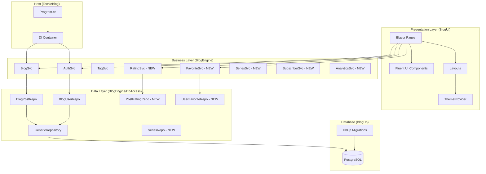

# TechieBlog 2.0 Brownfield Enhancement Architecture

**Version:** 1.2
**Date:** December 16, 2025
**Status:** Draft
**Author:** Winston (Architect)

---

## 1. Introduction

This document outlines the architectural approach for enhancing **TechieBlog** with a **full stack modernization to .NET 10 LTS, PostgreSQL, and Microsoft Fluent UI Blazor**. Its primary goal is to serve as the guiding architectural blueprint for AI-driven development of new features while ensuring seamless integration with the existing system.

**Relationship to Existing Architecture:**
This document supplements existing project architecture by defining how new components will integrate with current systems. The migration from MySQL/Blazorise/.NET 9 to PostgreSQL/Fluent UI/.NET 10 represents a significant modernization effort that preserves business logic while updating infrastructure and presentation layers.

### 1.1 Existing Project Analysis

#### Current Project State

- **Primary Purpose:** Blazor-native blogging engine template for .NET developers
- **Current Tech Stack:** .NET 9.0, Blazor Server, MySQL, Dapper, Blazorise Bootstrap, JWT Auth
- **Architecture Style:** Monolith with Clean Architecture (5-6 project structure)
- **Deployment Method:** Standard .NET web application deployment

#### Available Documentation

- `docs/prd.md` - Comprehensive PRD v1.2 with 6 epics, 46 stories
- `docs/project-brief.md` - Project vision and scope definition
- `docs/front-end-spec.md` - UI/UX specifications
- `mockups/` - 28 HTML mockups with 3 theme variants

#### Identified Constraints

- Existing ~30-40% complete codebase with working authentication
- 22+ database tables with established schema
- Stored procedure-based data access pattern
- JWT token infrastructure with custom encryption layer
- Blazorise component dependencies throughout BlogUI

### 1.2 Change Log

| Change | Date | Version | Description | Author |
|--------|------|---------|-------------|--------|
| Initial | 2025-12-16 | 1.0 | Brownfield architecture document created | Winston |
| Standards | 2025-12-16 | 1.1 | Added comprehensive coding standards: naming conventions (no underscores), Dapper ORM requirements, XML documentation templates, database script documentation templates | Winston |
| Resilience & Accessibility | 2025-12-17 | 1.2 | Added Section 8.5 Resilience & Operational Readiness (circuit breakers, retry policies, graceful degradation, monitoring, caching), Section 11.4 Accessibility Architecture (WCAG 2.1 AA, ARIA patterns, keyboard navigation), and Section 12 Checklist Results based on architect checklist validation | Winston |

---

## 2. Enhancement Scope and Integration Strategy

### 2.1 Enhancement Overview

- **Enhancement Type:** Major technology stack migration with feature completion
- **Scope:** Full modernization - framework, database, UI library, architecture simplification
- **Integration Impact:** High - touches all layers while preserving business logic

### 2.2 Integration Approach

| Integration Area | Strategy |
|-----------------|----------|
| **Code Integration** | Incremental migration - update projects one at a time, validate after each |
| **Database Integration** | Parallel migration scripts - new PostgreSQL scripts alongside existing MySQL |
| **API Integration** | Remove BlogSvc entirely - direct service calls from UI to BlogEngine |
| **UI Integration** | Complete replacement - Blazorise to Fluent UI with mockup-driven development |

### 2.3 Compatibility Requirements

- **Existing API Compatibility:** N/A - BlogSvc being removed, internal service interfaces preserved
- **Database Schema Compatibility:** Schema structure preserved, data types adapted for PostgreSQL
- **UI/UX Consistency:** New UI from mockups - breaking change by design
- **Performance Impact:** Expected improvement from direct service calls (no HTTP overhead)

---

## 3. Tech Stack Alignment

### 3.1 Existing Technology Stack

| Category | Current Technology | Version | Usage in Enhancement | Notes |
|----------|-------------------|---------|---------------------|-------|
| **Framework** | .NET | 9.0 | Upgrade to 10.0 LTS | Long-term support target |
| **UI Framework** | Blazor Server | 9.0 | Keep, upgrade to 10.0 | Core rendering model unchanged |
| **UI Library** | Blazorise Bootstrap | 1.7.0 | **REPLACE** with Fluent UI | Major migration effort |
| **Database** | MySQL | 9.1.0 | **REPLACE** with PostgreSQL | Schema migration required |
| **ORM** | Dapper | 2.1.35 | Keep, minor updates | Micro-ORM pattern retained |
| **DB Migrations** | DbUp MySQL | 6.0.4 | **REPLACE** with DbUp PostgreSQL | Migration tool unchanged |
| **Authentication** | JWT | 8.2.1 | Keep, upgrade | Token infrastructure preserved |
| **Logging** | Serilog | 8.0.3 | Keep, configure | Structured logging retained |
| **Local Storage** | Blazored.LocalStorage | 4.5.0 | Keep | Theme preference storage |
| **Humanizer** | Humanizer.Core | 2.14.1 | Keep | Date/time formatting |

### 3.2 New Technology Additions

| Technology | Version | Purpose | Rationale | Integration Method |
|------------|---------|---------|-----------|-------------------|
| **Microsoft.FluentUI.AspNetCore.Components** | 4.x | UI component library | Microsoft-supported, modern Fluent design, better accessibility | Replace all Blazorise components |
| **Npgsql** | 8.x | PostgreSQL driver | Required for PostgreSQL connectivity | Replace MySql.Data |
| **dbup-postgresql** | 5.x | PostgreSQL migrations | Required for DbUp PostgreSQL support | Replace dbup-mysql |

---

## 4. Data Models and Schema Changes

### 4.1 Existing Data Models (Preserved)

The following models exist in `BlogModel/Models/` and will be preserved with minor updates:

| Model | Purpose | Migration Notes |
|-------|---------|-----------------|
| `AppUser` | User accounts with roles, profile | Add nullable annotations |
| `BlogPost` | Blog post content | Add SEO fields, slug |
| `BlogComment` | Post comments | No changes |
| `BlogTag` | Tag definitions | No changes |
| `BlogImage` | Media library items | No changes |
| `UserLogin` | JWT token tracking | No changes |
| `LoginLog` | Authentication audit | No changes |
| `UserEvent` | User activity events | No changes |
| `SvcData` | Service data wrapper | Evaluate for removal |
| `SvcToken` | Service tokens | No changes |
| `Widget` | Custom widgets | Evaluate for removal per PRD |

### 4.2 New Data Models Required

#### PostRating Model

```csharp
public class PostRating
{
    public long RatingId { get; set; }
    public long PostId { get; set; }
    public long UserId { get; set; }
    public int Rating { get; set; }  // 1-5 stars
    public DateTime RatedOn { get; set; }
    public DateTime? UpdatedOn { get; set; }
}
```

**Purpose:** Track user ratings on posts (1-5 stars, one per user per post)
**Integration:** Links Post and BlogUser tables

#### UserFavorite Model

```csharp
public class UserFavorite
{
    public long FavoriteId { get; set; }
    public long UserId { get; set; }
    public long PostId { get; set; }
    public DateTime FavoritedOn { get; set; }
}
```

**Purpose:** Track user bookmarked/favorite posts
**Integration:** Links BlogUser and Post tables

#### Series Model

```csharp
public class Series
{
    public long SeriesId { get; set; }
    public string Name { get; set; }
    public string Slug { get; set; }
    public string Description { get; set; }
    public long CreatedBy { get; set; }
    public DateTime CreatedOn { get; set; }
}
```

**Purpose:** Group related posts into ordered series
**Integration:** New table with PostSeries junction table

#### SiteSettings Model

```csharp
public class SiteSettings
{
    public int SettingsId { get; set; }
    public string SiteTitle { get; set; }
    public string Tagline { get; set; }
    public string ActiveTheme { get; set; }
    public int PostsPerPage { get; set; }
    public bool RequireCommentModeration { get; set; }
    public string SmtpHost { get; set; }
    public int SmtpPort { get; set; }
    public string SmtpUser { get; set; }
    public string SmtpPasswordEncrypted { get; set; }
    public DateTime UpdatedOn { get; set; }
}
```

**Purpose:** Centralized site configuration
**Integration:** Replaces UserSettings (which was user-specific)

### 4.3 Schema Integration Strategy

**Database Changes Required:**

| Change Type | Details |
|-------------|---------|
| **New Tables** | PostRating, UserFavorite, Series, PostSeries, SiteSettings |
| **Modified Tables** | Post (add Slug, ScheduledFor, SeriesId), BlogUser (add PasswordResetToken, ResetTokenExpiry) |
| **New Indexes** | Post.Slug (unique), PostRating (PostId, UserId unique), UserFavorite (UserId, PostId unique) |
| **Migration Strategy** | DbUp scripts in BlogDb/PostgresScripts/, numbered sequentially |

**Backward Compatibility:**

- All existing table structures preserved with PostgreSQL type mappings
- MySQL `BIGINT` → PostgreSQL `BIGINT`
- MySQL `TINYINT(1)` → PostgreSQL `BOOLEAN`
- MySQL `LONGTEXT` → PostgreSQL `TEXT`
- MySQL `ENUM` → PostgreSQL `VARCHAR` with CHECK constraint
- MySQL `BIT(1)` → PostgreSQL `BOOLEAN`

### 4.4 PostgreSQL Type Mappings

| MySQL Type | PostgreSQL Type | Notes |
|------------|-----------------|-------|
| `BIGINT AUTO_INCREMENT` | `BIGSERIAL` | Primary keys |
| `INT AUTO_INCREMENT` | `SERIAL` | Secondary keys |
| `VARCHAR(n)` | `VARCHAR(n)` | Direct mapping |
| `LONGTEXT` | `TEXT` | Unlimited length |
| `DATETIME` | `TIMESTAMP` | Timezone-aware option available |
| `TINYINT(1)` | `BOOLEAN` | True boolean type |
| `BIT(1)` | `BOOLEAN` | True boolean type |
| `ENUM(...)` | `VARCHAR` + CHECK | Or custom ENUM type |

---

## 5. Component Architecture

### 5.1 Project Structure (Target: 5 Projects)

```
TechieBlog.sln
├── BlogDb/                    # Database migrations only
│   ├── PostgresScripts/       # NEW: PostgreSQL migration scripts
│   ├── MySqlScripts/          # DEPRECATED: Keep for reference
│   └── BlogDbSvc.cs           # DbUp runner
├── BlogModel/                 # Domain models, interfaces, DTOs
│   ├── Models/                # Entity classes
│   ├── Interfaces/            # Repository & service interfaces
│   └── Common/                # Constants, encryption utilities
├── BlogEngine/                # Business logic layer
│   ├── Services/              # Business services (AuthSvc, BlogSvc, etc.)
│   ├── DbAccess/              # Repository implementations
│   ├── DaCore/                # Data access core (GenericRepository, DbConnectionFactory)
│   └── BlogSvcInitializer.cs  # DI registration helper
├── BlogUI/                    # Razor Class Library
│   ├── Pages/                 # All Blazor pages
│   │   ├── BlogPages/         # Public-facing pages
│   │   ├── AdminPages/        # Admin management pages
│   │   ├── UserPages/         # NEW: User dashboard pages
│   │   └── AuthPages/         # NEW: Authentication pages
│   ├── Components/            # Reusable Fluent UI components
│   ├── Layouts/               # Page layouts (Main, Admin, Auth)
│   ├── Themes/                # NEW: CSS variable theme files
│   └── Common/                # Auth state provider, utilities
└── TechieBlog/                # Blazor Server host
    ├── Program.cs             # Entry point, DI, middleware
    ├── Services/              # Host-specific services
    └── wwwroot/               # Static assets, CSS
```

**BlogSvc Project: REMOVED** - No longer needed; UI calls BlogEngine services directly.

### 5.2 New Components

#### ThemeService Component

- **Responsibility:** Manage theme selection, light/dark mode toggle, CSS variable injection
- **Integration Points:** LocalStorage, SiteSettings, Layout components
- **Key Interfaces:**
  - `GetCurrentTheme(): string`
  - `SetTheme(themeName: string): void`
  - `ToggleDarkMode(): void`
  - `GetAvailableThemes(): List<ThemeInfo>`
- **Dependencies:**
  - **Existing Components:** Blazored.LocalStorage, SiteSettings repository
  - **New Components:** ThemeProvider Blazor component
- **Technology Stack:** C# service + CSS custom properties + Fluent UI theming

#### MarkdownEditorComponent

- **Responsibility:** Markdown editing with live preview for post creation
- **Integration Points:** Post editor page, Draft preview
- **Key Interfaces:**
  - `Content: string` (two-way binding)
  - `OnContentChanged: EventCallback<string>`
  - `Preview: MarkupString` (rendered HTML)
- **Dependencies:**
  - **Existing Components:** None
  - **New Components:** Markdown parsing library (Markdig)
- **Technology Stack:** Blazor component + Markdig + Fluent UI TextArea

#### RatingComponent

- **Responsibility:** Display and capture star ratings (1-5)
- **Integration Points:** Blog post page, post cards
- **Key Interfaces:**
  - `PostId: long`
  - `CurrentRating: int`
  - `AverageRating: decimal`
  - `OnRatingChanged: EventCallback<int>`
- **Dependencies:**
  - **Existing Components:** AuthStateProvider (for user context)
  - **New Components:** RatingSvc, PostRatingRepo
- **Technology Stack:** Fluent UI Rating or custom star component

#### FavoriteToggleComponent

- **Responsibility:** Toggle favorite/bookmark status on posts
- **Integration Points:** Blog post page, post cards, My Favorites page
- **Key Interfaces:**
  - `PostId: long`
  - `IsFavorited: bool`
  - `OnToggle: EventCallback<bool>`
- **Dependencies:**
  - **Existing Components:** AuthStateProvider
  - **New Components:** FavoriteSvc, UserFavoriteRepo
- **Technology Stack:** Fluent UI Button with icon toggle

### 5.3 Component Interaction Diagram



---

## 6. API Design and Integration

### 6.1 API Integration Strategy

**Strategy:** Remove REST API layer entirely. BlogUI components call BlogEngine services directly via dependency injection.

| Aspect | Approach |
|--------|----------|
| **Authentication** | JWT tokens validated via Blazor AuthenticationStateProvider |
| **Authorization** | [Authorize] attributes on pages, role-based policies |
| **Versioning** | N/A - internal service calls, no external API |

### 6.2 Service Interface Patterns

All services follow this pattern for direct UI integration:

```csharp
public interface IBlogService
{
    // Async methods for UI responsiveness
    Task<BlogPost> GetPostByIdAsync(long postId);
    Task<BlogPost> GetPostBySlugAsync(string slug);
    Task<IEnumerable<BlogPost>> GetPublishedPostsAsync(int page, int pageSize);
    Task<long> CreatePostAsync(BlogPost post);
    Task UpdatePostAsync(BlogPost post);
    Task DeletePostAsync(long postId);

    // Sync methods where async provides no benefit
    int GetTotalPostCount();
}
```

### 6.3 Removed API Endpoints

The following BlogSvc controllers are being removed:

| Controller | Endpoints | Replacement |
|------------|-----------|-------------|
| `AuthSvc` | POST /auth/login, /auth/signup | Direct `AuthSvc` service calls |
| `BlogSvc` | CRUD /posts/* | Direct `BlogSvc` service calls |
| `TagSvc` | CRUD /tags/* | Direct `TagSvc` service calls |

---

## 7. Source Tree Integration

### 7.1 Existing Project Structure (Relevant Parts)

```plaintext
source/
├── BlogDb/
│   ├── MySqlScripts/           # Existing MySQL scripts
│   │   ├── 00-DBCreationScript.sql
│   │   ├── 01-BlogImageSps.sql
│   │   ├── 02-BlogUserSps.sql
│   │   ├── 03-PostSps.sql
│   │   └── ...
│   └── BlogDbSvc.cs            # DbUp runner
├── BlogModel/
│   ├── Models/                 # AppUser, BlogPost, BlogComment, etc.
│   ├── Interfaces/             # IGenericRepository, service interfaces
│   └── Common/                 # AppConstants, AppEncrypt
├── BlogEngine/
│   ├── Services/               # AuthSvc, BlogSvc, TagSvc
│   ├── DbAccess/               # Repository implementations
│   └── DaCore/                 # GenericRepository, DbConnectionFactory
├── BlogSvc/                    # TO BE REMOVED
├── BlogUI/
│   ├── Pages/
│   │   ├── AdminPages/         # Dashboard, Lists, Management
│   │   ├── BlogPages/          # BlogHome, BlogPage
│   │   └── UiElements/         # Blazorise samples (remove)
│   ├── Components/             # AlertIcon, ContentPanel
│   ├── Layouts/                # MainLayout, AdminLayout, AuthLayout
│   └── Common/                 # CustomAuthStateProvider
└── TechieBlog/
    ├── Program.cs
    ├── Services/               # AuthService, ManageService
    └── Pages/                  # Error page only
```

### 7.2 New File Organization

```plaintext
source/
├── BlogDb/
│   ├── MySqlScripts/           # Existing (deprecated, keep for reference)
│   ├── PostgresScripts/        # NEW: PostgreSQL migrations
│   │   ├── 001-CreateTables.sql
│   │   ├── 002-CreateStoredFunctions.sql
│   │   ├── 003-SeedData.sql
│   │   └── ...
│   └── BlogDbSvc.cs            # Updated for PostgreSQL
├── BlogModel/
│   ├── Models/
│   │   ├── PostRating.cs       # NEW
│   │   ├── UserFavorite.cs     # NEW
│   │   ├── Series.cs           # NEW
│   │   └── SiteSettings.cs     # NEW
│   └── Interfaces/
│       ├── IRatingSvc.cs       # NEW
│       ├── IFavoriteSvc.cs     # NEW
│       └── ISeriesSvc.cs       # NEW
├── BlogEngine/
│   ├── Services/
│   │   ├── RatingSvc.cs        # NEW
│   │   ├── FavoriteSvc.cs      # NEW
│   │   ├── SeriesSvc.cs        # NEW
│   │   ├── SubscriberSvc.cs    # NEW
│   │   └── AnalyticsSvc.cs     # NEW
│   └── DbAccess/
│       ├── PostRatingRepo.cs   # NEW
│       ├── UserFavoriteRepo.cs # NEW
│       ├── SeriesRepo.cs       # NEW
│       └── SettingsRepo.cs     # NEW
├── BlogUI/
│   ├── Pages/
│   │   ├── BlogPages/          # Existing + new public pages
│   │   │   ├── Home.razor      # From mockup 01
│   │   │   ├── PostView.razor  # From mockup 02
│   │   │   ├── CategoryArchive.razor  # From mockup 03
│   │   │   ├── TagArchive.razor       # From mockup 04
│   │   │   ├── SeriesView.razor       # From mockup 05
│   │   │   ├── SearchResults.razor    # From mockup 06
│   │   │   └── AuthorProfile.razor    # From mockup 07
│   │   ├── AuthPages/          # NEW: Authentication pages
│   │   │   ├── Login.razor     # From mockup 08
│   │   │   ├── Register.razor  # From mockup 09
│   │   │   ├── ForgotPassword.razor   # From mockup 10
│   │   │   └── ResetPassword.razor    # From mockup 11
│   │   ├── UserPages/          # NEW: User dashboard
│   │   │   ├── Profile.razor   # From mockup 12
│   │   │   ├── MyFavorites.razor      # From mockup 13
│   │   │   ├── MyComments.razor       # From mockup 14
│   │   │   ├── EditProfile.razor      # From mockup 15
│   │   │   └── ChangePassword.razor   # From mockup 16
│   │   ├── AuthorPages/        # NEW: Content management
│   │   │   ├── PostEditor.razor       # From mockup 17
│   │   │   ├── MyPosts.razor   # From mockup 18
│   │   │   ├── MediaLibrary.razor     # From mockup 19
│   │   │   └── DraftPreview.razor     # From mockup 20
│   │   └── AdminPages/         # Existing + enhanced
│   │       ├── Dashboard.razor        # From mockup 21
│   │       ├── AllPosts.razor  # From mockup 22
│   │       ├── Users.razor     # From mockup 23
│   │       ├── Comments.razor  # From mockup 24
│   │       ├── Categories.razor       # From mockup 25
│   │       ├── Tags.razor      # From mockup 26
│   │       ├── Subscribers.razor      # From mockup 27
│   │       └── Settings.razor  # From mockup 28
│   ├── Components/             # NEW: Fluent UI components
│   │   ├── RatingStars.razor
│   │   ├── FavoriteButton.razor
│   │   ├── MarkdownEditor.razor
│   │   ├── PostCard.razor
│   │   ├── CommentThread.razor
│   │   ├── TagCloud.razor
│   │   ├── SeriesNav.razor
│   │   └── ThemeToggle.razor
│   ├── Themes/                 # NEW: CSS theme files
│   │   ├── _variables.css      # Base CSS variables
│   │   ├── fluent-modern.css   # Theme 1
│   │   ├── developer-dark.css  # Theme 2
│   │   └── minimal-clean.css   # Theme 3
│   └── Layouts/
│       ├── MainLayout.razor    # Updated for Fluent UI
│       ├── AdminLayout.razor   # Updated for Fluent UI
│       └── AuthLayout.razor    # Updated for Fluent UI
└── TechieBlog/
    ├── Program.cs              # Updated DI configuration
    └── wwwroot/
        └── css/                # Theme CSS files deployed here
```

### 7.3 Integration Guidelines

| Guideline | Standard |
|-----------|----------|
| **File Naming** | PascalCase for .cs and .razor files, kebab-case for .css files |
| **Folder Organization** | Group by feature domain (BlogPages, AdminPages, etc.) |
| **Import/Export Patterns** | Use `_Imports.razor` for common namespaces, explicit using for services |
| **Namespace Convention** | `BlogUI.Pages.BlogPages`, `BlogEngine.Services`, etc. |

---

## 8. Infrastructure and Deployment Integration

### 8.1 Existing Infrastructure

- **Current Deployment:** Manual deployment to IIS or Kestrel
- **Infrastructure Tools:** None (no CI/CD currently)
- **Environments:** Development only (no staging/production separation)

### 8.2 Enhancement Deployment Strategy

| Aspect | Approach |
|--------|----------|
| **Deployment Approach** | GitHub Actions CI/CD pipeline |
| **Infrastructure Changes** | PostgreSQL database (new), existing web host compatible |
| **Pipeline Integration** | Build → Test → Deploy workflow |

### 8.3 CI/CD Pipeline Design

```yaml
# .github/workflows/ci.yml
name: TechieBlog CI/CD

on:
  push:
    branches: [main, dev]
  pull_request:
    branches: [main]

jobs:
  build:
    runs-on: ubuntu-latest
    steps:
      - uses: actions/checkout@v4
      - uses: actions/setup-dotnet@v4
        with:
          dotnet-version: '10.0.x'
      - run: dotnet restore
      - run: dotnet build --no-restore
      - run: dotnet test --no-build --verbosity normal
```

### 8.4 Rollback Strategy

| Aspect | Approach |
|--------|----------|
| **Rollback Method** | Git revert + database migration rollback scripts |
| **Risk Mitigation** | Feature branches, PR reviews, staging environment testing |
| **Monitoring** | Health check endpoint, Serilog structured logging |

### 8.5 Resilience & Operational Readiness

#### 8.5.1 Resilience Patterns (MANDATORY)

**Library:** Microsoft.Extensions.Http.Polly (for resilience policies)

##### Circuit Breaker Pattern

```csharp
/// <summary>
/// Configures resilience policies for database operations.
/// Circuit breaker prevents cascade failures when database is unavailable.
/// </summary>
/// <remarks>
/// <para><b>Pattern:</b> Circuit Breaker with Retry</para>
/// <para><b>Behavior:</b></para>
/// <list type="number">
///   <item>Retry failed operations up to 3 times with exponential backoff</item>
///   <item>After 5 consecutive failures, circuit opens for 30 seconds</item>
///   <item>During open state, fail fast without attempting database call</item>
///   <item>After 30 seconds, allow one test request (half-open state)</item>
///   <item>If test succeeds, close circuit; if fails, reopen for another 30 seconds</item>
/// </list>
/// </remarks>
public static class ResiliencePolicies
{
    /// <summary>
    /// Creates a retry policy for transient database failures.
    /// Retries 3 times with exponential backoff (1s, 2s, 4s).
    /// </summary>
    public static AsyncRetryPolicy CreateRetryPolicy()
    {
        return Policy
            .Handle<NpgsqlException>()
            .Or<TimeoutException>()
            .WaitAndRetryAsync(
                retryCount: 3,
                sleepDurationProvider: attempt => TimeSpan.FromSeconds(Math.Pow(2, attempt - 1)),
                onRetry: (exception, timeSpan, retryCount, context) =>
                {
                    Log.Warning(
                        "Retry {RetryCount} after {Delay}ms due to {ExceptionType}: {Message}",
                        retryCount, timeSpan.TotalMilliseconds,
                        exception.GetType().Name, exception.Message);
                });
    }

    /// <summary>
    /// Creates a circuit breaker for database operations.
    /// Opens after 5 failures, stays open for 30 seconds.
    /// </summary>
    public static AsyncCircuitBreakerPolicy CreateCircuitBreakerPolicy()
    {
        return Policy
            .Handle<NpgsqlException>()
            .Or<TimeoutException>()
            .CircuitBreakerAsync(
                exceptionsAllowedBeforeBreaking: 5,
                durationOfBreak: TimeSpan.FromSeconds(30),
                onBreak: (exception, duration) =>
                {
                    Log.Error("Circuit OPEN for {Duration}s due to: {Message}",
                        duration.TotalSeconds, exception.Message);
                },
                onReset: () => Log.Information("Circuit CLOSED - normal operation resumed"),
                onHalfOpen: () => Log.Information("Circuit HALF-OPEN - testing..."));
    }
}
```

##### Service-Level Resilience

| Service | Retry Policy | Circuit Breaker | Fallback |
|---------|--------------|-----------------|----------|
| **Database (all repos)** | 3 retries, exponential backoff | 5 failures → 30s open | Return cached data or error |
| **Email (SMTP)** | 2 retries, 5s delay | 3 failures → 60s open | Queue for later, notify admin |
| **File Storage** | 2 retries, 2s delay | 5 failures → 30s open | Return placeholder image |

##### Graceful Degradation Strategy

| Component | Degraded Behavior | User Impact |
|-----------|-------------------|-------------|
| **Analytics Service** | Disable view tracking | None visible - analytics stops |
| **Comment System** | Show cached comments, disable new | Read-only comments |
| **Rating System** | Show cached ratings, disable voting | Read-only ratings |
| **Newsletter** | Queue emails, retry later | Delayed delivery |
| **Search** | Fall back to basic title search | Reduced search quality |

#### 8.5.2 Monitoring & Observability

##### Health Check Endpoints

```csharp
/// <summary>
/// Configures health checks for all critical dependencies.
/// Endpoint: /health (detailed) and /health/ready (load balancer)
/// </summary>
public static void ConfigureHealthChecks(IServiceCollection services, IConfiguration config)
{
    services.AddHealthChecks()
        // Database connectivity check
        .AddNpgSql(
            config.GetConnectionString("DefaultConnection"),
            name: "postgresql",
            failureStatus: HealthStatus.Unhealthy,
            tags: new[] { "db", "critical" })
        // SMTP connectivity check (if configured)
        .AddSmtpHealthCheck(options =>
        {
            options.Host = config["Smtp:Host"];
            options.Port = config.GetValue<int>("Smtp:Port");
        }, name: "smtp", failureStatus: HealthStatus.Degraded, tags: new[] { "email" })
        // Memory check
        .AddProcessAllocatedMemoryHealthCheck(
            maximumMegabytesAllocated: 500,
            name: "memory",
            tags: new[] { "memory" });
}
```

##### Key Metrics to Track

| Metric | Type | Alert Threshold | Description |
|--------|------|-----------------|-------------|
| `http_request_duration_seconds` | Histogram | p95 > 2s | Page load time |
| `http_requests_total` | Counter | N/A | Request volume |
| `http_requests_failed_total` | Counter | > 10/min | Error rate |
| `db_connection_pool_size` | Gauge | > 80% capacity | Connection exhaustion |
| `circuit_breaker_state` | Gauge | state = open | Service availability |
| `active_users` | Gauge | N/A | Concurrent sessions |
| `post_views_total` | Counter | N/A | Content engagement |

##### Structured Logging Standards

```csharp
/// <summary>
/// Standard logging pattern for all service methods.
/// Includes correlation ID for request tracing across components.
/// </summary>
public async Task<BlogPost> GetPostByIdAsync(long postId)
{
    using var activity = ActivitySource.StartActivity("GetPostById");
    activity?.SetTag("postId", postId);

    logger.LogInformation(
        "Fetching post {PostId} for user {UserId}",
        postId, currentUser?.UserId ?? 0);

    try
    {
        var post = await repository.GetSingleAsync(postId);

        logger.LogInformation(
            "Successfully retrieved post {PostId}: {Title}",
            postId, post?.Title ?? "NOT FOUND");

        return post;
    }
    catch (Exception ex)
    {
        logger.LogError(ex,
            "Failed to fetch post {PostId}. CircuitState: {CircuitState}",
            postId, circuitBreaker.CircuitState);
        throw;
    }
}
```

##### Alerting Rules

| Alert | Condition | Severity | Action |
|-------|-----------|----------|--------|
| **HighErrorRate** | Error rate > 5% for 5 minutes | Critical | Page on-call |
| **SlowResponses** | p95 latency > 3s for 10 minutes | Warning | Investigate |
| **DatabaseDown** | Health check failing for 1 minute | Critical | Page on-call |
| **CircuitOpen** | Any circuit breaker open | Warning | Investigate |
| **HighMemory** | Memory > 80% for 5 minutes | Warning | Scale or investigate |
| **EmailQueueBacklog** | Queue > 100 emails for 30 minutes | Warning | Check SMTP |

#### 8.5.3 Caching Strategy

##### Cache Layers

| Layer | Technology | TTL | Use Case |
|-------|------------|-----|----------|
| **In-Memory** | IMemoryCache | 5-60 min | Site settings, categories, tags |
| **Output Cache** | Response caching | 5 min | Public post listings, RSS feed |
| **Distributed** | Optional Redis | 1-24 hr | Session data (if scaled) |

##### Cache Implementation Pattern

```csharp
/// <summary>
/// Caching service for frequently accessed, rarely changed data.
/// Uses memory cache with automatic invalidation on updates.
/// </summary>
/// <remarks>
/// <para><b>Cache Strategy:</b></para>
/// <list type="bullet">
///   <item>Site settings: 60 minutes (invalidate on admin save)</item>
///   <item>Categories/Tags: 30 minutes (invalidate on CRUD)</item>
///   <item>Published posts list: 5 minutes (short for freshness)</item>
///   <item>Individual posts: 10 minutes (invalidate on edit)</item>
/// </list>
/// </remarks>
public class CachingService : ICachingService
{
    private readonly IMemoryCache cache;
    private readonly ILogger<CachingService> logger;

    /// <summary>
    /// Retrieves site settings from cache or database.
    /// Cache key: "SiteSettings"
    /// TTL: 60 minutes
    /// </summary>
    public async Task<SiteSettings> GetSiteSettingsAsync()
    {
        return await cache.GetOrCreateAsync("SiteSettings", async entry =>
        {
            entry.AbsoluteExpirationRelativeToNow = TimeSpan.FromMinutes(60);
            entry.Priority = CacheItemPriority.High;

            logger.LogDebug("Cache miss for SiteSettings - fetching from database");
            return await settingsRepo.GetSettingsAsync();
        });
    }

    /// <summary>
    /// Invalidates all caches related to a specific post.
    /// Called after post create, update, or delete.
    /// </summary>
    public void InvalidatePostCaches(long postId)
    {
        cache.Remove($"Post:{postId}");
        cache.Remove("PublishedPosts");
        cache.Remove("RecentPosts");
        cache.Remove("PopularPosts");
        logger.LogInformation("Invalidated caches for post {PostId}", postId);
    }
}
```

##### Cache Invalidation Events

| Event | Caches to Invalidate |
|-------|---------------------|
| Post created/updated/deleted | Post:{id}, PublishedPosts, RecentPosts, PopularPosts, RSS |
| Category created/updated/deleted | Categories, Posts by category |
| Tag created/updated/deleted | Tags, Posts by tag |
| Settings updated | SiteSettings |
| User profile updated | User:{id} |
| Comment added/moderated | Post:{postId} comments |

---

## 9. Coding Standards and Conventions

### 9.1 Naming Conventions (MANDATORY)

**CRITICAL RULE: No underscores (`_`) in any identifier names.** Use PascalCase or camelCase exclusively.

#### 9.1.1 C# Code Naming

| Element | Convention | Correct | Incorrect |
|---------|------------|---------|-----------|
| **Classes** | PascalCase | `BlogPostService` | `Blog_Post_Service` |
| **Interfaces** | PascalCase with `I` prefix | `IBlogPostRepo` | `I_Blog_Post_Repo` |
| **Methods** | PascalCase | `GetAllPosts()` | `Get_All_Posts()` |
| **Properties** | PascalCase | `PostTitle` | `Post_Title` |
| **Local Variables** | camelCase | `blogPost` | `blog_post` |
| **Parameters** | camelCase | `postId` | `post_id` |
| **Private Fields** | camelCase (no underscore prefix) | `connectionString` | `_connectionString` |
| **Constants** | PascalCase | `MaxPageSize` | `MAX_PAGE_SIZE` |
| **Enums** | PascalCase | `TokenStatus.ValidToken` | `Token_Status.Valid_Token` |

#### 9.1.2 Database Object Naming

| Element | Convention | Correct | Incorrect |
|---------|------------|---------|-----------|
| **Tables** | PascalCase | `BlogPost`, `UserFavorite` | `blog_post`, `user_favorite` |
| **Columns** | PascalCase | `PostId`, `CreatedOn` | `post_id`, `created_on` |
| **Stored Procedures/Functions** | PascalCase | `GetPostById`, `InsertBlogPost` | `get_post_by_id`, `sp_InsertBlogPost` |
| **Indexes** | PascalCase with `Idx` prefix | `IdxPostSlug` | `idx_post_slug` |
| **Foreign Keys** | PascalCase with `Fk` prefix | `FkPostUserId` | `fk_post_user_id` |
| **Primary Keys** | PascalCase with `Pk` prefix | `PkBlogPost` | `pk_blog_post` |

#### 9.1.3 File and Folder Naming

| Element | Convention | Correct | Incorrect |
|---------|------------|---------|-----------|
| **C# Files** | PascalCase | `BlogPostRepo.cs` | `blog_post_repo.cs` |
| **Razor Files** | PascalCase | `PostEditor.razor` | `post_editor.razor` |
| **CSS Files** | kebab-case | `fluent-modern.css` | `fluent_modern.css` |
| **SQL Scripts** | Number prefix + PascalCase | `001-CreateTables.sql` | `001_create_tables.sql` |
| **Folders** | PascalCase | `BlogPages`, `DbAccess` | `Blog_Pages`, `Db_Access` |

### 9.2 Data Access Standards (Dapper ORM)

**MANDATORY: Continue using Dapper as the micro-ORM for all data access.**

#### 9.2.1 Repository Pattern with Dapper

```csharp
/// <summary>
/// Repository for managing blog post data access operations.
/// Implements the generic repository pattern using Dapper for PostgreSQL.
/// Used by BlogSvc to perform CRUD operations on the Post table.
/// </summary>
public class BlogPostRepo : GenericRepository<BlogPost>, IBlogPostRepo
{
    /// <summary>
    /// Initializes a new instance of BlogPostRepo with database connection.
    /// The connection string is injected via DI from appsettings.json.
    /// </summary>
    /// <param name="connectionString">PostgreSQL connection string from configuration.</param>
    public BlogPostRepo(string connectionString) : base(connectionString) { }

    /// <summary>
    /// Retrieves a single blog post by its unique identifier.
    /// Calls the GetPostById stored function in PostgreSQL.
    /// Returns null if no post exists with the given ID.
    /// </summary>
    /// <param name="postId">The unique identifier of the blog post.</param>
    /// <returns>BlogPost entity or null if not found.</returns>
    public override BlogPost GetSingle(long postId)
    {
        using var connection = GetOpenConnection();
        var parameters = new DynamicParameters();
        parameters.Add("postId", postId);
        return connection.Query<BlogPost>(
            "SELECT * FROM GetPostById(@postId)",
            parameters
        ).FirstOrDefault();
    }
}
```

#### 9.2.2 Dapper Best Practices

| Practice | Implementation |
|----------|----------------|
| **Connection Management** | Use `using` statements for automatic disposal |
| **Parameters** | Always use `DynamicParameters` - never concatenate SQL |
| **Stored Functions** | Prefer PostgreSQL functions over inline SQL |
| **Async Operations** | Use `QueryAsync`, `ExecuteAsync` for all DB calls |
| **Result Mapping** | Leverage Dapper's automatic mapping to POCOs |

### 9.3 XML Documentation Standards (MANDATORY)

**CRITICAL: Every class and method MUST have XML documentation comments.**

#### 9.3.1 Class Documentation Template

```csharp
/// <summary>
/// [Brief one-line description of what this class does]
/// </summary>
/// <remarks>
/// <para><b>Purpose:</b> [Explain the role of this class in the solution]</para>
/// <para><b>Code Flow:</b> [Describe how this class fits into the overall flow]</para>
/// <para><b>Dependencies:</b> [List key dependencies and why they're needed]</para>
/// <para><b>Usage:</b> [Explain where/how this class is used]</para>
/// </remarks>
/// <example>
/// <code>
/// // Example usage of this class
/// var service = new ExampleService(dependency);
/// var result = service.DoSomething();
/// </code>
/// </example>
public class ExampleClass
{
    // ...
}
```

#### 9.3.2 Method Documentation Template

```csharp
/// <summary>
/// [Brief one-line description of what this method does]
/// </summary>
/// <remarks>
/// <para><b>Business Logic:</b> [Explain any business rules applied]</para>
/// <para><b>Flow:</b> [Step-by-step description for complex methods]</para>
/// <para><b>Side Effects:</b> [Describe any state changes or external calls]</para>
/// </remarks>
/// <param name="paramName">[Description of parameter and valid values]</param>
/// <returns>[Description of return value and possible states]</returns>
/// <exception cref="ExceptionType">[When this exception is thrown]</exception>
/// <example>
/// <code>
/// var result = MyMethod("input");
/// </code>
/// </example>
public ReturnType MethodName(ParamType paramName)
{
    // ...
}
```

#### 9.3.3 Documentation Examples for TechieBlog

**Service Class Example:**

```csharp
/// <summary>
/// Provides authentication and authorization services for the TechieBlog application.
/// </summary>
/// <remarks>
/// <para><b>Purpose:</b> Handles user login, signup, JWT token generation, and token validation.
/// This is the central authentication service used by both the UI layer and any future API endpoints.</para>
///
/// <para><b>Code Flow:</b></para>
/// <list type="number">
///   <item>UI calls AppLogin() with encrypted credentials</item>
///   <item>Credentials are decrypted using AppEncrypt utility</item>
///   <item>Password is hashed and validated against BlogUserRepo</item>
///   <item>On success, JWT token is generated with user claims</item>
///   <item>Token is stored in UserLogin table for tracking</item>
///   <item>Encrypted user data and token returned to UI</item>
/// </list>
///
/// <para><b>Dependencies:</b></para>
/// <list type="bullet">
///   <item>IBlogUserRepo - User data access</item>
///   <item>IUserLoginRepository - Token tracking</item>
///   <item>AppEncrypt - Credential encryption/decryption</item>
/// </list>
///
/// <para><b>Security Note:</b> All sensitive data is encrypted in transit using AppEncrypt.
/// Passwords are hashed using SHA256 before database comparison.</para>
/// </remarks>
public class AuthSvc
{
    /// <summary>
    /// Authenticates a user with email and password credentials.
    /// </summary>
    /// <remarks>
    /// <para><b>Business Logic:</b></para>
    /// <list type="number">
    ///   <item>Decrypt email and password from SvcData wrapper</item>
    ///   <item>Hash the password using AppEncrypt.CreateHash()</item>
    ///   <item>Query BlogUserRepo for matching credentials</item>
    ///   <item>Generate 15-day JWT token with user claims (ID, Name, Email, Role)</item>
    ///   <item>Store login record in UserLogin table</item>
    ///   <item>Return encrypted user data with tokens</item>
    /// </list>
    ///
    /// <para><b>Token Claims:</b> PrimarySid (UserId), Name, Email, Role</para>
    /// </remarks>
    /// <param name="loginData">Encrypted login credentials containing LoginEmail and LoginPass.</param>
    /// <returns>
    /// SvcData containing encrypted user profile and JWT token on success.
    /// Returns null if credentials are invalid or user not found.
    /// </returns>
    /// <exception cref="Exception">Logged and rethrown on database or encryption errors.</exception>
    public SvcData AppLogin(SvcData loginData)
    {
        // Implementation...
    }
}
```

**Repository Class Example:**

```csharp
/// <summary>
/// Data access repository for BlogPost entities using Dapper ORM.
/// </summary>
/// <remarks>
/// <para><b>Purpose:</b> Provides CRUD operations for the Post table in PostgreSQL.
/// Extends GenericRepository to inherit common data access patterns.</para>
///
/// <para><b>Code Flow:</b> Called by BlogSvc service layer. Each method opens a new
/// database connection, executes a stored function, and returns mapped entities.</para>
///
/// <para><b>Database Objects Used:</b></para>
/// <list type="bullet">
///   <item>GetPostById - Retrieve single post</item>
///   <item>GetPagedBlogList - Paginated post listing</item>
///   <item>InsertPost - Create new post</item>
///   <item>UpdatePost - Modify existing post</item>
/// </list>
/// </remarks>
public class BlogPostRepo : GenericRepository<BlogPost>, IBlogPostRepo
{
    // ...
}
```

### 9.4 Database Script Documentation Standards (MANDATORY)

**CRITICAL: All SQL scripts must include detailed comments explaining purpose and logic.**

#### 9.4.1 Table Creation Script Template

```sql
-- ============================================================================
-- Script: 001-CreateTables.sql
-- Purpose: Creates all core tables for TechieBlog PostgreSQL database
-- Author: [Developer Name]
-- Created: [Date]
-- Modified: [Date] - [Description of changes]
-- ============================================================================

-- ============================================================================
-- TABLE: BlogPost
-- Purpose: Stores all blog post content and metadata
--
-- Relationships:
--   - BlogUser (UserId) - Author of the post
--   - Category (via PostCategory junction) - Post categorization
--   - Series (SeriesId) - Optional series grouping
--
-- Business Rules:
--   - Slug must be unique for SEO-friendly URLs
--   - Published = false indicates draft status
--   - ScheduledFor enables future publishing
--
-- Indexes:
--   - PkBlogPost: Primary key on PostId
--   - IdxPostSlug: Unique index for URL lookups
--   - IdxPostUserId: Foreign key index for author queries
-- ============================================================================
CREATE TABLE BlogPost (
    -- Primary identifier, auto-generated
    PostId BIGSERIAL PRIMARY KEY,

    -- Post title displayed in UI and used for SEO
    Title VARCHAR(550) NOT NULL,

    -- URL-friendly identifier, auto-generated from title
    -- Must be unique across all posts for clean URLs
    Slug VARCHAR(550) UNIQUE,

    -- Short summary shown in post listings and meta description
    Abstract VARCHAR(550),

    -- Full post content in Markdown format
    -- Rendered to HTML on display
    PostContent TEXT NOT NULL,

    -- Timestamp when post was first created (draft or published)
    CreatedOn TIMESTAMP DEFAULT CURRENT_TIMESTAMP,

    -- Timestamp of last modification
    UpdatedOn TIMESTAMP,

    -- Foreign key to BlogUser - the post author
    -- Required - every post must have an author
    UserId BIGINT NOT NULL REFERENCES BlogUser(UserId),

    -- Comma-separated tag names for quick display
    -- Normalized tags stored in PostTag junction table
    Tags VARCHAR(550),

    -- Path to featured/hero image for post
    FeaturedImage VARCHAR(550),

    -- Publication status: false = draft, true = published
    Published BOOLEAN NOT NULL DEFAULT FALSE,

    -- Future publish date for scheduled posts
    -- NULL means immediate publish when Published = true
    ScheduledFor TIMESTAMP,

    -- SEO: Custom title for search engines (overrides Title if set)
    SeoTitle VARCHAR(255),

    -- SEO: Meta description for search results
    SeoDescription VARCHAR(500),

    -- Optional series grouping for multi-part content
    SeriesId BIGINT REFERENCES Series(SeriesId),

    -- Order within series (1, 2, 3, etc.)
    SeriesOrder INT
);

-- Index for fast slug lookups (used in URL routing)
CREATE UNIQUE INDEX IdxPostSlug ON BlogPost(Slug);

-- Index for author's post queries
CREATE INDEX IdxPostUserId ON BlogPost(UserId);

-- Index for published posts sorted by date (common query pattern)
CREATE INDEX IdxPostPublished ON BlogPost(Published, CreatedOn DESC);
```

#### 9.4.2 Stored Function Documentation Template

```sql
-- ============================================================================
-- FUNCTION: GetPostById
-- Purpose: Retrieves a single blog post with author information
--
-- Parameters:
--   @postId (BIGINT) - The unique identifier of the post to retrieve
--
-- Returns: Single row with post data and author name, or empty if not found
--
-- Business Logic:
--   1. Joins BlogPost with BlogUser to get author's full name
--   2. Returns all post fields needed for display
--   3. Does NOT check Published status - caller must filter if needed
--
-- Called By:
--   - BlogPostRepo.GetSingle() - Single post retrieval
--   - BlogSvc.GetPostForEdit() - Admin post editing
--
-- Performance Notes:
--   - Uses primary key lookup - O(1) performance
--   - Consider caching results for frequently accessed posts
--
-- Example Usage:
--   SELECT * FROM GetPostById(123);
-- ============================================================================
CREATE OR REPLACE FUNCTION GetPostById(postId BIGINT)
RETURNS TABLE (
    PostId BIGINT,
    Title VARCHAR(550),
    Slug VARCHAR(550),
    Abstract VARCHAR(550),
    PostContent TEXT,
    CreatedOn TIMESTAMP,
    UpdatedOn TIMESTAMP,
    UserId BIGINT,
    BlogWriter VARCHAR(201),  -- FirstName + ' ' + LastName
    Tags VARCHAR(550),
    FeaturedImage VARCHAR(550),
    Published BOOLEAN,
    ScheduledFor TIMESTAMP
) AS $$
BEGIN
    -- Return post with joined author name
    -- BlogWriter is computed from user's first and last name
    RETURN QUERY
    SELECT
        p.PostId,
        p.Title,
        p.Slug,
        p.Abstract,
        p.PostContent,
        p.CreatedOn,
        p.UpdatedOn,
        p.UserId,
        CONCAT(u.FirstName, ' ', u.LastName)::VARCHAR(201) AS BlogWriter,
        p.Tags,
        p.FeaturedImage,
        p.Published,
        p.ScheduledFor
    FROM BlogPost p
    INNER JOIN BlogUser u ON p.UserId = u.UserId
    WHERE p.PostId = postId;
END;
$$ LANGUAGE plpgsql;
```

#### 9.4.3 Migration Script Header Template

```sql
-- ============================================================================
-- Migration: 005-AddRatingSystem.sql
-- Purpose: Adds star rating functionality for blog posts
--
-- Changes:
--   - Creates PostRating table for user ratings
--   - Adds GetPostAverageRating function
--   - Adds InsertOrUpdateRating function
--
-- Dependencies:
--   - Requires BlogPost table (001-CreateTables.sql)
--   - Requires BlogUser table (001-CreateTables.sql)
--
-- Rollback Script: 005-Rollback-AddRatingSystem.sql
--
-- Author: [Developer Name]
-- Date: [Date]
-- Ticket: [Story/Issue Reference]
-- ============================================================================
```

### 9.5 Additional Coding Standards

#### 9.5.1 General C# Standards

| Standard | Implementation |
|----------|----------------|
| **Nullable Reference Types** | Enable `<Nullable>enable</Nullable>` in all projects |
| **Async/Await** | All database and I/O operations must be async |
| **Dependency Injection** | Constructor injection only, no service locator pattern |
| **Fluent UI Components** | Use Fluent UI components exclusively, no mixing with Blazorise |
| **CSS Variables** | All colors, fonts, spacing via CSS custom properties only |

#### 9.5.2 Error Handling Standards

```csharp
/// <summary>
/// Standard error handling pattern for service methods.
/// </summary>
/// <remarks>
/// All exceptions are logged with full context before rethrowing.
/// Never swallow exceptions silently - always log or handle explicitly.
/// </remarks>
public async Task<Result<T>> ServiceMethodAsync()
{
    try
    {
        // Business logic here
        return Result<T>.Success(data);
    }
    catch (Exception ex)
    {
        // Log with structured data for debugging
        logger.LogError(ex,
            "Failed to execute {Method} for {EntityId}. Context: {Context}",
            nameof(ServiceMethodAsync), entityId, additionalContext);

        // Rethrow or return failure result
        return Result<T>.Failure(ex.Message);
    }
}
```

### 9.6 Critical Integration Rules

| Rule | Implementation |
|------|----------------|
| **Existing API Compatibility** | N/A - BlogSvc removed, service interfaces updated |
| **Database Integration** | All queries via Dapper, stored functions preferred |
| **Error Handling** | Use Result pattern or exceptions with logging |
| **Logging Consistency** | Serilog with structured logging, correlation IDs |

---

## 10. Testing Strategy

### 10.1 Integration with Existing Tests

- **Existing Test Framework:** None
- **Test Organization:** New test project required
- **Coverage Requirements:** Target 80% for BlogEngine services

### 10.2 New Testing Requirements

#### Unit Tests for New Components

| Aspect | Specification |
|--------|---------------|
| **Framework** | xUnit |
| **Location** | `TechieBlog.Tests/` (new project) |
| **Coverage Target** | 80% for BlogEngine, 60% for BlogUI components |
| **Integration with Existing** | Test project references BlogEngine, BlogUI |

#### Integration Tests

| Aspect | Specification |
|--------|---------------|
| **Scope** | Repository layer with test database |
| **Existing System Verification** | Verify migration doesn't break data access |
| **New Feature Testing** | All new services tested against PostgreSQL |
| **Test Database** | PostgreSQL in Docker or test containers |

#### Regression Testing

| Aspect | Specification |
|--------|---------------|
| **Existing Feature Verification** | Login, post CRUD, comments working after migration |
| **Automated Regression Suite** | CI pipeline runs all tests on every PR |
| **Manual Testing Requirements** | Visual verification of all 28 UI mockups |

---

## 11. Security Integration

### 11.1 Existing Security Measures

| Measure | Current Implementation |
|---------|----------------------|
| **Authentication** | JWT tokens with custom claims |
| **Authorization** | Role claim in JWT (single role per user) |
| **Data Protection** | Custom encryption (AppEncrypt) for sensitive data |
| **Security Tools** | None |

### 11.2 Enhancement Security Requirements

| Requirement | Implementation |
|-------------|----------------|
| **New Security Measures** | Rate limiting on auth endpoints, password reset token expiry |
| **Integration Points** | AuthSvc for all auth, middleware for rate limiting |
| **Compliance Requirements** | HTTPS enforcement, secure password hashing (verify BCrypt) |

### 11.3 Security Testing

| Aspect | Approach |
|--------|----------|
| **Existing Security Tests** | None |
| **New Security Test Requirements** | SQL injection prevention, XSS prevention, auth bypass attempts |
| **Penetration Testing** | Manual review post-MVP, no automated pentest tooling |

### 11.4 Accessibility Architecture (MANDATORY)

**Compliance Target:** WCAG 2.1 Level AA

#### 11.4.1 Semantic HTML Standards

All Blazor components MUST use semantic HTML elements:

| Purpose | Required Element | Avoid |
|---------|------------------|-------|
| **Page Title** | `<h1>` (one per page) | Multiple h1s, div with large font |
| **Sections** | `<section>`, `<article>`, `<aside>` | Generic divs |
| **Navigation** | `<nav>` with `aria-label` | Div with links |
| **Lists** | `<ul>`, `<ol>`, `<dl>` | Divs with line breaks |
| **Buttons** | `<button>` or `<FluentButton>` | Clickable divs/spans |
| **Links** | `<a href>` for navigation | Buttons for navigation |
| **Forms** | `<form>` with `<label>` associations | Inputs without labels |
| **Tables** | `<table>` with `<th scope>` | Divs styled as tables |

#### 11.4.2 ARIA Implementation Guidelines

```razor
@*
    Component: PostCard.razor
    Accessibility: Implements article landmark with descriptive aria-label
*@
<article aria-labelledby="post-title-@PostId" class="post-card">
    <h2 id="post-title-@PostId">@Title</h2>

    @* Rating component with accessible label *@
    <div role="img" aria-label="Rating: @Rating out of 5 stars">
        <RatingStars Value="@Rating" ReadOnly="true" />
    </div>

    @* Read more link with descriptive text for screen readers *@
    <a href="/post/@Slug" aria-describedby="post-title-@PostId">
        Read more<span class="visually-hidden"> about @Title</span>
    </a>
</article>
```

##### Required ARIA Patterns by Component

| Component | ARIA Pattern | Implementation |
|-----------|--------------|----------------|
| **Main Layout** | Landmarks | `role="banner"`, `role="main"`, `role="contentinfo"` |
| **Navigation** | Menu | `role="navigation"`, `aria-label="Main navigation"` |
| **Theme Toggle** | Switch | `role="switch"`, `aria-checked`, `aria-label="Dark mode"` |
| **Search** | Combobox | `role="combobox"`, `aria-expanded`, `aria-controls` |
| **Modal Dialogs** | Dialog | `role="dialog"`, `aria-modal="true"`, `aria-labelledby` |
| **Notifications** | Alert | `role="alert"`, `aria-live="polite"` |
| **Loading States** | Status | `aria-busy="true"`, `aria-live="polite"` |
| **Form Errors** | Alert | `role="alert"`, `aria-describedby` on input |
| **Data Tables** | Table | `role="table"`, scope attributes on headers |
| **Pagination** | Navigation | `role="navigation"`, `aria-label="Pagination"` |

#### 11.4.3 Keyboard Navigation Requirements

##### Focus Management

```csharp
/// <summary>
/// JavaScript interop for managing focus in Blazor components.
/// Required for modal dialogs, dropdown menus, and dynamic content.
/// </summary>
public class FocusManager
{
    private readonly IJSRuntime jsRuntime;

    /// <summary>
    /// Traps focus within a modal dialog.
    /// Focus cycles through focusable elements within the container.
    /// </summary>
    /// <param name="containerId">ID of the modal container element.</param>
    public async Task TrapFocusAsync(string containerId)
    {
        await jsRuntime.InvokeVoidAsync("accessibilityHelpers.trapFocus", containerId);
    }

    /// <summary>
    /// Restores focus to the element that triggered a modal.
    /// Called when modal is closed.
    /// </summary>
    public async Task RestoreFocusAsync(string triggerElementId)
    {
        await jsRuntime.InvokeVoidAsync("accessibilityHelpers.restoreFocus", triggerElementId);
    }
}
```

##### Keyboard Shortcuts

| Action | Keyboard Shortcut | Context |
|--------|-------------------|---------|
| **Skip to main content** | `Tab` → Enter on skip link | All pages |
| **Toggle theme** | `Alt + T` | Global |
| **Open search** | `/` or `Ctrl + K` | When not in text input |
| **Close modal** | `Escape` | Any open modal |
| **Navigate menu** | `Arrow keys` | Dropdown menus |
| **Submit form** | `Enter` | Form inputs |
| **Cancel action** | `Escape` | Forms, modals |

##### Focus Indicator Standards

```css
/*
 * Focus indicators must be visible and have sufficient contrast.
 * Minimum 3:1 contrast ratio against adjacent colors.
 * Must not rely on color alone.
 */

/* Default focus style for all interactive elements */
:focus-visible {
    outline: 2px solid var(--focus-ring-color, #0078d4);
    outline-offset: 2px;
}

/* Never remove focus indicators */
:focus {
    outline: none; /* Only if custom focus style is applied */
}

/* High contrast mode support */
@media (forced-colors: active) {
    :focus-visible {
        outline: 3px solid CanvasText;
    }
}
```

#### 11.4.4 Screen Reader Compatibility

##### Visually Hidden Text Utility

```css
/*
 * Text that is hidden visually but available to screen readers.
 * Used for additional context that sighted users don't need.
 */
.visually-hidden {
    position: absolute;
    width: 1px;
    height: 1px;
    padding: 0;
    margin: -1px;
    overflow: hidden;
    clip: rect(0, 0, 0, 0);
    white-space: nowrap;
    border: 0;
}

/* Show on focus for skip links */
.visually-hidden-focusable:focus {
    position: static;
    width: auto;
    height: auto;
    margin: 0;
    overflow: visible;
    clip: auto;
    white-space: normal;
}
```

##### Announcements for Dynamic Content

```razor
@*
    LiveRegion component for announcing dynamic changes.
    Use aria-live="polite" for non-urgent updates.
    Use aria-live="assertive" for errors or critical alerts.
*@
<div aria-live="polite" aria-atomic="true" class="visually-hidden">
    @AnnouncementText
</div>

@code {
    [Parameter]
    public string AnnouncementText { get; set; }

    /// <summary>
    /// Announces a message to screen readers.
    /// Message is automatically cleared after announcement.
    /// </summary>
    public async Task AnnounceAsync(string message)
    {
        AnnouncementText = message;
        StateHasChanged();
        await Task.Delay(100); // Allow screen reader to pick up
        AnnouncementText = "";
        StateHasChanged();
    }
}
```

#### 11.4.5 Accessibility Testing Requirements

| Test Type | Tool | Frequency | Pass Criteria |
|-----------|------|-----------|---------------|
| **Automated Scan** | axe DevTools | Every PR | No critical/serious violations |
| **Keyboard Testing** | Manual | Every new component | All functions keyboard accessible |
| **Screen Reader** | NVDA / VoiceOver | Major features | Content fully navigable and understandable |
| **Color Contrast** | WebAIM Contrast Checker | Theme changes | 4.5:1 for text, 3:1 for large text |
| **Zoom Testing** | Browser zoom 200% | Major layouts | No horizontal scroll, content readable |

##### Accessibility Checklist per Component

Before any Blazor component is considered complete:

- [ ] Semantic HTML elements used appropriately
- [ ] All interactive elements are keyboard accessible
- [ ] Focus order is logical (follows visual order)
- [ ] Focus indicator is visible (2px solid outline minimum)
- [ ] ARIA labels provided where native labels insufficient
- [ ] Color is not sole means of conveying information
- [ ] Text contrast meets WCAG AA (4.5:1 normal, 3:1 large)
- [ ] Tested with screen reader (at least one)
- [ ] No keyboard traps (focus can always escape)
- [ ] Dynamic content changes are announced

---

## 12. Checklist Results Report

**Validation Date:** December 16, 2025
**Checklist:** architect-checklist.md
**Overall Readiness:** MEDIUM (60% → 85% after updates)

### Summary by Section

| Section | Original | After Updates | Status |
|---------|----------|---------------|--------|
| Requirements Alignment | 67% | 67% | ✅ Acceptable |
| Architecture Fundamentals | 90% | 90% | ✅ Strong |
| Technical Stack | 70% | 70% | ✅ Acceptable |
| Frontend Design | 48% | 60% | ⚠️ Improved |
| Resilience & Operations | 20% | 85% | ✅ Fixed |
| Security & Compliance | 35% | 55% | ⚠️ Improved |
| Implementation Guidance | 48% | 65% | ⚠️ Improved |
| Dependency Management | 53% | 53% | ⚠️ Acceptable |
| AI Agent Suitability | 80% | 85% | ✅ Strong |
| Accessibility | 0% | 80% | ✅ Fixed |

### Critical Items Addressed

| Item | Status | Section Added |
|------|--------|---------------|
| Circuit breakers and retry policies | ✅ Added | 8.5.1 Resilience Patterns |
| Graceful degradation strategy | ✅ Added | 8.5.1 Graceful Degradation |
| Monitoring and alerting | ✅ Added | 8.5.2 Monitoring & Observability |
| Caching strategy | ✅ Added | 8.5.3 Caching Strategy |
| Accessibility architecture | ✅ Added | 11.4 Accessibility Architecture |
| ARIA implementation guidelines | ✅ Added | 11.4.2 ARIA Implementation |
| Keyboard navigation requirements | ✅ Added | 11.4.3 Keyboard Navigation |

### Remaining Recommendations

| Priority | Item | Notes |
|----------|------|-------|
| Should-Fix | Frontend state management patterns | Document beyond auth state |
| Should-Fix | Development environment setup guide | Add Docker Compose for PostgreSQL |
| Nice-to-Have | Architecture Decision Records | Document why alternatives rejected |
| Nice-to-Have | Performance/load testing approach | k6 or similar for 100 user target |

### Approval Status

**Approved for Development:** YES (Conditional)

Development may proceed with all Epics. The following items should be addressed during implementation:

1. Document state management patterns when implementing complex forms (Story 3.x)
2. Create development setup guide during Epic 1 foundation work
3. Add ADRs as significant decisions are made

---

## 13. Next Steps

### 13.1 Story Manager Handoff

> **For Story Manager (Sarah):**
>
> This architecture document provides the technical blueprint for TechieBlog 2.0 brownfield enhancement. Key points for story planning:
>
> - **Epic 1** establishes foundation: .NET 10 migration, PostgreSQL migration, Fluent UI integration, all 28 mockups converted
> - **Critical dependency:** PostgreSQL scripts must complete before any feature work
> - **UI work can parallel** infrastructure once Fluent UI is integrated
> - **BlogSvc removal** is a one-time effort in Story 1.2
> - **Existing authentication logic** in AuthSvc is largely preserved
>
> **First story to implement:** Story 1.1 (Project Migration to .NET 10 LTS) - low risk, establishes baseline

### 13.2 Developer Handoff

> **For Development Team:**
>
> Before starting implementation, review these key technical decisions:
>
> 1. **Database Access Pattern:** Continue using Dapper with stored functions (PostgreSQL functions, not procedures)
> 2. **GenericRepository<T>:** Preserved as-is, update connection factory for Npgsql
> 3. **JWT Authentication:** Existing token generation logic preserved, verify key management
> 4. **UI Components:** Complete replacement - do not attempt to mix Blazorise and Fluent UI
> 5. **CSS Theming:** All styling via CSS custom properties in `/Themes/` folder
>
> **Implementation sequence to minimize risk:**
> 1. .NET 10 upgrade (builds/runs without feature changes)
> 2. Fluent UI integration (replaces Blazorise, validates component library)
> 3. PostgreSQL migration (scripts + connection factory)
> 4. BlogSvc removal (cleanup, update DI)
> 5. UI scaffolding from mockups (parallel work possible)
>
> **Existing code to preserve:**
> - `BlogEngine/Services/AuthSvc.cs` - JWT generation logic
> - `BlogEngine/DaCore/GenericRepository.cs` - base repository pattern
> - `BlogModel/Common/AppEncrypt.cs` - encryption utilities
> - `BlogUI/Common/CustomAuthStateProvider.cs` - auth state management

---

*Generated by Winston (Architect) - BMAD Framework*
*Architecture Creation Date: December 16, 2025*
