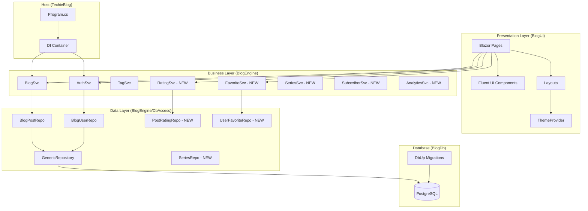

# 5. Component Architecture

### 5.1 Project Structure (Target: 5 Projects)

```
TechieBlog.sln
├── BlogDb/                    # Database migrations only
│   ├── PostgresScripts/       # NEW: PostgreSQL migration scripts
│   ├── MySqlScripts/          # DEPRECATED: Keep for reference
│   └── BlogDbSvc.cs           # DbUp runner
├── BlogModel/                 # Domain models, interfaces, DTOs
│   ├── Models/                # Entity classes
│   ├── Interfaces/            # Repository & service interfaces
│   └── Common/                # Constants, encryption utilities
├── BlogEngine/                # Business logic layer
│   ├── Services/              # Business services (AuthSvc, BlogSvc, etc.)
│   ├── DbAccess/              # Repository implementations
│   ├── DaCore/                # Data access core (GenericRepository, DbConnectionFactory)
│   └── BlogSvcInitializer.cs  # DI registration helper
├── BlogUI/                    # Razor Class Library
│   ├── Pages/                 # All Blazor pages
│   │   ├── BlogPages/         # Public-facing pages
│   │   ├── AdminPages/        # Admin management pages
│   │   ├── UserPages/         # NEW: User dashboard pages
│   │   └── AuthPages/         # NEW: Authentication pages
│   ├── Components/            # Reusable Fluent UI components
│   ├── Layouts/               # Page layouts (Main, Admin, Auth)
│   ├── Themes/                # NEW: CSS variable theme files
│   └── Common/                # Auth state provider, utilities
└── TechieBlog/                # Blazor Server host
    ├── Program.cs             # Entry point, DI, middleware
    ├── Services/              # Host-specific services
    └── wwwroot/               # Static assets, CSS
```

**BlogSvc Project: REMOVED** - No longer needed; UI calls BlogEngine services directly.

### 5.2 New Components

#### ThemeService Component

- **Responsibility:** Manage theme selection, light/dark mode toggle, CSS variable injection
- **Integration Points:** LocalStorage, SiteSettings, Layout components
- **Key Interfaces:**
  - `GetCurrentTheme(): string`
  - `SetTheme(themeName: string): void`
  - `ToggleDarkMode(): void`
  - `GetAvailableThemes(): List<ThemeInfo>`
- **Dependencies:**
  - **Existing Components:** Blazored.LocalStorage, SiteSettings repository
  - **New Components:** ThemeProvider Blazor component
- **Technology Stack:** C# service + CSS custom properties + Fluent UI theming

#### MarkdownEditorComponent

- **Responsibility:** Markdown editing with live preview for post creation
- **Integration Points:** Post editor page, Draft preview
- **Key Interfaces:**
  - `Content: string` (two-way binding)
  - `OnContentChanged: EventCallback<string>`
  - `Preview: MarkupString` (rendered HTML)
- **Dependencies:**
  - **Existing Components:** None
  - **New Components:** Markdown parsing library (Markdig)
- **Technology Stack:** Blazor component + Markdig + Fluent UI TextArea

#### RatingComponent

- **Responsibility:** Display and capture star ratings (1-5)
- **Integration Points:** Blog post page, post cards
- **Key Interfaces:**
  - `PostId: long`
  - `CurrentRating: int`
  - `AverageRating: decimal`
  - `OnRatingChanged: EventCallback<int>`
- **Dependencies:**
  - **Existing Components:** AuthStateProvider (for user context)
  - **New Components:** RatingSvc, PostRatingRepo
- **Technology Stack:** Fluent UI Rating or custom star component

#### FavoriteToggleComponent

- **Responsibility:** Toggle favorite/bookmark status on posts
- **Integration Points:** Blog post page, post cards, My Favorites page
- **Key Interfaces:**
  - `PostId: long`
  - `IsFavorited: bool`
  - `OnToggle: EventCallback<bool>`
- **Dependencies:**
  - **Existing Components:** AuthStateProvider
  - **New Components:** FavoriteSvc, UserFavoriteRepo
- **Technology Stack:** Fluent UI Button with icon toggle

### 5.3 Component Interaction Diagram



---

