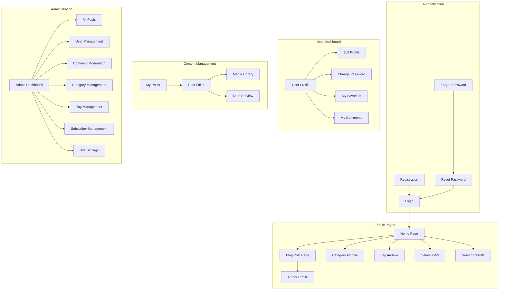
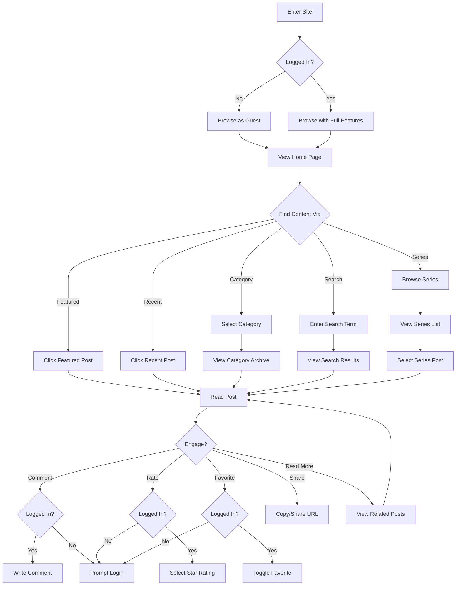
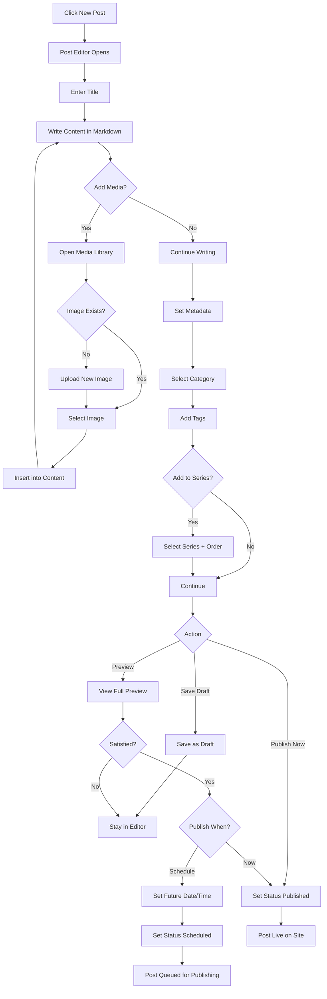
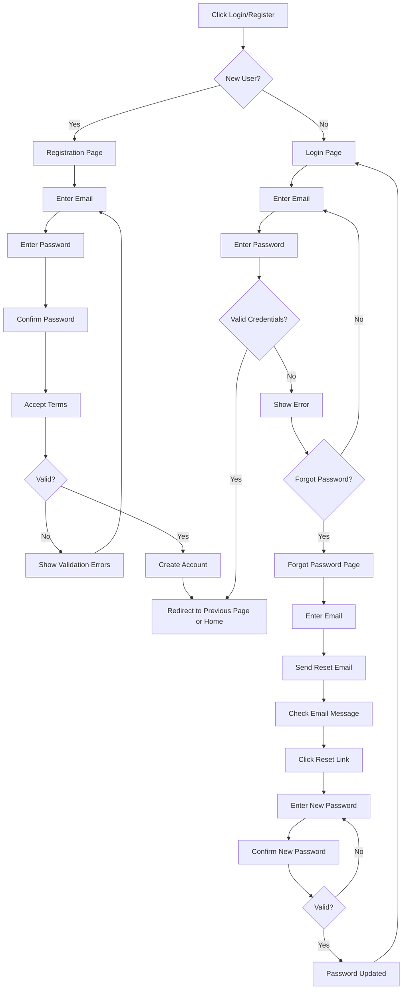
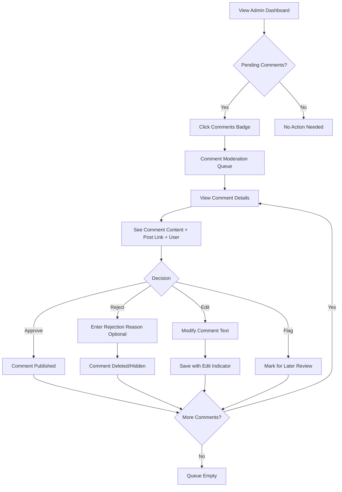

# TechieBlog 2.0 UI/UX Specification

**Version:** 1.0
**Date:** December 16, 2025
**Status:** Draft
**Author:** Sally (UX Expert)

---

## 1. Introduction

This document defines the user experience goals, information architecture, user flows, and visual design specifications for **TechieBlog 2.0**'s user interface. It serves as the foundation for visual design and frontend development, ensuring a cohesive and user-centered experience.

### 1.1 Overall UX Goals & Principles

#### Target User Personas

**Primary Persona: .NET Developer (Template User)**
- Mid-level to senior .NET developer
- Familiar with C#, ASP.NET Core basics
- Learning or experienced with Blazor
- Needs blog functionality for personal or client projects
- Values clean, readable code they can learn from and customize
- Comfortable with command-line operations

**Secondary Persona: Blog Reader**
- End users of TechieBlog-powered sites
- Seeks clean reading experience without clutter
- May want to engage via comments and ratings
- Values quick page loads and mobile-friendly design

**Tertiary Persona: Content Contributor**
- Authors and editors creating blog content
- Needs intuitive Markdown editor with preview
- Values efficient workflows for draft → preview → publish

#### Usability Goals

1. **Clone-to-Run Speed:** Developer can clone, build, and run locally in < 5 minutes
2. **Architecture Clarity:** Developer understands project structure in < 1 hour
3. **Theme Customization:** Colors and fonts changeable in < 4 hours via CSS variables only
4. **Content-First Reading:** Readers focus on content, not chrome
5. **Efficient Authoring:** Authors can create and publish posts with minimal friction
6. **Mobile Responsiveness:** Seamless experience across all device sizes

#### Design Principles

1. **Clarity over Cleverness** — Prioritize clear communication over aesthetic innovation
2. **Content-First** — Minimize UI chrome; maximize focus on blog content
3. **Progressive Disclosure** — Show only what's needed, when it's needed
4. **Consistent Fluent Patterns** — Use Microsoft Fluent UI components consistently
5. **Immediate Feedback** — Every action has clear, immediate visual response

### 1.2 Change Log

| Date | Version | Description | Author |
|------|---------|-------------|--------|
| 2025-12-16 | 1.0 | Initial UI/UX Specification created | Sally (UX Expert) |

---

## 2. Information Architecture (IA)

### 2.1 Site Map / Screen Inventory



### 2.2 Navigation Structure

**Primary Navigation (Header):**
- Site Logo/Title (links to Home)
- Home
- Categories (dropdown with category list)
- Series
- Search (icon that expands to search input)
- **Theme Toggle (Light/Dark mode switch)** - User preference stored in localStorage
- User Menu (Login/Register or User Avatar with dropdown)

**Secondary Navigation (Sidebar - Context Dependent):**
- **Public Pages:** Recent Posts, Categories List, Tags Cloud, Subscribe Form
- **User Dashboard:** Profile, Favorites, Comments, Settings
- **Content Management:** My Posts, New Post, Media Library
- **Admin:** Dashboard, Posts, Users, Comments, Categories, Tags, Subscribers, Settings

**Breadcrumb Strategy:**
- Enabled on all pages except Home
- Format: `Home > Category > Post Title` or `Admin > Users > Edit User`
- Truncate long titles with ellipsis
- Always clickable for navigation

**Footer Navigation:**
- About (optional static page)
- RSS Feed
- Copyright notice

---

## 2.3 Theming Architecture

TechieBlog implements a two-level theming system:

### User-Level: Light/Dark Mode
- **Toggle Location:** Header (always visible)
- **Storage:** User preference stored in localStorage (or user profile if logged in)
- **Default:** Follows system preference (`prefers-color-scheme`)
- **Scope:** Affects all pages (public, dashboard, admin)

### Site-Level: Visual Themes
- **Selection:** Admin configures via Site Settings
- **Scope:** Affects public-facing pages only (Home, Blog Post, Category, Tag, Series, Search, Author Profile)
- **Pre-built Themes:**
  1. **Fluent Modern** (Default) - Clean, professional Microsoft Fluent-inspired design
  2. **Developer Dark** - Code editor-inspired with syntax highlighting colors, monospace accents
  3. **Minimal Clean** - Typography-focused, generous whitespace, serif headings

Each site theme includes both light and dark mode variants (6 total combinations).

### CSS Variable Structure
```css
/* Base theme variables (shared) */
:root {
  --font-family-primary: ...;
  --spacing-*: ...;
  --border-radius-*: ...;
}

/* Light mode (default) */
:root[data-theme="light"] {
  --color-background: #ffffff;
  --color-surface: #f5f5f5;
  --color-text-primary: #323130;
  /* ... */
}

/* Dark mode */
:root[data-theme="dark"] {
  --color-background: #1f1f1f;
  --color-surface: #2d2d2d;
  --color-text-primary: #e0e0e0;
  /* ... */
}

/* Site theme overrides */
:root[data-site-theme="developer"] { ... }
:root[data-site-theme="minimal"] { ... }
```

---

## 3. User Flows

### 3.1 Reader: Browse and Read Posts

**User Goal:** Find and read interesting blog content

**Entry Points:** Direct URL, Home Page, Search, Category/Tag Archive

**Success Criteria:** Reader finds relevant content and engages (reads, comments, rates)

#### Flow Diagram



**Edge Cases & Error Handling:**
- Post not found: Display 404 page with search suggestion
- Empty search results: Show "No results found" with suggestions
- Rate limit on comments: Display throttle message
- Comment too long: Inline validation before submit

**Notes:** The reading experience should feel fast and distraction-free. Minimize prompts for login until user actively tries to engage.

---

### 3.2 Author: Create and Publish Post

**User Goal:** Write and publish a blog post

**Entry Points:** "New Post" button from dashboard or My Posts page

**Success Criteria:** Post is published and visible on public site

#### Flow Diagram



**Edge Cases & Error Handling:**
- Auto-save failure: Display warning, allow manual save
- Image upload failure: Show error with retry option
- Slug conflict: Auto-append number, allow manual edit
- Session timeout: Preserve content in local storage, prompt re-login
- Validation errors: Highlight fields inline, scroll to first error

**Notes:** Auto-save every 30 seconds during editing. Warn before navigating away with unsaved changes.

---

### 3.3 User: Registration and Login

**User Goal:** Create account or access existing account

**Entry Points:** Login/Register links in header, engagement prompts on posts

**Success Criteria:** User authenticated and redirected to intended destination

#### Flow Diagram



**Edge Cases & Error Handling:**
- Email already registered: Clear message with login link
- Weak password: Real-time strength indicator with requirements
- Reset token expired: Clear message with option to request new link
- Too many failed logins: Rate limiting with lockout message

**Notes:** Remember last page visited to redirect after successful auth. Consider "Remember me" option for extended sessions.

---

### 3.4 Admin: Moderate Comments

**User Goal:** Review and approve/reject pending comments

**Entry Points:** Admin Dashboard notification, Comment Moderation page

**Success Criteria:** All pending comments processed (approved, rejected, or flagged for later)

#### Flow Diagram



**Edge Cases & Error Handling:**
- Bulk selection: Allow select all, approve all, reject all selected
- Comment with reported content: Highlight with warning indicator
- User banned while comment pending: Auto-reject with notification
- Concurrent moderation: Handle optimistic updates with conflict resolution

**Notes:** Show post preview in modal to provide context. Enable keyboard shortcuts for rapid moderation (A=approve, R=reject, N=next).

---

## 4. Wireframes & Mockups

**Primary Design Files:** To be created in Figma/design tool

### 4.1 Key Screen Layouts

#### Home Page

**Purpose:** Welcome visitors, showcase featured and recent content, enable content discovery

**Key Elements:**
- Hero section with featured post(s)
- Recent posts grid (3-column on desktop, 1-column on mobile)
- Sidebar with categories, tags, and subscribe form
- Pagination or "Load More" for additional posts

**Interaction Notes:** Featured posts can rotate or be manually curated by admin. Post cards show title, excerpt, author, date, category, and thumbnail.

---

#### Blog Post Page

**Purpose:** Display full article content with engagement options

**Key Elements:**
- Article header (title, author, date, category, reading time)
- Markdown-rendered content area
- Series navigation (if part of series)
- Author bio card
- Star rating widget
- Comments section
- Related posts

**Interaction Notes:** Sticky table of contents for long articles (optional). Social sharing buttons. Favorite toggle button.

---

#### Post Editor

**Purpose:** Create and edit blog posts with Markdown

**Key Elements:**
- Title input field
- Split-pane Markdown editor (edit | preview)
- Formatting toolbar (bold, italic, headers, links, images, code)
- Metadata sidebar (category, tags, series, featured image, scheduling)
- Action buttons (Save Draft, Preview, Publish)

**Interaction Notes:** Auto-save indicator. Unsaved changes warning. Media library modal. Full-screen distraction-free mode option.

---

#### Admin Dashboard

**Purpose:** Overview of blog statistics and quick access to admin functions

**Key Elements:**
- Statistics cards (total posts, users, comments, subscribers, views)
- Quick action buttons (New Post, Moderate Comments, etc.)
- Recent activity feed
- Simple charts (posts over time, views trend)

**Interaction Notes:** Cards link to detailed management pages. Badge indicators for items needing attention (pending comments, scheduled posts).

---

## 5. Component Library / Design System

**Design System Approach:** Microsoft Fluent UI Blazor as the foundation, extended with custom theming via CSS variables

### 5.1 Core Components

#### FluentButton

**Purpose:** Primary action trigger throughout the application

**Variants:** Primary, Secondary, Outline, Subtle, Stealth

**States:** Default, Hover, Active, Disabled, Loading

**Usage Guidelines:** Use Primary for main page action, Secondary for alternative actions, Outline for less emphasis. Always include clear action labels.

---

#### FluentCard

**Purpose:** Container for related content (post cards, stat cards, user cards)

**Variants:** Default, Elevated, Outlined

**States:** Default, Hover (when clickable), Selected

**Usage Guidelines:** Use for post listings, dashboard stats, and grouped information. Maintain consistent padding and spacing.

---

#### FluentDataGrid

**Purpose:** Display tabular data in admin interfaces

**Variants:** Default, Compact

**States:** Loading, Empty, Error, Sortable columns, Selectable rows

**Usage Guidelines:** Use for post lists, user management, comment moderation. Enable sorting on relevant columns. Include pagination for large datasets.

---

#### FluentTextField / FluentTextArea

**Purpose:** Text input for forms and editors

**Variants:** Standard, Outlined, Underlined

**States:** Default, Focus, Error, Disabled, ReadOnly

**Usage Guidelines:** Use TextField for single-line inputs, TextArea for multi-line. Always include labels and validation messages.

---

#### FluentNavMenu

**Purpose:** Navigation sidebar for all page sections

**Variants:** Expanded, Collapsed (icon-only)

**States:** Default, Active (current page), Hover

**Usage Guidelines:** Use for main navigation. Group related items under expandable sections. Highlight current location.

---

#### PostCard (Custom)

**Purpose:** Display post summary in listings

**Variants:** Default (with image), Compact (no image), Featured (large)

**States:** Default, Hover, Loading skeleton

**Usage Guidelines:** Consistent sizing in grids. Show title, excerpt (truncated), author avatar, date, category badge, rating stars.

---

#### MarkdownEditor (Custom)

**Purpose:** Write and preview Markdown content

**Variants:** Split-pane, Toggle (edit/preview), Full-screen

**States:** Default, Saving, Error

**Usage Guidelines:** Include formatting toolbar. Sync scroll between editor and preview. Support drag-drop image upload.

---

#### StarRating (Custom)

**Purpose:** Display and collect star ratings

**Variants:** Display-only, Interactive

**States:** Empty, Partial, Full, Hover (for interactive)

**Usage Guidelines:** 1-5 stars. Show average and count for display. Allow click/tap to rate for interactive.

---

## 6. Branding & Style Guide

**Brand Guidelines:** CSS variable-based theming allows complete visual customization without code changes

### 6.1 Color Palette

| Color Type | Hex Code (Light) | Hex Code (Dark) | Usage |
|------------|------------------|-----------------|-------|
| Primary | `#0078D4` | `#4DA6FF` | Primary actions, links, active states |
| Secondary | `#6B6B6B` | `#A0A0A0` | Secondary text, borders |
| Accent | `#107C10` | `#54B054` | Success states, positive indicators |
| Background | `#FFFFFF` | `#1F1F1F` | Page background |
| Surface | `#F5F5F5` | `#2D2D2D` | Card backgrounds, elevated surfaces |
| Success | `#107C10` | `#54B054` | Positive feedback, confirmations |
| Warning | `#FFB900` | `#FFD966` | Cautions, important notices |
| Error | `#D13438` | `#FF6B6E` | Errors, destructive actions |
| Neutral | `#323130` | `#E0E0E0` | Primary text |

### 6.2 Typography

#### Font Families
- **Primary:** Segoe UI, -apple-system, BlinkMacSystemFont, sans-serif
- **Secondary:** Segoe UI (same as primary for consistency with Fluent)
- **Monospace:** Cascadia Code, Consolas, monospace (for code blocks)

#### Type Scale

| Element | Size | Weight | Line Height |
|---------|------|--------|-------------|
| H1 | 32px / 2rem | 600 | 1.25 |
| H2 | 24px / 1.5rem | 600 | 1.3 |
| H3 | 20px / 1.25rem | 600 | 1.4 |
| Body | 16px / 1rem | 400 | 1.6 |
| Small | 14px / 0.875rem | 400 | 1.5 |

### 6.3 Iconography

**Icon Library:** Fluent UI System Icons (via @fluentui/svg-icons or built-in Fluent Blazor icons)

**Usage Guidelines:**
- Use consistent icon sizes (16px for inline, 20px for buttons, 24px for navigation)
- Always pair icons with text labels in navigation
- Use filled icons for active/selected states, regular for default
- Ensure sufficient contrast for accessibility

### 6.4 Spacing & Layout

**Grid System:**
- 12-column grid for layouts
- Gutter: 16px (mobile), 24px (tablet), 32px (desktop)
- Max content width: 1200px

**Spacing Scale:** Based on 4px base unit
- `--spacing-xs`: 4px
- `--spacing-sm`: 8px
- `--spacing-md`: 16px
- `--spacing-lg`: 24px
- `--spacing-xl`: 32px
- `--spacing-2xl`: 48px
- `--spacing-3xl`: 64px

---

## 7. Accessibility Requirements

### 7.1 Compliance Target

**Standard:** WCAG 2.1 Level AA

### 7.2 Key Requirements

**Visual:**
- Color contrast ratios: Minimum 4.5:1 for normal text, 3:1 for large text
- Focus indicators: Visible 2px solid outline on all interactive elements
- Text sizing: Support up to 200% zoom without horizontal scrolling

**Interaction:**
- Keyboard navigation: All functionality accessible via keyboard
- Screen reader support: Proper ARIA labels, roles, and live regions
- Touch targets: Minimum 44x44px for touch devices

**Content:**
- Alternative text: All images have descriptive alt text
- Heading structure: Proper H1-H6 hierarchy, single H1 per page
- Form labels: All inputs have associated labels, error messages linked to fields

### 7.3 Testing Strategy

- Automated testing with axe-core or similar tool
- Manual keyboard navigation testing for all flows
- Screen reader testing (NVDA, VoiceOver) for critical paths
- Color contrast validation using browser dev tools
- Responsive zoom testing at 200%

---

## 8. Responsiveness Strategy

### 8.1 Breakpoints

| Breakpoint | Min Width | Max Width | Target Devices |
|------------|-----------|-----------|----------------|
| Mobile | 320px | 767px | Phones |
| Tablet | 768px | 1199px | Tablets, small laptops |
| Desktop | 1200px | 1599px | Laptops, monitors |
| Wide | 1600px | - | Large monitors |

### 8.2 Adaptation Patterns

**Layout Changes:**
- Mobile: Single column, stacked layout, full-width cards
- Tablet: Two-column layout, collapsible sidebar
- Desktop: Three-column layout with sidebar, optimized reading width
- Wide: Centered content with generous margins

**Navigation Changes:**
- Mobile: Hamburger menu with slide-out drawer
- Tablet: Collapsible sidebar (icons only when collapsed)
- Desktop: Full sidebar with labels

**Content Priority:**
- Mobile: Hide secondary sidebar content, show above/below main content
- Tablet: Collapsible sidebar sections
- Desktop: Full sidebar with all widgets

**Interaction Changes:**
- Mobile: Larger touch targets (48px minimum), swipe gestures for navigation
- Tablet: Hybrid touch/mouse support
- Desktop: Hover states, keyboard shortcuts

---

## 9. Animation & Micro-interactions

### 9.1 Motion Principles

1. **Purposeful:** Animation should guide attention and provide feedback, never distract
2. **Fast:** Animations should feel snappy (150-300ms max for most transitions)
3. **Natural:** Use easing curves that feel organic (ease-out for enters, ease-in for exits)
4. **Accessible:** Respect prefers-reduced-motion media query

### 9.2 Key Animations

- **Page Transitions:** Fade in content (Duration: 200ms, Easing: ease-out)
- **Button Hover:** Subtle background color shift (Duration: 150ms, Easing: ease)
- **Card Hover:** Slight elevation increase with shadow (Duration: 200ms, Easing: ease-out)
- **Modal Open:** Fade in backdrop + scale up modal (Duration: 250ms, Easing: ease-out)
- **Toast Notifications:** Slide in from top-right (Duration: 300ms, Easing: ease-out)
- **Skeleton Loading:** Shimmer effect for loading states (Duration: 1500ms, Easing: linear, infinite)
- **Star Rating Hover:** Scale up star on hover (Duration: 100ms, Easing: ease)
- **Favorite Toggle:** Heart pulse animation on toggle (Duration: 300ms, Easing: ease-out)

---

## 10. Performance Considerations

### 10.1 Performance Goals

- **Page Load:** Initial load under 2 seconds on broadband
- **Interaction Response:** UI response within 100ms of user action
- **Animation FPS:** 60fps for all animations

### 10.2 Design Strategies

- **Lazy Loading:** Images below the fold load on scroll
- **Skeleton Screens:** Show loading placeholders instead of spinners
- **Optimized Images:** WebP format, responsive srcset, appropriate sizing
- **Minimal Animation:** Keep animations short and GPU-accelerated (transform, opacity)
- **Component Virtualization:** Virtualize long lists (posts, comments, users)
- **Above-the-Fold Priority:** Critical CSS inlined, defer non-critical styles
- **Icon Optimization:** Use SVG icons, consider icon sprites or font icons

---

## 11. Next Steps

### 11.1 Immediate Actions

1. Review and approve this UI/UX Specification with stakeholders
2. Create high-fidelity mockups in Figma for key screens (Home, Post, Editor, Dashboard)
3. Define CSS custom properties file with all theme variables
4. Build component library samples with Fluent UI
5. Begin Phase 1 UI scaffolding per PRD stories 1.6-1.12

### 11.2 Design Handoff Checklist

- [x] All user flows documented
- [x] Component inventory complete
- [x] Accessibility requirements defined
- [x] Responsive strategy clear
- [x] Brand guidelines incorporated
- [x] Performance goals established
- [ ] High-fidelity mockups created (Figma)
- [ ] CSS theme variables file created
- [ ] Component examples built
- [ ] Developer handoff meeting scheduled

---

## 12. Checklist Results

*To be completed after UI/UX checklist review*

---

*Generated by Sally (UX Expert) — BMAD Framework*
*Document Creation Date: December 16, 2025*
