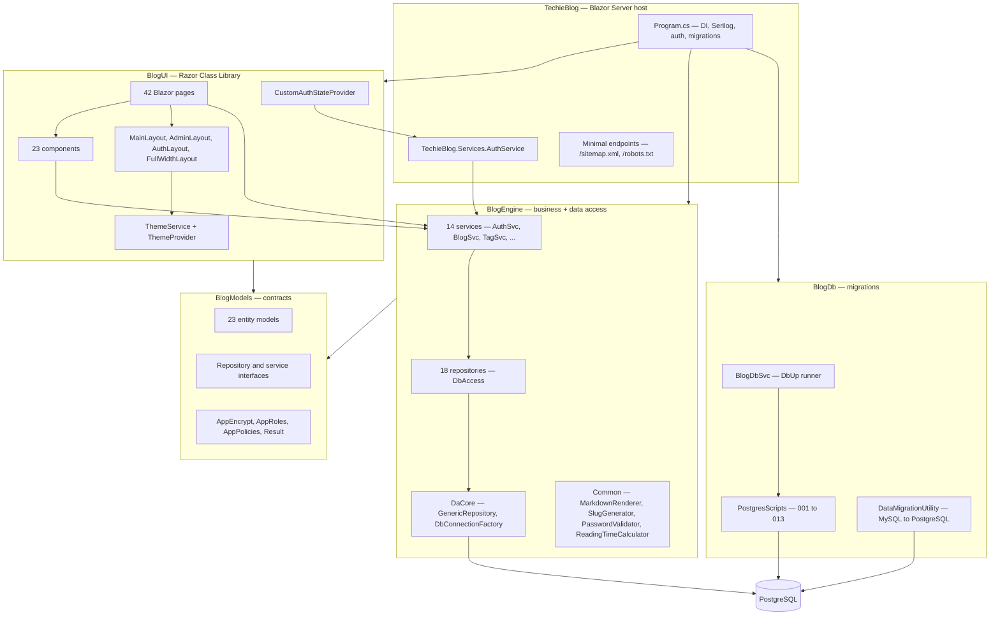
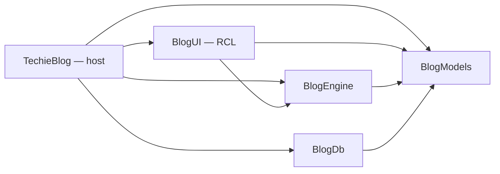
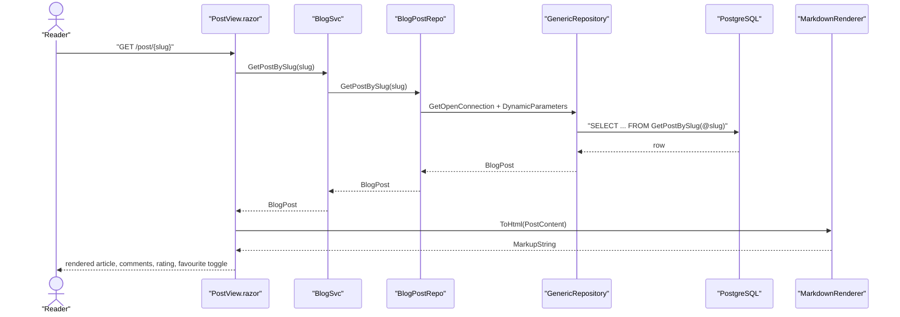
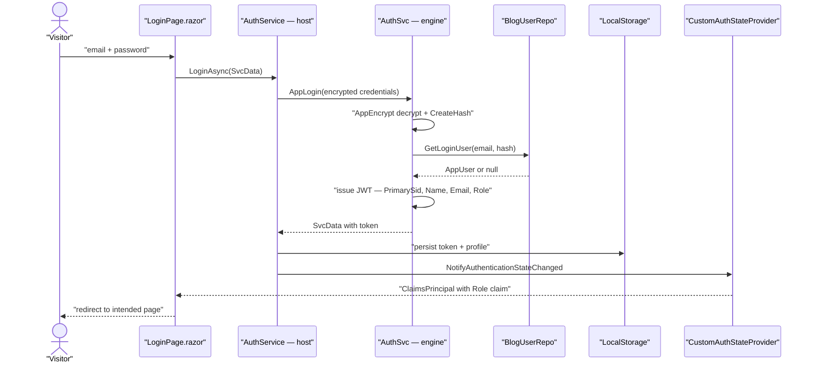
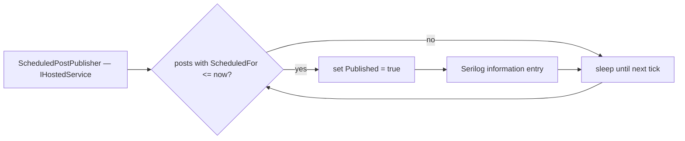
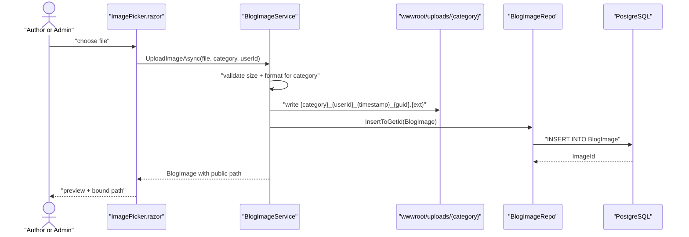
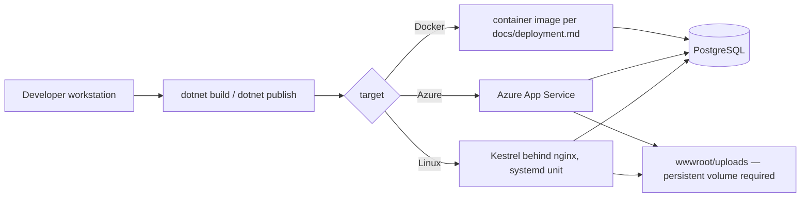
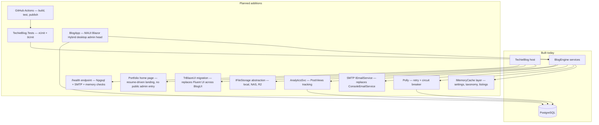

# TechieBlog — Architecture

**Last updated:** 2026-08-06
**Status:** Current (brownfield) — as-built reverse-documentation of the working tree, plus the planned deltas the source docs still call for. Amended 2026-08-06: TrBlazeUI adoption (ADR-010), portfolio home + hidden admin entry (ADR-011), BlogApp MAUI desktop head (ADR-012), anonymous engagement (ADR-013), no public author pages (ADR-014), verification + self-hosted captcha (ADR-015), public newsletter archive (ADR-016) — all planned deltas, not yet built.

<!-- AGENT-ONLY AUTHORING NOTES. Everything in this comment is an instruction to the DRAFTING
     AGENT, not content for the document's human reader.

  DEPTH MANDATE: this is a HUMAN document, read as rendered HTML. Module rows in §4 with
  non-trivial behavior get a prose paragraph beneath the table, and every significant runtime
  flow beyond §3's primary path gets its own sequenceDiagram/flowchart. When harvesting source
  docs, preserve their architecture content — superset, never summary.

  MERMAID MANDATE: every diagram MUST follow the authoring rules in
  .tfcore/templates/v4custom/html-render-shell.md §5.5 — quote every node/edge/subgraph label
  and never use `end` as a node id.
-->

## Table of Contents

1. [Tech stack](#tech-stack)
2. [Component map](#component-map)
3. [Data flow — primary path](#data-flow-primary-path)
4. [Module responsibilities](#module-responsibilities)
5. [Cross-cutting concerns](#cross-cutting-concerns)
6. [Deployment architecture](#deployment-architecture)
7. [Architectural decisions (ADR-style log)](#architectural-decisions-adr-style-log)
8. [Target architecture — planned deltas](#target-architecture-planned-deltas)
9. [Open questions / risks](#open-questions-risks)
10. [Sources harvested](#sources-harvested)

---

## 1. Tech stack

Verified from the five `.csproj` files under `source/` on 2026-08-02. The migration described in the
2025-12 source docs (MySQL → PostgreSQL, Blazorise → Fluent UI, .NET 9 → .NET 10) is **complete** —
every project targets `net10.0`, Blazorise is gone, and Npgsql/dbup-postgresql are in place.

| Layer | Choice | Version | Notes |
|-------|--------|---------|-------|
| Runtime | .NET | `net10.0` (LTS) | All 5 projects. Migration from .NET 9 done (Story 1.1). |
| UI | Blazor **Server** (interactive server render mode) | 10.0 | `AddInteractiveServerComponents`, `DetailedErrors = true` in `Program.cs`. No WASM head. |
| UI component library | Microsoft.FluentUI.AspNetCore.Components | `4.*` (floats → 4.14.4) | Replaced Blazorise (Story 1.4). **The floating `4.*` is the current build blocker — see §9.** **Being replaced by TrBlazeUI (ADR-010, 2026-08-06) — migration pending (REQ-UI-048); removal also retires the blocker.** |
| Icons | Microsoft.FluentUI.AspNetCore.Components.Icons | `4.*` | Retires with the Fluent UI removal; TrBlazeUI bundles Lucide / Heroicons / Feather icon sets. |
| DB | PostgreSQL | Npgsql 9.0.2 | Migrated from MySQL 9.1.0 (Story 1.3). MySQL scripts retained read-only for reference. |
| ORM | Dapper | 2.1.35 | Micro-ORM; repositories call PostgreSQL stored functions and parameterised SQL. |
| DB migrations | DbUp (`dbup-postgresql`) | 6.0.3 | 12 numbered scripts in `source/BlogDb/PostgresScripts/`, run automatically at host startup. |
| Auth | Custom JWT + cookie scheme `BlazorServerAuth` | `System.IdentityModel.Tokens.Jwt` 8.2.1 | Token issued by `AuthSvc`, surfaced to Blazor via `CustomAuthStateProvider`. |
| Logging | Serilog | `Serilog.AspNetCore` 8.0.3, `Serilog.Sinks.File` 7.0.0 | Console + daily rolling file `logs/techieblog-.log`, 7-file retention. |
| Markdown | Markdig | 0.44.0 | `BlogEngine/Common/MarkdownRenderer.cs`, registered as a singleton. |
| Client storage | Blazored.LocalStorage | 4.5.0 | Theme + dark-mode preference (`techieblog-theme`, `techieblog-dark-mode`). |
| Formatting | Humanizer.Core | 2.14.1 | Relative dates in listings. |
| TrBlazeUI | `TrBlazeUI.Components` (GitHub Packages feed) | latest | **Adopted 2026-08-06 (ADR-010), not yet installed.** shadcn/ui-compatible, CSS-variable theming, `.dark` dark mode, `<PortalHost />` required in root layouts. Owner supplies feed credentials in `nuget.config`. TechieRag remains unused — no AI/RAG features, no `REQ-RAG-*`. |

**Not present despite appearing in the 2025-12 architecture doc as "mandatory":** Polly resilience
policies, `IMemoryCache` caching layer, ASP.NET health checks, and any test project. Those sections
were forward-looking design, never built — they are carried into §8 as planned deltas rather than
described here as if they exist.

## 2. Component map

**Project reference graph** (from `<ProjectReference>` elements — this is the enforced dependency
direction; nothing points "up"):

`BlogModels` has no project references at all — it is the leaf every other project depends on. The
**BlogSvc REST API project was removed** (Story 1.2); the UI calls `BlogEngine` services directly
through DI, with no HTTP hop.

## 3. Data flow — primary path

The dominant request shape is *reader opens a published post*. Note there is no API layer: the
Blazor circuit calls the service in-process.

**Authentication handshake** — the second significant flow. `AuthSvc` (engine) issues the JWT;
`TechieBlog.Services.AuthService` (host) wraps it; `CustomAuthStateProvider` (UI) turns it into a
Blazor `AuthenticationState`, and the token is persisted in browser local storage:

**Scheduled publishing** — a background `IHostedService` that promotes scheduled posts without any
user request:

**Image upload** — the newest subsystem (resume/multi-author epic), with per-category validation and
disk storage under the RCL's `wwwroot`:

## 4. Module responsibilities

| Module | Responsibility | Depends on |
|--------|----------------|------------|
| `source/TechieBlog` | Blazor Server host. DI composition, Serilog bootstrap, cookie auth + 5 authorization policies, automatic DbUp migration at startup, static files, `/sitemap.xml` and `/robots.txt` endpoints, host-side `AuthService` façade. | BlogUI, BlogEngine, BlogModels, BlogDb |
| `source/BlogUI` | Razor Class Library holding **all** UI: 42 pages, 23 components, 4 layouts, 4 CSS themes, `ThemeService`, `CustomAuthStateProvider`. Kept as an RCL so a future MAUI Blazor Hybrid desktop head can reuse it — now planned as `BlogApp` (ADR-012, 2026-08-06). | BlogEngine, BlogModels |
| `source/BlogEngine` | Business logic + data access. 14 services (`Services/`), 18 Dapper repositories (`DbAccess/`), the generic data-access core (`DaCore/`), and shared helpers (`Common/`). Exposes `BlogSvcInitializer.Initialize` as the single DI registration entry point. | BlogModels |
| `source/BlogModel` (assembly `BlogModels`) | Contracts only: 23 entity models, repository/service interfaces, `AppEncrypt`, `AppRoles`/`AppPolicies`, `Result<T>`. No project references — the dependency leaf. | (none) |
| `source/BlogDb` | Database lifecycle. `BlogDbSvc` runs DbUp against `PostgresScripts/`; `DataMigrationUtility` + `MigrationRunner` provide the one-off MySQL → PostgreSQL data copy (also usable as a CLI, `OutputType=Exe`). | BlogModels |
| `source/BlogApp` *(planned, 2026-08-06 — ADR-012)* | MAUI Blazor Hybrid desktop head (Windows + macOS) hosting the complete admin experience. Reuses `BlogUI` pages/layouts and `BlogEngine` services in-process; first-run connection-setup screen stores the site's PostgreSQL connection string in platform secure storage. No local database, no sync — requires network reach to the site DB. | BlogUI, BlogEngine, BlogModels |

### 4.1 `BlogEngine.Services` — what each service owns

`BlogSvc` is the widest surface: post CRUD, slug lookup, publication state, featured/recent
selection, category- and tag-filtered listings, paging counts, draft saving, and full-text search
(`SearchPosts` uses PostgreSQL `ILIKE` across Title/Abstract/PostContent/Tags). It returns
`Result<BlogPost>` for mutations so pages can surface failures without exception handling.

`AuthSvc` owns the whole identity story — signup, login, token lookup (`GetUserByToken`),
registration with `PasswordValidator`, password-reset request/validate/reset, profile read/update,
and password change. Credentials arrive wrapped in `SvcData` and are decrypted with `AppEncrypt`
before hashing; the JWT carries `PrimarySid`, `Name`, `Email`, `Role`.

`CommentSvc` covers the moderation workflow: per-post comment retrieval, the pending queue, paged
admin views (approved and unapproved), add/approve/delete/update, plus `GetAdminCounts` which feeds
the admin dashboard tiles.

`TagSvc` and `CategorySvc` are the taxonomy pair. `TagSvc` additionally owns the post↔tag junction
(`GetTagsForPost` / `SetTagsForPost`), inline tag creation (`GetOrCreateTag`) and autocomplete
(`SearchTags`). `SeriesSvc` groups posts into ordered series and computes previous/next navigation
(`GetSeriesNavigation`, `GetNextPartNumber`).

`RatingSvc` and `FavoriteSvc` implement the engagement features — one rating per user per post with
change support and aggregate stats (`PostRatingStats`), and a toggle-style favourites store with
per-user and per-post counts.

`SubscriberSvc` handles subscribe/unsubscribe, status filtering, search, and export projection.
**Newsletter *sending* is not implemented** — there is no SMTP sender; `IEmailService` has a single
implementation, `ConsoleEmailService`, which logs the password-reset email instead of sending it.

`BlogImageService` (interface in `BlogModels.Interfaces.IBlogImageService`) performs category-scoped
upload validation, unique filename generation, disk write under `wwwroot/uploads/{category}/`, and
DB metadata capture. `SitemapSvc` renders the sitemap XML consumed by the host endpoint.
`ScheduledPostPublisher` is the only `IHostedService`.

### 4.2 `BlogEngine.DaCore` — the repository base

`GenericRepository<T>` supplies `GetOpenConnection()` plus the CRUD shape every repository inherits
(`GetSingle`, `GetAll`, `Insert`, `InsertToGetId`, `Update`, `GetPagedData`). `DbConnectionFactory`
builds `NpgsqlConnection` instances from the connection string passed to
`BlogSvcInitializer.Initialize`. Every repository is registered as `Transient` with the connection
string closed over in the factory lambda — there is **no** `IOptions`/config injection inside the
engine, which keeps `BlogEngine` free of a hosting dependency.

### 4.3 `BlogUI` page families

| Folder | Pages | Access |
|--------|-------|--------|
| `Pages/BlogPages` | Home, PostView, CategoryArchive, TagArchive, SeriesView, SearchResults, AuthorsPage, AuthorProfilePage, About, RssFeed | Anonymous |
| `Pages/` (root) | ResumePage (`/resume`, `FullWidthLayout`), AccessDenied | Anonymous |
| `Pages/UserPages` | MyFavorites | `[Authorize]` |
| `Pages/AdminPages` (auth screens) | LoginPage, RegisterPage, ForgotPasswordPage, ResetPasswordPage, 404Page | Anonymous, `AuthLayout` |
| `Pages/AdminPages` (authoring) | ManagePost, PreviewPost, ManageSeries, SeriesList, ManageProfile, ManageExperience, ManageSkills, ManageAwards | `AuthorOrAbove` |
| `Pages/AdminPages` (editorial) | AdminDashboard, BlogsList, CommentsList, ManageComments | `EditorOrAbove` |
| `Pages/AdminPages` (admin) | UsersList, AddUser, CategoriesList, ManageCategory, TagsList, ManageTag, SubscribersList, Settings, ManageImages | `AdminOnly` |
| `Pages/AdminPages` (self) | ProfilePage | `[Authorize]` |
| `Pages/UiElements` | FluentDemo | dev-only sample page |

## 5. Cross-cutting concerns

**Logging — Serilog, wired at the head (compliant).** `Program.cs` configures the logger *before*
`WebApplication.CreateBuilder`, with a console sink and a daily rolling file sink at
`logs/techieblog-.log` (7 files retained), machine/environment enrichers, and per-namespace level
overrides. `builder.Host.UseSerilog()` routes all `ILogger<T>` output through it, and
`UseSerilogRequestLogging` adds an HTTP access line per request. Startup is wrapped in
`try/catch → Log.Fatal` with `Log.CloseAndFlush()` in `finally`. The class libraries correctly
reference only `Microsoft.Extensions.Logging.Abstractions` — Serilog is a host-only dependency. This
satisfies the TechieFlow standing observability requirement; the remaining gap is
`AppDomain.UnhandledException` / `TaskScheduler.UnobservedTaskException` handlers, which are absent.

**Authentication & authorization.** Cookie scheme `BlazorServerAuth` (login `/login`, access-denied
`/access-denied`) plus a JWT minted by `AuthSvc` and cached in browser local storage.
`CustomAuthStateProvider` converts the stored token into a `ClaimsPrincipal`. Five policies are
registered in `Program.cs` and map to the 5-tier role model in `BlogModels.Common.AppRoles`:

| Policy | Roles accepted | Typical pages |
|--------|----------------|---------------|
| `AdminOnly` | Admin | Users, Categories, Tags, Settings, Subscribers, Images |
| `EditorOrAbove` | Admin, Editor | Admin dashboard, all posts, comment moderation |
| `AuthorOrAbove` | Admin, Editor, Author | Post editor, series, own profile/resume data |
| `ContributorOrAbove` | Admin, Editor, Author, Contributor | (declared; no page uses it yet) |
| `Authenticated` | any signed-in user | favourites, profile |

**Error handling.** `Result` / `Result<T>` (`BlogModels.Common`) is the service-layer convention for
expected failures; exceptions are logged and rethrown at the repository boundary.
`app.UseExceptionHandler("/Error")` + HSTS apply outside Development. There is **no** global
ProblemDetails middleware (no API surface to need one).

**Theming.** Two independent axes, both client-persisted: site theme (`fluent-modern`,
`developer-dark`, `minimal-clean`) and light/dark mode. `ThemeService` (scoped, in
`BlogUI/Common/`) reads and writes `techieblog-theme` / `techieblog-dark-mode` in local storage and
raises `OnThemeChanged`; `ThemeProvider.razor` applies the result as `data-theme` / `data-site-theme`
attributes on the document element. All colour, spacing and typography values live in CSS custom
properties under `BlogUI/wwwroot/Themes/` (`_variables.css` + one file per theme), with
`css/fluent-dark-mode.css` carrying the Fluent-component dark overrides added by Epic 7.

**Caching, resilience, telemetry.** None implemented. No `IMemoryCache` registration, no Polly
policies, no OpenTelemetry/Application Insights, no `/health` endpoint. See §8.

**Database migration at startup.** The host resolves `PostgresScripts` relative to `AppContext.BaseDirectory`
(with a published-layout fallback) and runs DbUp on every boot; a failed migration logs a warning but
does **not** stop the application.

## 6. Deployment architecture

No CI/CD exists in the repository — `.github/` contains no workflow files and there is no
`Dockerfile` at the root (Stories 1.13/1.14 were deferred). `docs/deployment.md` documents three
supported deployment paths in prose, including a Dockerfile to copy in, an Azure App Service CLI
recipe, and a Linux/systemd recipe.

Deployment-relevant facts a reader needs: the connection string is read from configuration key
`AppDbConString` (not `ConnectionStrings:Default`); uploaded media is written to the **file system**
under the RCL's `wwwroot/uploads/`, so any container or scale-out deployment needs a persistent
mount; DbUp runs automatically on boot, so the app account needs DDL rights on first deploy.

## 7. Architectural decisions (ADR-style log)

- **ADR-001 — Current stack as-is (reverse-doc baseline).** .NET 10 / Blazor Server / PostgreSQL /
  Dapper / Fluent UI, 5 projects under `source/`. Recorded 2026-08-02 as the day-1 baseline.
- **ADR-002 — No REST API layer.** The `BlogSvc` API project was deleted; `BlogUI` calls
  `BlogEngine` services directly via DI. Reason: a template project gains nothing from an HTTP hop,
  and removing it halves the moving parts a learner has to understand. Consequence: the engine is
  reachable only in-process; exposing it externally later means adding a new head, not restoring the
  old one.
- **ADR-003 — `BlogUI` stays a Razor Class Library.** Reason: keeps a future MAUI Blazor Hybrid
  desktop writer possible without moving any page.
- **ADR-004 — Dapper + PostgreSQL stored functions, not EF Core.** Reason: continuity with the
  pre-existing data layer and explicit SQL as an educational artifact. Consequence: schema changes
  are hand-written DbUp scripts; there is no model-first migration.
- **ADR-005 — DbUp migrations run automatically at host startup.** Reason: "clone and run" in under
  five minutes with no separate migration step. Consequence: the runtime DB account needs DDL rights.
- **ADR-006 — CSS custom properties are the only theming mechanism.** Reason: a developer must be
  able to re-skin the site without touching Razor. Consequence: no hardcoded colours are permitted in
  components; every new component must consume the variables in `Themes/_variables.css`.
- **ADR-007 — Custom JWT + `AppEncrypt`, no ASP.NET Core Identity.** Reason: inherited from the
  original codebase and kept to avoid a rewrite. Consequence: password hashing, reset tokens and
  rate limiting are hand-rolled and carry the risks listed in §9.
- **ADR-008 — Password-reset tokens are stored in memory.** `PasswordResetTokenRepo` is registered as
  a singleton with an in-memory store (deliberate, per FIX-PLAN). Consequence: tokens do not survive
  a restart and will not work across multiple instances.
- **ADR-009 — Uploaded media on local disk under `wwwroot/uploads/`, seven fixed categories.**
  Reason: zero external dependency for the template's default path. Consequence: the "configurable
  storage backend" promised by the brief (FR19) is *not* yet an abstraction — see §8.
- **ADR-010 — TrBlazeUI replaces Microsoft Fluent UI Blazor as the only component library** (2026-08-06,
  BRD-92). Reason: owner's own library — full control over components and styling, shadcn/ui-quality
  visuals, and CSS-variable theming that matches ADR-006 exactly. Consequence: every page, component
  and layout in `BlogUI` is migrated; `fluent-dark-mode.css` and both FluentUI packages are removed
  (which also retires the NU1605 blocker in §9.1); the GitHub Packages feed requires owner-supplied
  `nuget.config` credentials; root layouts gain `<PortalHost />`.
- **ADR-011 — Portfolio-style home page; no admin entry points on the public site** (2026-08-06,
  BRD-30 revised + BRD-93). Reason: the site should read as a technology professional's personal
  site (nitinpandit.com / montemagno.com model), and an open-source blog engine should not advertise
  its admin door. Consequence: the home page is rebuilt from site-owner resume data (F-RESUME — no
  new data model); the header loses the login link and user menu on public pages; admin access is by
  direct `/login` URL documented in the README; engagement features keep contextual sign-in prompts.
- **ADR-013 — Reader accounts are dropped; engagement is anonymous and email-identified** (2026-08-06,
  BRD-36/40/41 revised, BRD-13/37/43/44 retired). Reason: a personal blog should not ask visitors to
  register in order to comment or rate. Consequence: `BlogComment` and `PostRating` gain
  commenter-name/email columns and lose their mandatory `UserId` (a DbUp migration); the
  `Authenticated` policy no longer guards any public surface; favourites (`UserFavorite`,
  `FavoriteSvc`, `/my-favorites`) and the reader `/profile` are removed; **comment moderation
  (BRD-38/39) and spam protection become load-bearing** — see §9.14. Sign-in remains for staff roles
  (Author/Editor/Admin) via the direct `/login` URL.
- **ADR-014 — No public author-browsing surface** (2026-08-06, BRD-53/54/55 retired). Reason: a
  TechieBlog instance is a personal site; the site owner's `/resume` is the one public profile.
  Consequence: `/authors` and `/author/{username}` routes plus `AuthorsPage.razor` /
  `AuthorProfilePage.razor` are removed and bylines render as plain text. Multi-author *publishing*
  (roles, post ownership, per-author admin resume editors) is untouched, and the `IsSiteOwner` flag
  and username column stay because F-RESUME uses them.
- **ADR-015 — Anonymous writes are gated by double opt-in verification and a self-hosted captcha**
  (2026-08-06, BRD-98/99). Reason: ADR-013 opened comments, ratings and subscriptions to
  unauthenticated visitors, which needs an abuse answer that does not reintroduce accounts; the owner
  also requires **no third-party library or service**, so the whole mechanism must sit on the .NET
  base class library. Consequence: (a) a persisted, single-use, 24-hour verification token per
  address, with a verified-address registry so repeat visitors are not re-challenged — note this
  contradicts the in-memory token store of ADR-008, so reset tokens should move to the same persisted
  store (REQ-NFR-019); (b) captcha codes come from `RandomNumberGenerator`, are rendered **as SVG**
  (deliberately *not* `System.Drawing.Common`, which is Windows-only and unsupported cross-platform),
  and are validated against an `IDataProtector`-signed token or a short-lived cache entry so the
  answer never reaches the client; (c) BRD-98 has a hard dependency on a real SMTP sender
  (REQ-FN-033) — with the console stub, verification cannot complete outside development.
- **ADR-016 — Sent newsletters are published as public content** (2026-08-06, BRD-100/101). Reason:
  the admin composer had no reader-facing counterpart, so issues were write-only. Consequence: a sent
  issue gains a slug and becomes a public record served at `/newsletters` and `/newsletter/{slug}`;
  drafts and unsent issues must never be publicly resolvable, which makes send-state the access
  boundary for that content type.
- **ADR-012 — BlogApp: MAUI Blazor Hybrid desktop admin head with a direct database connection**
  (2026-08-06, BRD-94…97). Reason: manage the blog from an installed desktop app; reusing `BlogUI`
  (the standing purpose of ADR-003) guarantees web and desktop admin cannot drift. Consequence: a
  sixth project `source/BlogApp` referencing BlogUI/BlogEngine/BlogModels; connection string captured
  at first run and held in platform secure storage; **no local DB and no sync** — the app needs
  network reach to the site's PostgreSQL, and the DB must accept remote connections from the admin's
  machine (a deployment consideration for adopters).

## 8. Target architecture — planned deltas

Everything below is **designed but not built**. It is carried forward verbatim in intent from
`docs/architecture.md` §8.5 / §10 / §11 and `docs/OldDocs/prd.md` Epics 5–6 so the design is not lost; each
item maps to an open requirement in `docs/TechieBlog-Checklist.md`.

**Resilience (design fixed, unimplemented).** `Microsoft.Extensions.Http.Polly`: retry 3× with
exponential backoff (1s/2s/4s) on `NpgsqlException` and `TimeoutException`; circuit breaker opens
after 5 consecutive failures for 30s, half-open probe on recovery. Per-dependency intent:

| Dependency | Retry | Circuit breaker | Fallback |
|-----------|-------|-----------------|----------|
| Database (all repos) | 3, exponential | 5 failures → 30s open | cached data or error |
| Email (SMTP) | 2, 5s delay | 3 failures → 60s open | queue for later, notify admin |
| File storage | 2, 2s delay | 5 failures → 30s open | placeholder image |

Graceful-degradation intent: analytics silently disabled; comments and ratings become read-only;
newsletters queue; search falls back to title-only.

**Caching (design fixed, unimplemented).** In-memory for site settings (60 min), categories/tags
(30 min), published-post listings (5 min), individual posts (10 min); output caching for public
listings and RSS (5 min); optional Redis only if the app is ever scaled out. Invalidation events:
post write → `Post:{id}`, `PublishedPosts`, `RecentPosts`, `PopularPosts`, RSS; taxonomy write →
that taxonomy + its filtered listings; settings write → `SiteSettings`; comment write →
`Post:{postId}` comments.

**Monitoring (design fixed, unimplemented).** `/health` (detailed) and `/health/ready` (load
balancer) with Npgsql, SMTP and allocated-memory checks. Metric intent: request duration (alert p95
> 2s), request and failure counters (alert > 10 failures/min), connection-pool gauge (alert > 80%),
circuit state, active users, post views. Alert rules: HighErrorRate (>5% for 5 min, critical),
SlowResponses (p95 > 3s for 10 min), DatabaseDown (1 min, critical), CircuitOpen, HighMemory (>80%
for 5 min), EmailQueueBacklog (>100 for 30 min).

**Testing (design fixed, unimplemented).** `TechieBlog.Tests` with xUnit + bUnit; 80% coverage target
for `BlogEngine`, 60% for `BlogUI` components; repository integration tests against a PostgreSQL test
container; regression pass over login, post CRUD and comments after any migration.

**Storage abstraction.** FR19 ("configurable storage backends") requires promoting the current
direct-to-disk write in `BlogImageService` behind an `IFileStorage` interface with local/NAS/cloud
implementations. Not started.

**UI re-platform + desktop head (added 2026-08-06).** Three amendment deltas, all design-fixed and
unbuilt: **(1) TrBlazeUI migration** (ADR-010, REQ-UI-048) — swap both FluentUI packages for
`TrBlazeUI.Components`, migrate every `BlogUI` page/component/layout, re-express the three site
themes as TrBlazeUI/shadcn CSS-variable sets, add `<PortalHost />` to the root layouts, retire
`fluent-dark-mode.css`; the swap also removes the NU1605 blocker's cause. **(2) Portfolio home**
(ADR-011, REQ-UI-049/050) — rebuild `/` from the site-owner's resume data with a latest-articles
section; strip login/user-menu entry points from the public shell; document the direct `/login`
admin URL in the README. **(3) BlogApp** (ADR-012, REQ-FN-046/047, REQ-UI-051/052) — a
`source/BlogApp` MAUI Blazor Hybrid project hosting the shared admin pages against the live site
database, with first-run connection setup in platform secure storage. Runtime verification for the
MAUI Windows head will opt in via `core-config.yaml` `runtimeVerification` when BlogApp exists
(Hard rule 3 then applies).

**Accessibility architecture.** The WCAG 2.1 AA contract from `docs/architecture.md` §11.4 —
semantic-element mapping, per-component ARIA patterns (landmarks, `role="switch"` on the theme
toggle, combobox search, modal dialog, `aria-live` alerts), keyboard shortcuts (`Alt+T` theme,
`/` or `Ctrl+K` search, `Escape` close), 2px `:focus-visible` outlines, `.visually-hidden` utility,
and the per-component checklist — remains the standard for new UI. It has never been audited, so its
current conformance is unknown (§9).

## 9. Open questions / risks

1. **BUILD IS RED (blocker).** `dotnet build TechieBlog.slnx` fails on both the WSL SDK (ladder rung
   #2) and the Windows SDK (rung #4) with `NU1605`: `BlogUI` pins
   `Microsoft.AspNetCore.Components.Web 10.0.0`, but the floating
   `Microsoft.FluentUI.AspNetCore.Components 4.*` now resolves to 4.14.4, which requires ≥ 10.0.9.
   Fix is one of — bump the pinned `Microsoft.AspNetCore.Components.Web` and
   `Microsoft.AspNetCore.Components.Authorization` references to 10.0.9+, or pin FluentUI to the
   4.13.x it was developed against. **Floating `4.*` version ranges are the root cause and should be
   pinned regardless.** Until this is fixed the app cannot start, so nothing can be runtime-verified.
   *Amendment 2026-08-06:* the strategic fix is the TrBlazeUI migration (ADR-010), which removes both
   FluentUI packages entirely; the tactical pin remains worthwhile for any runtime work done before
   the migration lands.
2. **Standards drift — instance-field naming is mixed.** 250 bare (no-prefix) private fields versus
   32 `_underscore`-prefixed ones across `source/`, so no style reaches the 80% threshold cleanly for
   the underscore variant but bare wins at ~89%. §4 of the Coding Standards picks **bare, no
   prefix**. The 32 underscore fields live in 17 files (`BlogEngine/Services/*` mostly,
   plus `MarkdownRenderer`, `DataMigrationUtility`, two Resume components and `ManageProfile.razor.cs`)
   and are remediated incrementally during implementation, not in a big-bang rename.
3. **Password hashing strength unverified.** `AppEncrypt.CreateHash` is a hand-rolled hash, not
   BCrypt/Argon2/PBKDF2 as NFR7 and the architecture doc's security section assume. Needs review
   before any production use.
4. **Seed admin password is stored in plain text.** `003-SeedData.sql` inserts
   `Ravi@techieblog.com` with `LoginPass = 'admin_password'` and a `TODO` to hash it. Any deployment
   from a clean database starts with a known plaintext credential.
5. **Password-reset tokens are in-memory only** (ADR-008) — they vanish on restart and break under
   more than one instance.
6. **No rate limiting on authentication endpoints** (NFR10 unmet); `AuthSvc` tracks failed attempts
   but nothing throttles.
7. **Uploaded media is not covered by any backup or storage abstraction** — a container redeploy
   without a mounted volume loses every uploaded image and CV.
8. **`Nullable` is `disable` in all five projects**, contradicting the coding standard ("nullable
   reference types enabled") and the models that already use `string?`. Enabling it will surface a
   wave of warnings; do it project-by-project.
9. **No automated tests and no CI** — every regression claim in the migrated plan is manual.
10. **Duplicate/legacy artifacts.** `BlogUI/Pages/AccessDenied.razor` and
    `BlogUI/Components/AccessDenied.razor` both exist; `Pages/UiElements/FluentDemo.razor` is a
    Blazorise-era sample page; `BlogDb` still carries `MySqlScripts/` and a `MySql.Data` package
    reference. Migration script numbering also skips `011`.
11. **Two competing migration guides** (`docs/DataMigrationGuide.md` and
    `docs/database-migration-guide.md`) describe the same MySQL → PostgreSQL move. One should be
    retired.
12. **Accessibility conformance is unmeasured** — the WCAG AA contract exists on paper only (§8).
13. **BlogApp prerequisites (added 2026-08-06).** The GitHub Packages feed needs owner-supplied
    credentials in `nuget.config` before any TrBlazeUI build; the Windows build host needs the MAUI
    workload for `source/BlogApp`; and the direct-DB model (ADR-012) means the site's PostgreSQL must
    accept remote connections from the admin's machine — an adopter-facing deployment consideration
    (firewall / `pg_hba.conf` / SSL) that the deployment guide must cover when BlogApp ships.
14. **Anonymous engagement spam defence — now specified (2026-08-06, ADR-013 → ADR-015).** Opening
    comments and ratings to unauthenticated visitors makes the site a spam target and turns the
    existing rate-limiting gap (§9.6, BRD-82) from theoretical into live. The answer is fixed as
    BRD-98 (double opt-in email verification) plus BRD-99 (self-hosted captcha), on top of
    approval-before-display and per-IP/per-email rate limiting. **Open dependency:** verification
    cannot work until a real SMTP `IEmailService` replaces `ConsoleEmailService` (REQ-FN-033), so
    BRD-98 and BRD-36/40 cannot ship before it. Rating de-duplication is only as strong as the
    address supplied, so treat rating counts as indicative, not authoritative.

## 10. Sources harvested

| Source file | What it contributed |
|-------------|---------------------|
| `docs/architecture.md` (v1.2, 1746 lines) | Tech-stack tables, data models and PostgreSQL type mappings, component architecture, source tree, resilience/monitoring/caching design (§8), coding standards, testing strategy, security and accessibility architecture |
| `docs/OldDocs/prd.md` (v1.2) | Epic structure, technical assumptions, service architecture decisions |
| `docs/OldDocs/project-brief.md` | 5-project rationale, key architecture decisions table, integration and security considerations |
| `docs/OldDocs/front-end-spec.md` | Theming architecture (two-level), CSS variable structure, component inventory, responsive breakpoints |
| `docs/OldDocs/feature-ideation-images-resume.md` | Image category/size matrix, resume data model, `IBlogImageService` contract |
| `docs/OldDocs/epic-image-resume-multiauthor.md` | Migration `012` schema, repository interfaces, component hierarchy |
| `docs/deployment.md` | Docker / Azure / Linux deployment paths (§6) |
| `docs/customization.md` | CSS variable reference and theme-authoring workflow |
| `docs/database-migration-guide.md`, `docs/DataMigrationGuide.md` | `DataMigrationUtility` / `MigrationRunner` roles |
| `README.md`, `GETTING_STARTED.md` | Product framing, prerequisites, configuration keys |
| Code scan of `source/` | Everything marked "as-built": csproj versions, DI registrations, routes, policies, service/repository surfaces, Serilog wiring, absent subsystems |

---
Last updated: 2026-08-06 (amended: ADR-010…016 — TrBlazeUI, portfolio home, BlogApp, anonymous engagement, no public author pages, verification + self-hosted captcha, public newsletter archive)
