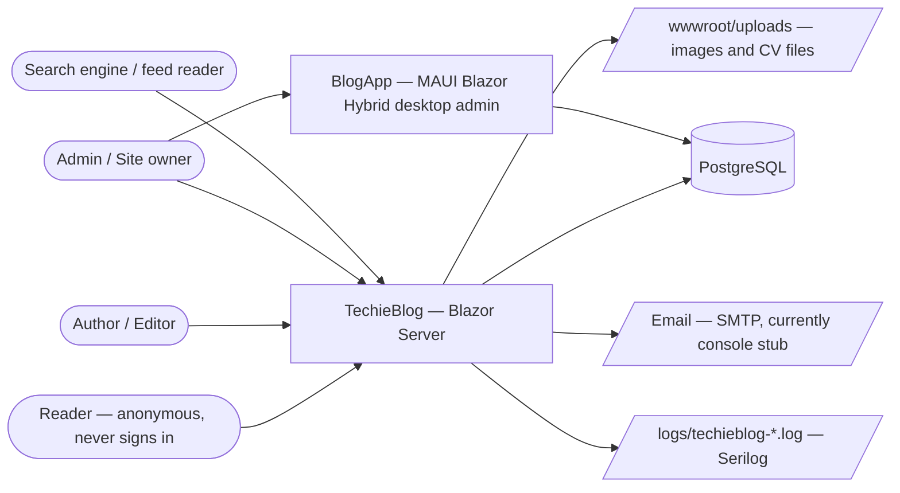
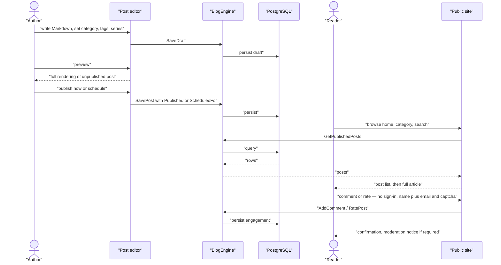
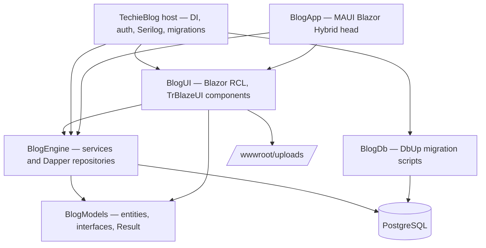
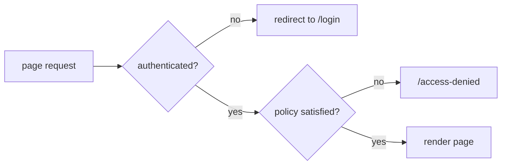
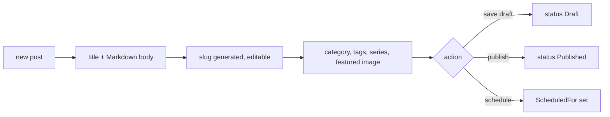
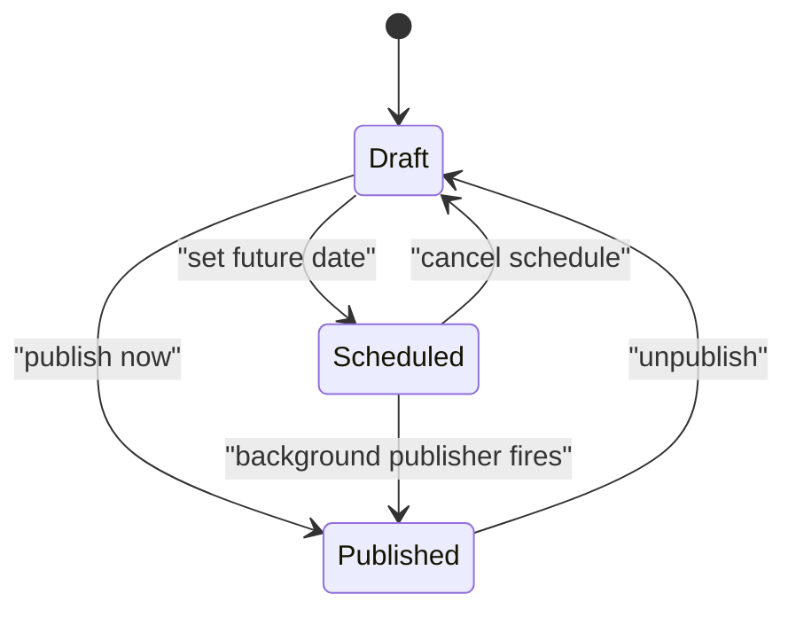
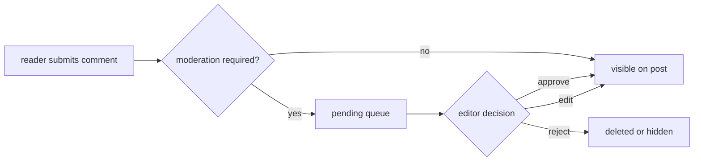
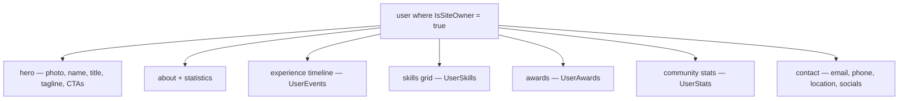
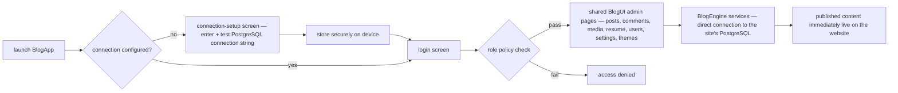

# TechieBlog — Business Requirements

<!-- AGENT-ONLY AUTHORING NOTES. Instructions to the DRAFTING AGENT, not content for the reader.
  STABLE IDS: every requirement has a BRD-{N} ID. IDs are append-only across revisions.
  DEPTH MANDATE: human document, read as rendered HTML. One-line entries belong ONLY in §10.
  MERMAID MANDATE: follow html-render-shell.md §5.5 — quote every label, never use `end` as a node id.
-->

## Table of Contents

1. [Executive summary](#executive-summary)
2. [Business objectives](#business-objectives)
3. [Scope](#scope)
4. [Development status](#development-status)
5. [Stakeholders / users](#stakeholders-users)
6. [Context diagram](#context-diagram)
7. [User journey — primary use case](#user-journey-primary-use-case)
8. [Component sketch](#component-sketch)
9. [Feature catalog](#feature-catalog)
   - [F-AUTH: Authentication & account access](#f-auth-authentication-account-access)
   - [F-ROLE: Roles & authorization](#f-role-roles-authorization)
   - [F-PROF: User profile & account management](#f-prof-user-profile-account-management)
   - [F-POST: Post authoring & CRUD](#f-post-post-authoring-crud)
   - [F-DRAFT: Draft, preview & scheduling](#f-draft-draft-preview-scheduling)
   - [F-TAX: Categories & tags](#f-tax-categories-tags)
   - [F-SER: Series & collections](#f-ser-series-collections)
   - [F-PUB: Public reading experience](#f-pub-public-reading-experience)
   - [F-SRCH: Search](#f-srch-search)
   - [F-CMT: Comments & moderation](#f-cmt-comments-moderation)
   - [F-RATE: Star ratings](#f-rate-star-ratings)
   - ~~F-FAV: Favourites & bookmarks~~ *(removed 2026-08-06)*
   - [F-MEDIA: Image management & media library](#f-media-image-management-media-library)
   - [F-RESUME: Resume / portfolio page](#f-resume-resume-portfolio-page)
   - ~~F-AUTHOR: Multi-author profiles~~ *(removed 2026-08-06)*
   - [F-SUB: Subscribers & newsletter](#f-sub-subscribers-newsletter)
   - [F-ANA: Analytics & admin dashboard](#f-ana-analytics-admin-dashboard)
   - [F-SEO: RSS & sitemap](#f-seo-rss-sitemap)
   - [F-THEME: Theming & dark mode](#f-theme-theming-dark-mode)
   - [F-ADMIN: Admin console & site settings](#f-admin-admin-console-site-settings)
   - [F-TPL: Template distribution & developer experience](#f-tpl-template-distribution-developer-experience)
   - [F-OPS: Operations, logging & delivery pipeline](#f-ops-operations-logging-delivery-pipeline)
   - [F-DESK: BlogApp desktop admin application](#f-desk-blogapp-desktop-admin-application)
10. [Functional requirements (BRD ledger)](#functional-requirements-brd-ledger)
11. [Non-functional requirements](#non-functional-requirements)
12. [Constraints & assumptions](#constraints-assumptions)
13. [Success metrics](#success-metrics)
14. [Risks](#risks)
15. [Glossary](#glossary)

## 1. Executive summary

**TechieBlog** is a no-fuss, Blazor-native blogging engine distributed as a **template / starter
project** for .NET developers — not a NuGet package, not a SaaS product. A developer clones the
repository, points it at a PostgreSQL database, re-skins it through CSS variables, and deploys their
own instance. It serves two purposes at once: a practical blogging engine for personal or client
projects, and an educational reference implementation that demonstrates Blazor and clean-architecture
practice in code that is deliberately readable rather than clever.

The gap it fills is specific. A .NET developer who wants a blog today must either bolt on a
heavyweight non-.NET CMS (WordPress, Ghost) with its own hosting and templating stack, adopt a full
CMS platform (Orchard Core) whose learning curve dwarfs the requirement, or build from scratch with
no reference architecture. TechieBlog is the missing middle: a complete, five-project solution a
competent developer can run in under five minutes, understand in under an hour, re-theme in under a
day, and put into production inside a week.

The product has been through a full stack modernization — **.NET 9 → .NET 10 LTS, MySQL →
PostgreSQL, Blazorise → Microsoft Fluent UI Blazor → TrBlazeUI**, and removal of the REST API layer
in favour of direct in-process service calls. That migration and the feature set are complete and
shipped; Fluent UI has been removed from the solution entirely.
As of 2026-08-14, 160 of the checklist's 164 requirements are terminal; the four still open are all
operations-side and are listed in §4 under F-OPS.

**Amended 2026-08-06.** Three directional changes are folded into this revision: (1) the UI
component library moves from Microsoft Fluent UI Blazor to **TrBlazeUI** — the owner's
shadcn/ui-inspired Blazor component library, consumed from the GitHub Packages NuGet feed (BRD-92);
(2) the public home page becomes a **personal-brand landing page** in the style of
nitinpandit.com / montemagno.com, driven by the site-owner's existing resume data, and the public
site exposes **no login or admin entry points** — admin access is by direct URL, documented in the
README (BRD-30 revised, BRD-93); and (3) a new **MAUI Blazor Hybrid desktop application, BlogApp**,
delivers the complete admin experience by reusing `BlogUI`, connecting directly to the site's
PostgreSQL database (BRD-94…BRD-97, feature F-DESK).

## 2. Business objectives

- **O1 — Ship a production-ready Blazor blogging engine on .NET 10 LTS** that a developer can deploy
  as-is, not a demo.
- **O2 — Be the definitive Blazor blogging reference.** Codebase structured for readability over
  cleverness; a 5-project layout understandable in under an hour of review.
- **O3 — Make re-skinning a CSS exercise, not a code change.** All colour, font and spacing values in
  CSS custom properties; three shipped themes prove the range.
- **O4 — Support multi-author publishing** with a 5-tier role model (Admin, Editor, Author,
  Contributor, Reader) so the same engine serves a solo blog and a small editorial team.
- **O5 — Achieve a "clone to production" timeline under one week** for a competent .NET developer.
- **O6 — Modernize the legacy stack** (MySQL → PostgreSQL, Blazorise → Fluent UI → TrBlazeUI, .NET 9 → .NET 10)
  for broader hosting compatibility and Microsoft-supported components. *(Met.)*

## 3. Scope

**In scope:** blog post authoring with Markdown and live preview; drafts, preview, scheduling and
series; categories and tags; the public reading experience (home, post, archives, series, search);
reader engagement through **anonymous** comments with moderation and 1–5 star ratings; image upload
and a media library; a resume/portfolio page for the site owner; email subscriber capture and list
management; an admin console with site settings; RSS and sitemap for syndication and SEO;
CSS-variable theming with three site themes and a
user light/dark toggle; and the template-distribution experience (README, getting-started,
customization, deployment and migration guides). *Added 2026-08-06:* a portfolio-style public home
page driven by the site-owner's resume data (revised BRD-30), removal of all public login/admin
entry points (BRD-93), and the **BlogApp** MAUI Blazor Hybrid desktop admin application
(BRD-94…BRD-97).

**Removed from scope 2026-08-06 (design-review pass over the mockups):** the public authors index and
per-author profile pages (~~BRD-53~~…~~BRD-55~~ — a TechieBlog instance is a personal site); reader
accounts and everything that depended on them — favourites (~~BRD-43~~, ~~BRD-44~~), the reader
comment-history page (~~BRD-13~~) and self-service comment editing (~~BRD-37~~); and public
self-service registration (~~BRD-1~~). Commenting and rating are now **anonymous,
email-identified** (BRD-36, BRD-40, BRD-41 revised).

**Added in the same pass:** because public write surfaces are now open to anonymous visitors, the
product gains **double opt-in email verification** (BRD-98) and a **self-hosted captcha built on the
.NET base class library alone — no third-party library or service** (BRD-99). The site also gains a
**public newsletter archive** (BRD-100) and per-issue view (BRD-101), so the admin-side newsletter
composer finally has a reader-facing counterpart.

**Out of scope (explicit):** email drip campaigns / sequences; lead magnets; social login (Google,
GitHub); magic-link or passwordless authentication; advanced SEO tooling (Open Graph editor, meta-tag
UI); an admin UI for *creating* themes; a **mobile** application wrapper *(the desktop admin
application moved in scope on 2026-08-06 — see F-DESK)*; multi-tenancy;
localization / internationalization; and advanced analytics such as referrer tracking. A community
theme repository remains a post-MVP aspiration. The MAUI Blazor Hybrid desktop writer — the reason
`BlogUI` is kept as a Razor Class Library — moved **in scope** on 2026-08-06 as **BlogApp** (F-DESK,
BRD-94…BRD-97).

## 4. Development status

<!-- SNAPSHOT (point-in-time), feature level only. Live per-requirement status lives in
     PROJECT-STATUS.md + the Requirements Status table in docs/TechieBlog-Checklist.md. -->

**Snapshot as of 2026-08-14.** Live, per-requirement status: see `PROJECT-STATUS.md` and the
**Requirements Status** table in `docs/TechieBlog-Checklist.md`. Every Status and % below is derived
from that table's Status column as it stands after the **2026-08-11** verify pass (51 rows graded)
and the **2026-08-14** pass (14 more) — not from the migrated MVP execution plan, and not carried
forward from this document's earlier snapshots. Of the table's **164** requirement rows, **160 are
terminal** (`Verified`, `N/A`, or `N/A (removed …)`); the **four still open all belong to F-OPS**.

> **Build is GREEN** — `dotnet build TechieBlog.slnx` returns `0 Error(s)` across 7/7 projects
> including the `net10.0-windows10.0.19041.0` BlogApp head. The earlier `NU1605` note here was
> stale and is retired (REQ-FN-043 closed; both Fluent UI packages were removed by REQ-UI-048).
> The automated suite stands at **1 490 tests — 1 487 pass / 3 skip / 0 fail**.

| Feature (F-code) | Phase | Status | % | Notes |
|------------------|-------|--------|---|-------|
| F-AUTH: Authentication & account access | 2 | Done | 100 | Login, forgot/reset password, JWT issuance and token refresh, password-strength rules, salted hashing, auth rate limiting, persisted reset tokens and the login audit trail. Public registration retired (~~BRD-1~~). All mapped REQs terminal as of 2026-08-14. |
| F-ROLE: Roles & authorization | 2 | Done | 100 | The five-role model mapped to five authorization policies, with `/access-denied` as the single denial surface. All mapped REQs terminal as of 2026-08-14. |
| F-PROF: User profile & account management | 2 | Done | 100 | Profile read/update, change password with current-password enforcement, avatar, and the users list plus add-user screen. All mapped REQs terminal as of 2026-08-14 — REQ-FN-010 (admin user-management backend) is terminal as `N/A`, not agent-observable. |
| F-POST: Post authoring & CRUD | 3 | Done | 100 | Post CRUD service and repository, slug generation/uniqueness and slug-based routing, Markdig rendering, the Markdown editor with live preview and metadata sidebar, and the post list with status filters. All mapped REQs terminal as of 2026-08-14. |
| F-DRAFT: Draft, preview & scheduling | 3 | Done | 100 | Draft/Published state handling, the draft preview page, and post scheduling with its background publisher. All mapped REQs terminal as of 2026-08-14. |
| F-TAX: Categories & tags | 3 | Done | 100 | Category CRUD with single-category assignment, tag CRUD with the post–tag junction, autocomplete and counts, and both archive pages. All mapped REQs terminal as of 2026-08-14. |
| F-SER: Series & collections | 3 | Done | 100 | Series CRUD, part ordering and prev/next navigation, the admin series list and manage screens, and the public series view page. All mapped REQs terminal as of 2026-08-14. |
| F-PUB: Public reading experience | 3 / 9 | Done | 100 | Portfolio-style home, post view, category/tag archives, About and 404, the shared PostCard/Pagination/Breadcrumb/Sidebar components, and published listings with featured post, related posts and reading time. Public login/admin entry points removed (REQ-UI-050). All mapped REQs terminal as of 2026-08-14. |
| F-SRCH: Search | 3 | Done | 100 | The search service — ILIKE across title, abstract, body and tags with paging — and the search results page. All mapped REQs terminal as of 2026-08-14. |
| F-CMT: Comments & moderation | 4 / 9 | Done | 100 | **Reworked to anonymous name+email commenting and verified end to end**: captcha, double opt-in, single-use tokens, moderation queue and approval all behave; unapproved comments never appear publicly and no email address is ever rendered. |
| F-RATE: Star ratings | 4 / 9 | Done | 100 | **Re-keyed to email with no sign-in, verified end to end**: one rating per email per post, changeable in place, and the public average counts *verified* ratings only. |
| ~~F-FAV: Favourites & bookmarks~~ | 4 | **Removed** | — | Retired 2026-08-06 with reader accounts (BRD-43/44). The built code (`UserFavorite`, `FavoriteSvc`, MyFavorites page, toggle) **has been removed** — REQ-UI-014/028, REQ-FN-024, verified absent from `source/` on 2026-08-14. |
| F-MEDIA: Image management & media library | 5 / 8 | Done | 100 | Image upload with per-category validation, the `BlogImage` metadata and category schema, the media library page with its category tabs, and the reusable `ImagePicker`. All mapped REQs terminal as of 2026-08-14. |
| F-RESUME: Resume / portfolio page | 8 | Done | 100 | The public `/resume` page (hero, experience, skills, awards, contact), the resume data model and repositories, the manage-experience/skills/awards/profile screens, CV upload and download, and username + site-owner uniqueness. All mapped REQs terminal as of 2026-08-14. |
| ~~F-AUTHOR: Multi-author profiles~~ | 8 | **Removed** | — | Retired 2026-08-06 (BRD-53/54/55) — personal site, no public author browsing. The `/authors` + `/author/{username}` pages **have been removed**; `IsSiteOwner` + username stay for F-RESUME. REQ-UI-041/042, verified absent from `source/` on 2026-08-14. |
| F-SUB: Subscribers & newsletter | 5 / 9 | Done | 100 | Subscriber capture with validation and duplicate handling, the subscribers admin page, newsletter compose/send/history and unsubscribe, the public newsletter archive and per-issue pages, the subscribe form, double opt-in verification and the captcha guarding public write surfaces. All mapped REQs terminal as of 2026-08-14 — REQ-FN-033 (real SMTP delivery) is terminal as `N/A`, no SMTP host configured in this environment. |
| F-ANA: Analytics & admin dashboard | 5 | Done | 100 | The admin dashboard with its stat tiles and quick actions, the dashboard counts service, post-view tracking, popular posts and per-post engagement statistics, and the analytics dashboard with charts and a date range. All mapped REQs terminal as of 2026-08-14. |
| F-SEO: RSS & sitemap | 6 | Done | 100 | RSS feed generation with its feed page and auto-discovery link, plus the `/sitemap.xml` and `/robots.txt` endpoints. All mapped REQs terminal as of 2026-08-14. |
| F-THEME: Theming & dark mode | 1 / 6 / 7 / 9 | Done | 100 | `ThemeService`, `ThemeProvider` and the CSS-variable theme system persisted as a site setting, the header light/dark toggle, the Site Settings theme selector, and the dark-mode corrections across sidebar, public, search, about and admin surfaces. All mapped REQs terminal as of 2026-08-14. |
| F-ADMIN: Admin console & site settings | 6 | Done | 100 | **Site Settings now persists** — all six tabs render their stored values and 27 `SiteSetting` rows back them; the earlier 'save discards everything' finding is resolved. Grouped admin nav hides refused groups rather than rendering them empty. |
| F-TPL: Template distribution & developer experience | 6 | Done | 100 | Seed/sample data set is built and verified (10 posts, 5 categories, 15 tags, 4 roles, 2 series); rename scripts and the full adopter documentation set are present. |
| F-OPS: Operations, logging & delivery pipeline | 1 / 6 | Partial | 95 | Health checks, correlation IDs, Serilog rolling files, resilience pipelines, output caching, the performance budget (REQ-NFR-001) and the xUnit + bUnit test project (REQ-NFR-016) are all terminal. **The only four open rows in the whole checklist sit here:** REQ-NFR-017 `PARTIAL` — CI cannot restore TrBlazeUI until the repo secret exists; REQ-NFR-025 `In Progress` — the revoked PAT is still in git history, awaiting an owner decision; REQ-NFR-026 `PARTIAL` — stage 4 deferred by the owner; REQ-NFR-038 `Implemented` — the deploy pipeline needs a real VPS, so it is not agent-verifiable. |
| F-DESK: BlogApp desktop admin application | 10 | Done | 100 | **Built and runtime-verified 2026-08-09** — the `⚠ STATIC-ONLY` stamp is lifted. 19/19 admin routes driven in the desktop head over WebView2 CDP with grid counts matching PostgreSQL exactly, DPAPI connection storage proved non-plaintext at byte level, and a post published in BlogApp appeared immediately on the separate web host. |

**Legend:** **Done** = shipped & working · **In progress** = actively being built · **Partial** = some
sub-features done, others pending · **Planned** = not started.

## 5. Stakeholders / users

TechieBlog has two distinct audiences: the **developer who adopts the template** (the customer) and
the **people who use a running instance** (readers, authors, admins). The role model below is the
in-application one — a single-role-per-user string on `BlogUser`, mapped to authorization policies in
the host.

| Role | Who they are | Needs | Key screens | How they get the role |
|------|--------------|-------|-------------|-----------------------|
| **Template adopter** (.NET developer) | Mid-to-senior .NET developer, comfortable with C# and ASP.NET Core basics, learning or using Blazor | Clone, understand and re-skin fast; production-quality reference code; full ownership of the source | (repo + docs, not the app) | Clones the GitHub template |
| **Reader** *(anonymous only, from 2026-08-06)* | End user of a TechieBlog site — **never signs in** | Clean, fast, distraction-free reading; comment and rate with just an email | Home, Post, Category/Tag archive, Series, Search, Resume | No account — the Reader *role* remains in the model but no public flow creates one |
| **Contributor** | Registered user permitted to submit content for review | Draft and submit posts without publishing rights | (policy declared; no dedicated screens yet) | Assigned by an Admin |
| **Author** | Content creator | Efficient Markdown authoring, media, own profile and resume data | Post editor, My Posts, Media library, Draft preview, Manage Profile/Experience/Skills/Awards | Assigned by an Admin |
| **Editor** | Editorial oversight | Manage all posts, moderate comments | Admin dashboard, All posts, Comment moderation | Assigned by an Admin |
| **Admin** | Site owner / operator | Full control — users, taxonomy, subscribers, settings, images, theme | Everything, plus Users, Categories, Tags, Subscribers, Settings, Manage Images | Seeded on first install; assignable |

**Role hierarchy** (Admin ⊃ Editor ⊃ Author ⊃ Contributor ⊃ Reader) is expressed as five authorization
policies rather than nested roles:

| Policy | Roles accepted | Guards |
|--------|----------------|--------|
| `AdminOnly` | Admin | Users, Categories, Tags, Settings, Subscribers, Manage Images |
| `EditorOrAbove` | Admin, Editor | Admin dashboard, All posts, Comments |
| `AuthorOrAbove` | Admin, Editor, Author | Post editor, Preview, Series, Profile/Experience/Skills/Awards |
| `ContributorOrAbove` | Admin, Editor, Author, Contributor | *(declared, not yet used by any page)* |
| `Authenticated` | any signed-in user | Own profile *(favourites retired 2026-08-06)* |

**Site owner** is a separate, orthogonal flag (`BlogUser.IsSiteOwner`, enforced unique by a partial
index): exactly one user's resume is what `/resume` renders.

## 6. Context diagram

## 7. User journey — primary use case

The core loop the product exists for: an author publishes, a reader discovers and engages.

## 8. Component sketch

## 9. Feature catalog

### F-AUTH: Authentication & account access

**Personas:** Reader, Contributor, Author, Editor, Admin · **Phase:** 2

TechieBlog ships its own email/password authentication rather than depending on an external identity
provider, so a cloned instance works with nothing but a database. `AuthSvc` validates credentials,
issues a JWT carrying the user's id, name, email and role, and records the login; the Blazor circuit
turns that token into an `AuthenticationState` through `CustomAuthStateProvider`, and the token is
kept in browser local storage so a refresh does not log the user out. Password reset is token-based
with an expiry; reset tokens are persisted in the database (migration
`017-SecurityAndTokenPersistence.sql`), and the "email" is currently written to the log by
`ConsoleEmailService` rather than sent over SMTP.

**Revised 2026-08-06:** public self-service **registration is removed** (~~BRD-1~~) — there are no
reader accounts, so the only accounts are staff ones created by an admin (BRD-10). `/register` and
`/signup` are retired. Sign-in remains for Author/Editor/Admin via the direct `/login` URL (BRD-93).

| Screen | Route | Description |
|--------|-------|-------------|
| Login | `/login`, `/LoginPage`, `/LoginPage/{PageCode}` | Email + password, forgot-password link |
| ~~Register~~ | ~~`/register`, `/signup`~~ | *Removed 2026-08-06* |
| Forgot password | `/forgot-password` | Email capture, generates reset token |
| Reset password | `/reset-password`, `/reset-password/{Token}` | Token validation + new password |
| Access denied | `/access-denied` | Shown when a policy rejects the user |

**Workflow:**
1. Visitor submits credentials; the UI encrypts them into a `SvcData` envelope.
2. `AuthSvc.AppLogin` decrypts, hashes the password via `AppEncrypt.CreateHash`, and looks the user up.
3. On success a JWT is issued with `PrimarySid`, `Name`, `Email`, `Role` claims and a login row is written.
4. The host `AuthService` stores token + profile in local storage and notifies the auth-state provider.
5. Subsequent requests read the claims principal; `[Authorize]` policies gate each page.
6. Forgot-password issues a time-limited token; reset validates it, updates the password, invalidates the token.

**Requirements:** ~~BRD-1~~, BRD-2, BRD-3 *(revised)*, BRD-4, BRD-5, BRD-6 (see §10)

### F-ROLE: Roles & authorization

**Personas:** Admin (assigns), everyone (subject to) · **Phase:** 2

Five roles form a strict capability ladder — Admin > Editor > Author > Contributor > Reader — mapped
to five named policies registered in `Program.cs`. Pages declare their requirement with
`@attribute [Authorize(Policy = "...")]`; UI elements additionally hide themselves based on role so
users are not shown actions they cannot perform. Unauthorized navigation lands on `/access-denied`.

| Screen | Route | Description |
|--------|-------|-------------|
| User management | `/users` | List, search, role assignment |
| Add user | `/AddUser` | Admin-created accounts |

**Requirements:** BRD-7, BRD-8, BRD-9, BRD-10

### F-PROF: User profile & account management

**Personas:** every registered user · **Phase:** 2

Registered users maintain their own display name, bio, avatar and social links, and can change their
password with current-password verification. Authors and above get an extended profile surface
(`/admin/profile`) that also carries the resume fields — username, title, tagline, phone, location,
CV file and the `ResumeEnabled` toggle — plus jump-off links to the experience, skills and awards
editors.

| Screen | Route | Description |
|--------|-------|-------------|
| Profile | `/profile` | Current user's details, `[Authorize]` |
| Manage profile | `/admin/profile` | Full self-service editor incl. resume fields, `AuthorOrAbove` |

**Design note:** the mockups and PRD defined separate *My Comments*, *Edit Profile* and *Change
Password* screens (mockups 14–16). As built, editing and password change live on one consolidated
profile surface. The *My Comments* history page was **retired from scope** on 2026-08-06
(~~BRD-13~~) along with reader accounts, so it is not a gap.

**Requirements:** BRD-11, BRD-12

### F-POST: Post authoring & CRUD

**Personas:** Author, Editor, Admin · **Phase:** 3

The heart of the product. Authors create posts with a title, Markdown body, excerpt and slug; the
slug is generated from the title by `SlugGenerator` with manual override, and must be unique because
public URLs are `/post/{slug}`. The editor is a custom `MarkdownEditor.razor` component over Markdig
with live preview and a formatting toolbar. Posts carry a featured image, category, tags, optional
series membership, and SEO title/description fields. Deletion is available from the post list.

| Screen | Route | Description |
|--------|-------|-------------|
| Post editor | `/ManagePost`, `/ManagePost/{PageId}` | Create/edit: title, Markdown + preview, metadata sidebar |
| All posts | `/BlogsList` | Editorial list with status filters and actions |
| Media library | `/admin/images` | Insert images into a post (see F-MEDIA) |

**Workflow:**
1. Author opens the editor; a new post starts as Draft.
2. Title entry auto-generates the slug (editable).
3. Markdown is typed; the preview pane renders it through Markdig as the author types.
4. Metadata is set: category (one), tags (many, with autocomplete and inline creation), optional series + order, featured image.
5. Save persists via `BlogSvc.SavePost`, returning a `Result<BlogPost>` the UI surfaces as success or error.

**Requirements:** BRD-14, BRD-15, BRD-16, BRD-17

### F-DRAFT: Draft, preview & scheduling

**Personas:** Author, Editor · **Phase:** 3

Posts move through Draft → Published, with a scheduled variant in between. A draft is invisible to
the public; `PreviewPost` renders it exactly as it will appear, restricted to the author and editors.
Scheduling sets `ScheduledFor`; the `ScheduledPostPublisher` background service promotes the post at
the appointed time without anyone being logged in. Unpublishing returns a post to Draft.

| Screen | Route | Description |
|--------|-------|-------------|
| Draft preview | `/admin/preview/{PostId}` | Full rendering of an unpublished post, `AuthorOrAbove` |

**Requirements:** BRD-18, BRD-19, BRD-20, BRD-21

### F-TAX: Categories & tags

**Personas:** Author (applies), Admin (curates), Reader (browses) · **Phase:** 3

Two taxonomies with different shapes: a post belongs to **one** category (a curated, admin-managed
list with name, slug and description) and carries **many** tags (lightweight, author-creatable
inline with autocomplete). Each has a public archive page listing its posts, and each is surfaced in
the sidebar. Post counts per tag were originally wrong and were fixed in Story 7.5.

| Screen | Route | Description |
|--------|-------|-------------|
| Category archive | `/category/{Slug}`, `/categories`, `/categories/{Slug}` | Posts in a category |
| Tag archive | `/tag/{Slug}`, `/tags`, `/tags/{Slug}` | Posts with a tag |
| Categories admin | `/admin/categories`, `/CategoriesList` | List + CRUD, `AdminOnly` |
| Manage category | `/admin/category`, `/admin/category/{PageId}` | Add/edit form |
| Tags admin | `/admin/tags`, `/TagsList` | List + CRUD, `AdminOnly` |
| Manage tag | `/ManageTag`, `/ManageTag/{PageId}` | Add/edit form |

**Requirements:** BRD-22, BRD-23, BRD-24, BRD-25, BRD-26

### F-SER: Series & collections

**Personas:** Author, Reader · **Phase:** 3

Multi-part content is grouped into a named series with a slug and description. Each post in a series
carries an order number; the post page shows previous/next navigation within the series, and the
series landing page lists every part in reading order. Authors can reorder parts.

| Screen | Route | Description |
|--------|-------|-------------|
| Series list (public) | `/series` | All available series |
| Series view | `/series/{Slug}` | Ordered post listing, full-width layout |
| Series admin | `/admin/series`, `/SeriesList` | Author's series, `AuthorOrAbove` |
| Manage series | `/admin/series/new`, `/admin/series/{PageId}` | Create/edit series |

**Requirements:** BRD-27, BRD-28, BRD-29

### F-PUB: Public reading experience

**Personas:** Reader (anonymous — never signs in) · **Phase:** 3, 9

The reader-facing surface: a home page with a featured post and a recent-posts grid plus sidebar
(recent posts, categories, tag cloud, subscribe form); a post page rendering Markdown to HTML with
author info, publish date, category, tags, reading-time estimate, related posts, series navigation
and the engagement widgets; and the archive pages. URLs are slug-based for SEO. An About page and a
404 page complete the set.

**Revised 2026-08-06 (BRD-30 modified, BRD-93 added).** The home page becomes a **personal-brand
landing page** modeled on nitinpandit.com / montemagno.com: a full-viewport hero (profile photo,
"Hi, I'm {FirstName}", title, tagline, Get-In-Touch and Download-CV CTAs, social links), headline
statistics, an about summary, a latest-articles section fed by recent published posts, and a contact
block — all driven by the site-owner's existing resume data (F-RESUME), so no new data model is
needed. The former featured-post + recent-grid home is superseded; `/resume` remains available and
the home page deep-links into its sections. Additionally (**BRD-93**), the public site exposes **no
login or admin entry points** — no header login link and no user menu on public pages; admin access
is by directly opening `/login` (documented in the README). The engagement features on a post —
commenting and rating — are anonymous and email-identified, so they carry no sign-in prompt.

| Screen | Route | Description |
|--------|-------|-------------|
| Home | `/` | Portfolio-style landing: hero, stats, about, latest articles, contact *(revised 2026-08-06)* |
| Post view | `/post/{Slug}`, `/post/{Slug}/{PageNumber}` | Full article + engagement, full-width layout |
| About | `/about` | Static site information |
| Not found | `/404` | Friendly 404 |

**Requirements:** BRD-30 *(revised)*, BRD-31, BRD-32, BRD-33, BRD-93

### F-SRCH: Search

**Personas:** Reader · **Phase:** 3

Full-text search over published posts using PostgreSQL `ILIKE` across title, abstract, body and tags,
with paging, term highlighting in results, and a category filter whose options load from the live
category list.

| Screen | Route | Description |
|--------|-------|-------------|
| Search results | `/search` | Query box, category filter, paged results with highlighting |

**Requirements:** BRD-34, BRD-35

### F-CMT: Comments & moderation

**Personas:** Visitor (writes), Editor/Admin (moderates) · **Phase:** 4, 9

**Revised 2026-08-06 (BRD-36 modified, BRD-37 removed).** Commenting is **anonymous — no account and
no sign-in**. A visitor supplies a display name, an email address and the comment body; the email is
stored for moderation and reply notification but is **never published**. Comments are flat (no
threading) and display in chronological order with a count shown on post cards. Approval before
display is expected to be the default for anonymous input, and the moderation queue (BRD-38, BRD-39)
becomes the only edit/delete path — a visitor cannot edit their own comment because there is no
authenticated owner.

| Screen | Route | Description |
|--------|-------|-------------|
| Comment form + list | on `/post/{Slug}` | Inline on the post page |
| Moderation queue | `/CommentsList`, `/comments` | Pending + all comments, `EditorOrAbove` |
| Manage comment | (admin detail surface) | Edit/approve/delete a single comment |

**Anti-abuse (added 2026-08-06).** Because the form is open to the public it is protected by a
self-hosted captcha (BRD-99) and double opt-in email verification (BRD-98): a comment is held until
the address is confirmed, and only then enters the moderation queue.

**Requirements:** BRD-36 *(revised)*, ~~BRD-37~~, BRD-38, BRD-39, BRD-98, BRD-99

### F-RATE: Star ratings

**Personas:** Visitor (anonymous) · **Phase:** 4, 9

A 1–5 star widget on the post page, usable **without signing in** — the visitor is identified by
email address (revised 2026-08-06). One rating per email per post, changeable at any time; the post
shows the average and the count, and ratings appear on post cards in listings. Ratings are queryable
for "top rated" selections.

Choosing a star reveals the email + captcha step; the rating counts once the address is confirmed
(BRD-98, BRD-99). A visitor whose address is already verified rates in one click.

**Requirements:** BRD-40 *(revised)*, BRD-41 *(revised)*, BRD-42, BRD-98, BRD-99

### ~~F-FAV: Favourites & bookmarks~~ — REMOVED 2026-08-06

Favourites required a signed-in reader identity. Reader accounts were dropped on 2026-08-06 (this is
a personal site; commenting and rating are anonymous), so the favourite toggle, the counts and the
`/my-favorites` page are removed from scope. `FavoriteSvc`, the `/my-favorites` page and every
`UserFavorite` reference have since been deleted from `source/`, and no `userfavorite` table exists
in the database (both verified 2026-08-14). The retirement is complete.

**Requirements:** ~~BRD-43~~, ~~BRD-44~~ *(both retired)*

### F-MEDIA: Image management & media library

**Personas:** Author, Admin · **Phase:** 5 and 8

A single upload pipeline serves every image need in the product, organised into **seven categories**
with per-category size and format limits enforced server-side. Files are written to
`wwwroot/uploads/{category}/` under a collision-proof name, and metadata (category, alt text, MIME
type, width, height) is recorded against the `BlogImage` row. A reusable `ImagePicker` component
gives every form the same "choose from library or upload new" experience, filtered to the relevant
category.

| Category | Path | Max size | Allowed formats | Used by |
|----------|------|----------|-----------------|---------|
| profiles | `/uploads/profiles/` | 2 MB | jpg, png, webp | Resume hero, author avatar |
| logos | `/uploads/logos/` | 500 KB | jpg, png, svg, webp | Experience timeline |
| awards | `/uploads/awards/` | 500 KB | jpg, png, svg, webp | Awards section |
| icons | `/uploads/icons/` | 200 KB | png, svg, webp | Skills grid |
| blog | `/uploads/blog/` | 5 MB | jpg, png, gif, webp | Post bodies, featured images |
| cv | `/uploads/cv/` | 10 MB | pdf | Resume CV download |
| general | `/uploads/general/` | 5 MB | jpg, png, gif, webp | Miscellaneous |

| Screen | Route | Description |
|--------|-------|-------------|
| Manage images | `/admin/images` | Gallery with category tabs, upload, delete, copy URL, paging, `AdminOnly` |
| Image picker | (component) | Embedded in every form that binds an image path |

**Requirements:** BRD-45, BRD-46, BRD-47, BRD-48

### F-RESUME: Resume / portfolio page

**Personas:** Site owner (authors it), anyone (reads it) · **Phase:** 8

A full-page, anchor-navigated public resume for the one user flagged `IsSiteOwner`, modelled on a
personal portfolio site. Sections, top to bottom: a full-viewport hero (profile photo, "Hi, I'm
{FirstName}", title, tagline, Get-In-Touch and Download-CV buttons, social links, scroll cue); about
with headline statistics; a reverse-chronological experience timeline with company logos and
Markdown bullet descriptions, showing "Present" for the current role; a skills grid grouped by
category with optional icons; awards and recognition with badge images, years and links; community
contribution statistics; and a contact block with email, phone, location and social links.

| Screen | Route | Description |
|--------|-------|-------------|
| Resume | `/resume` | Public full-page resume, `FullWidthLayout` |
| Manage experience | `/admin/experience`, `/admin/experience/{EventId}` | Timeline CRUD with logo picker and ordering |
| Manage skills | `/admin/skills` | Skills CRUD grouped by category |
| Manage awards | `/admin/awards` | Awards CRUD with badge picker |

Data lives in extended `BlogUser` columns (title, tagline, phone, location, CV path, Instagram,
`ResumeEnabled`), the repurposed `UserEvents` table (experience, with `StartDate`, `Description`,
`DisplayOrder`, `IsCurrent`), and three tables added by migration `012` — `UserSkills`, `UserAwards`,
`UserStats`.

**Requirements:** BRD-49, BRD-50, BRD-51, BRD-52

### ~~F-AUTHOR: Multi-author profiles~~ — REMOVED 2026-08-06

A TechieBlog instance is a **personal site**, so a public authors index and per-author public
profiles are not wanted: `/authors` and `/author/{username}` are removed, and post bylines render as
plain text rather than links. The single public profile is the site owner's resume at `/resume`
(F-RESUME). Multi-author *publishing* is unaffected — the five-role model, per-author post ownership
and the admin-side profile/resume editors all remain; only the public author-browsing surface is
dropped. The `IsSiteOwner` flag and username column stay (used by F-RESUME); the public routes,
`AuthorsPage.razor` and `AuthorProfilePage.razor` have been deleted (verified 2026-08-14).

**Requirements:** ~~BRD-53~~, ~~BRD-54~~, ~~BRD-55~~ *(all retired)*

### F-SUB: Subscribers & newsletter

**Personas:** Visitor (subscribes), Admin (manages, sends) · **Phase:** 5

A subscribe form (sidebar, footer or dedicated placement) captures an email address with validation
and duplicate handling. Admins see the subscriber list with search and status filtering, can remove
subscribers, and can export the list.

**Extended 2026-08-06.** Subscribing is now **double opt-in** (BRD-98) and captcha-protected
(BRD-99): the address is stored as *pending* until the emailed confirmation link is used. The site
also gains a **public newsletter archive** — the admin composes issues (BRD-59) and every sent issue
is published at `/newsletters` (BRD-100) and readable individually at `/newsletter/{slug}` (BRD-101),
so the audience can read past issues and judge the newsletter before subscribing. The archive page
carries the primary subscribe form.

| Screen | Route | Description |
|--------|-------|-------------|
| Subscribe form | (component, on public pages) | Email capture + captcha + double opt-in confirmation |
| Newsletter archive | `/newsletters` | Public list of past issues, newest first, paged; subscribe form |
| Newsletter issue | `/newsletter/{Slug}` | A single published issue with previous/next navigation |
| Email confirmation | `/verify/{Token}` | Landing page for the double opt-in link (comment, rating or subscription) |
| Subscribers admin | `/admin/subscribers` | List, search, status, remove, export, `AdminOnly` |

**Requirements:** BRD-56, BRD-57, BRD-58, BRD-59, BRD-98, BRD-99, BRD-100, BRD-101

### F-ANA: Analytics & admin dashboard

**Personas:** Admin, Editor, Author · **Phase:** 5

The admin dashboard shows count tiles and quick actions. The deeper analytics story covers tracking
total and unique post views, identifying popular posts, showing engagement statistics per post, and
trend charts with a date-range filter.

| Screen | Route | Description |
|--------|-------|-------------|
| Admin dashboard | `/admin`, `/AdminDashboard` | Count tiles + quick actions, `EditorOrAbove` |

**Requirements:** BRD-60, BRD-61, BRD-62

### F-SEO: RSS & sitemap

**Personas:** Reader (feed), search engines · **Phase:** 6

An RSS feed of recent published posts for syndication to aggregators, and an auto-generated
`sitemap.xml` covering published posts plus category and tag archives, referenced from a generated
`robots.txt`.

| Screen | Route | Description |
|--------|-------|-------------|
| RSS feed | `/rss` | Feed page |
| Sitemap | `/sitemap.xml` | Minimal endpoint, XML |
| Robots | `/robots.txt` | Minimal endpoint, points at the sitemap |

**Requirements:** BRD-63, BRD-64

### F-THEME: Theming & dark mode

**Personas:** Reader (light/dark), Admin (site theme), developer (customization) · **Phase:** 1, 6, 7, 9

Two independent theming axes. **Light/dark mode** is a per-user preference toggled from the header on
every page and stored in local storage. **Site theme** is chosen by the admin in Site Settings and
applies to public pages: *Fluent Modern* (default, clean Microsoft-Fluent-inspired), *Developer Dark*
(code-editor inspired with syntax-highlight colours and monospace accents), and *Minimal Clean*
(typography-first, generous whitespace, serif headings). Each site theme has light and dark variants
— six combinations. Every colour, font and spacing value is a CSS custom property; no component
hardcodes a value, which is what makes re-skinning a CSS-only exercise.

**Revised 2026-08-06 (BRD-92 added, BRD-67 modified).** The component library moves from Microsoft
Fluent UI Blazor to **TrBlazeUI** (`TrBlazeUI.Components`, consumed from the GitHub Packages NuGet
feed at `nuget.pkg.github.com/techierathore`; the owner supplies the feed credentials in
`nuget.config` before development starts). TrBlazeUI is shadcn/ui-compatible and themes entirely
through CSS custom properties with a `.dark` class for dark mode, so the BRD-65 principle carries
over unchanged. The three site themes are re-expressed as TrBlazeUI/shadcn CSS-variable sets (light
and dark variants preserved), and the Fluent-specific dark-mode overrides (`fluent-dark-mode.css`)
are retired together with the library. The migration touches every page, component and layout in
`BlogUI` and requires `<PortalHost />` in the root layouts for overlay components.

| Screen | Route | Description |
|--------|-------|-------------|
| Theme toggle | (header component) | Light/dark switch, persisted |
| Theme selector | `/settings` | Admin picks the site theme |

**Requirements:** BRD-65, BRD-66, BRD-67 *(revised)*, BRD-68, BRD-92

### F-ADMIN: Admin console & site settings

**Personas:** Admin · **Phase:** 6

A dedicated admin layout with grouped navigation (dashboard, content, taxonomy, users, resume data,
media, subscribers, settings) fronting every management screen. Site Settings holds
the site title and tagline, posts-per-page, comment-moderation toggle, theme selection, SMTP
configuration and storage-provider settings.

| Screen | Route | Description |
|--------|-------|-------------|
| Site settings | `/settings` | All site configuration, `AdminOnly` |
| (all admin pages) | see F-* above | Reached through `AdminLayout` navigation |

**Requirements:** BRD-69, BRD-70

### F-TPL: Template distribution & developer experience

**Personas:** Template adopter (.NET developer) · **Phase:** 6

The product *is* the repository, so the adoption experience is a first-class feature: a GitHub
template repository the developer clones with one click, a rename script, and a documentation set
covering getting started, customization, deployment and the MySQL → PostgreSQL migration path. The
target is clone-to-running in under five minutes and clone-to-production in under a week. The feature
also covers a seed/sample data set (sample posts demonstrating Markdown, images and series; a user
per role; categories, tags, comments and ratings) and a final code-cleanup and XML-documentation
pass.

| Artifact | Location | Description |
|----------|----------|-------------|
| README | `README.md` | Product overview, features, quick start |
| Getting started | `GETTING_STARTED.md` | Prerequisites, DB setup, configuration, build and run |
| Customization guide | `docs/customization.md` | CSS variables, theme authoring, dark mode |
| Deployment guide | `docs/deployment.md` | Docker, Azure App Service, Linux/systemd |
| Migration guides | `docs/database-migration-guide.md`, `docs/DataMigrationGuide.md` | MySQL → PostgreSQL schema and data |
| Release checklist | `docs/template-release-checklist.md` | Pre-publish hygiene for the template repo |
| Rename script | `scripts/` | Re-brands a clone to the adopter's project name |

**Requirements:** BRD-71, BRD-72, BRD-73

### F-OPS: Operations, logging & delivery pipeline

**Personas:** Developer / operator · **Phase:** 1 and 6

Structured logging is in place — Serilog is configured before anything else can fail, writes to
console and a daily rolling file under `logs/`, enriches with machine and environment name, logs
every HTTP request, and flushes on shutdown; class libraries log through `ILogger<T>` only. The
`/health` endpoint verifying database and dependency availability, correlation IDs for request
tracing, the xUnit + bUnit automated test project and the GitHub Actions CI pipeline are all in
place as well. What remains open are the four requirements listed in §4 — `REQ-NFR-017` (CI cannot
restore TrBlazeUI until the repository secret exists), `REQ-NFR-025` (the revoked PAT is still in
git history), `REQ-NFR-026` (stage 4 deferred by the owner) and `REQ-NFR-038` (the deploy pipeline
needs a real VPS to be verifiable).

**Requirements:** BRD-74, BRD-75, BRD-76, BRD-77

### F-DESK: BlogApp desktop admin application

**Personas:** Admin, Editor, Author (anyone with admin-side rights) · **Phase:** 10 · *added 2026-08-06*

**BlogApp** is a MAUI Blazor Hybrid cross-platform desktop application (Windows and macOS) that
delivers the complete admin experience outside the browser. It exists so the site owner can manage
the blog — write posts, moderate comments, curate taxonomy, maintain the resume and profile, manage
users, subscribers, media, settings and themes — from an installed desktop app instead of the
website's admin section. This is the realisation of the long-standing reason `BlogUI` is a Razor
Class Library: BlogApp hosts the **same** admin pages, layouts and components the web admin uses, so
the two surfaces cannot drift apart.

BlogApp keeps the architecture deliberately simple: there is **no local database and no
synchronisation**. On first run a connection-setup screen captures the target site's PostgreSQL
connection string, which is stored securely on the device (platform secure storage); from then on
the app boots straight into the login screen and every operation runs against the live site database
through the same `BlogEngine` services the web host uses. Publishing a post in BlogApp makes it
immediately visible on the website. The app therefore requires network reachability to the site's
PostgreSQL instance — disconnected editing is out of scope by design.

| Screen | Route | Description |
|--------|-------|-------------|
| Connection setup | (first run / settings) | Capture + test the site's PostgreSQL connection string; store in platform secure storage |
| Login | `/login` (in-app) | Same credentials and role policies as the web admin |
| Admin surface | (all admin routes) | The full `BlogUI` admin page set — dashboard, posts, taxonomy, series, comments, media, resume data, users, subscribers, settings, themes |

**Workflow:**
1. First launch shows the connection-setup screen; the connection string is validated against the database and stored securely.
2. Subsequent launches open the login screen; credentials are checked by the same `AuthSvc` and the five role policies apply unchanged.
3. The signed-in user manages the blog through the shared `BlogUI` admin pages; all reads/writes go directly to the site's PostgreSQL.
4. Publishing (immediate or scheduled) behaves exactly as on the web — the post appears on the public site as soon as it is published.

**Requirements:** BRD-94, BRD-95, BRD-96, BRD-97

## 10. Functional requirements (BRD ledger)

<!-- One line per discrete capability. Append-only IDs. Each names its catalog feature. -->

- ~~**BRD-1**~~ — *(removed 2026-08-06: no reader accounts exist — commenting, rating and subscribing are anonymous and email-verified, so public self-service registration has no purpose. Staff accounts are created by an admin under BRD-10.)* A visitor can register for an account *(F-AUTH)*
- **BRD-2** — A user can authenticate with email and password and receive a JWT carrying their id, name, email and role *(F-AUTH)* <!-- from: docs/OldDocs/prd.md FR1 -->
- **BRD-3** — The system shall enforce password strength requirements (minimum 8 characters, mixed case, number) wherever a password is set — admin-created staff accounts (BRD-10) and password reset (BRD-5) *(F-AUTH)* *(revised 2026-08-06; was: at registration)*
- **BRD-4** — A user can request a password reset by email and receive a time-limited reset token *(F-AUTH)* <!-- from: docs/OldDocs/prd.md FR4 -->
- **BRD-5** — A user can set a new password with a valid reset token, after which the token is invalidated *(F-AUTH)*
- **BRD-6** — The system shall refresh an expiring session token without forcing re-login *(F-AUTH)*
- **BRD-7** — The system shall support five user roles: Admin, Editor, Author, Contributor, Reader *(F-ROLE)* <!-- from: docs/OldDocs/prd.md FR2 -->
- **BRD-8** — The system shall enforce role-based access control on every protected page and action *(F-ROLE)* <!-- from: docs/OldDocs/prd.md FR5 -->
- **BRD-9** — The system shall hide UI elements the current user's role cannot use, and return an access-denied page on unauthorized navigation *(F-ROLE)*
- **BRD-10** — An admin can list, search, view, role-change, enable/disable and delete users *(F-ROLE)*
- **BRD-11** — A registered user can view and edit their own profile (display name, bio, avatar, social links) *(F-PROF)*
- **BRD-12** — A registered user can change their password after verifying the current one *(F-PROF)*
- ~~**BRD-13**~~ — *(removed 2026-08-06: reader accounts dropped — comments are anonymous, so there is no per-reader comment history)* A registered user can view their own comment history *(F-PROF)*
- **BRD-14** — An author can create, read, update and delete blog posts *(F-POST)* <!-- from: docs/OldDocs/prd.md FR6 -->
- **BRD-15** — The system shall auto-generate a unique URL slug from the post title, with manual override *(F-POST)*
- **BRD-16** — An author can write post content in Markdown with live preview and a formatting toolbar *(F-POST)* <!-- from: docs/OldDocs/prd.md FR7 -->
- **BRD-17** — An author can set a featured image, excerpt and SEO title/description on a post *(F-POST)*
- **BRD-18** — An author can save a post as a draft that is not publicly visible *(F-DRAFT)* <!-- from: docs/OldDocs/prd.md FR9 -->
- **BRD-19** — An author or editor can preview an unpublished post exactly as it will render *(F-DRAFT)* <!-- from: docs/OldDocs/prd.md FR10 -->
- **BRD-20** — An author can schedule a post for future publication *(F-DRAFT)* <!-- from: docs/OldDocs/prd.md FR11 -->
- **BRD-21** — The system shall publish scheduled posts automatically at their scheduled time via a background service *(F-DRAFT)*
- **BRD-22** — An admin can create, edit and delete categories with name, slug and description *(F-TAX)*
- **BRD-23** — An author can assign exactly one primary category to a post *(F-TAX)* <!-- from: docs/OldDocs/prd.md FR8 -->
- **BRD-24** — An author can assign multiple tags to a post, with autocomplete and inline creation of new tags *(F-TAX)*
- **BRD-25** — A reader can browse a category archive listing every published post in that category *(F-TAX)*
- **BRD-26** — A reader can browse a tag archive listing every published post carrying that tag, with an accurate post count *(F-TAX)*
- **BRD-27** — An author can create a series with name, slug and description and add posts to it in a specified order *(F-SER)* <!-- from: docs/OldDocs/prd.md FR12 -->
- **BRD-28** — A reader viewing a post in a series can navigate to the previous and next part *(F-SER)*
- **BRD-29** — A reader can open a series landing page listing all its posts in reading order *(F-SER)*
- **BRD-30** — A reader can view the home page as a personal-brand landing page — hero (photo, name, title, tagline, Get-In-Touch and Download-CV CTAs, social links), headline statistics, about summary, latest articles and contact block — driven by the site-owner's resume data *(F-PUB)* *(revised 2026-08-06; was: featured post + recent-posts grid with sidebar)*
- **BRD-31** — A reader can read a published post rendered from Markdown, with author, publish date, category and tags *(F-PUB)*
- **BRD-32** — The system shall display a reading-time estimate and related posts on each post page *(F-PUB)*
- **BRD-33** — The system shall use SEO-friendly slug-based URLs for all public content *(F-PUB)*
- **BRD-34** — A reader can search published posts by keyword across title, excerpt, body and tags *(F-SRCH)*
- **BRD-35** — A reader can filter search results by category and page through them, with matched terms highlighted *(F-SRCH)*
- **BRD-36** — A visitor can comment on a post by supplying a name and email address — **no account or sign-in required**; the email is never published and is used only for moderation and reply notification *(F-CMT)* *(revised 2026-08-06; was: a signed-in reader can comment)*
- ~~**BRD-37**~~ — *(removed 2026-08-06: with anonymous commenting there is no authenticated owner of a comment; editing/removal is a moderator action under BRD-39)* A user can edit and delete their own comments *(F-CMT)*
- **BRD-38** — The system shall optionally require comment approval before display, driven by a site setting *(F-CMT)*
- **BRD-39** — An editor or admin can approve, edit, delete and bulk-process comments from a moderation queue *(F-CMT)* <!-- from: docs/OldDocs/prd.md FR14 -->
- **BRD-40** — A visitor can rate a post from 1 to 5 stars identified by email address — **no account or sign-in required** *(F-RATE)* *(revised 2026-08-06; was: a signed-in reader can rate)*
- **BRD-41** — A visitor can change their existing rating on a post; only one rating per **email address** per post is stored *(F-RATE)* *(revised 2026-08-06; was: per user)*
- **BRD-42** — The system shall display the average rating and rating count on the post page and in listings *(F-RATE)*
- ~~**BRD-43**~~ — *(removed 2026-08-06: favourites require a reader account; reader accounts dropped)* A signed-in reader can favourite/unfavourite a post *(F-FAV)*
- ~~**BRD-44**~~ — *(removed 2026-08-06: same reason as BRD-43)* A reader can view all their favourited posts on a My Favourites page *(F-FAV)*
- **BRD-45** — An author can upload images, validated server-side against per-category size and format limits *(F-MEDIA)* <!-- from: docs/OldDocs/prd.md FR18 -->
- **BRD-46** — The system shall store uploads under seven fixed categories (profiles, logos, awards, icons, blog, cv, general) with collision-proof filenames *(F-MEDIA)*
- **BRD-47** — An admin can browse, filter by category, copy the URL of, and delete uploaded images in a media library *(F-MEDIA)*
- **BRD-48** — The system shall provide a reusable image-picker component that any form can bind to an image path *(F-MEDIA)*
- **BRD-49** — A visitor can view the site owner's full resume at `/resume` *(F-RESUME)*
- **BRD-50** — The site owner can maintain resume experience entries with company logo, role, dates, current-role flag and Markdown description, in a chosen display order *(F-RESUME)*
- **BRD-51** — The site owner can maintain skills grouped by category, awards with badge images and years, and headline statistics *(F-RESUME)*
- **BRD-52** — A visitor can download the site owner's CV from the resume page *(F-RESUME)*
- ~~**BRD-53**~~ — *(removed 2026-08-06: TechieBlog instances are personal sites — a public authors index is not wanted)* A visitor can browse `/authors` listing every author *(F-AUTHOR)*
- ~~**BRD-54**~~ — *(removed 2026-08-06: same reason as BRD-53; the site owner's resume at `/resume` is the only public profile)* A visitor can view an author's profile at `/author/{username}` *(F-AUTHOR)*
- ~~**BRD-55**~~ — *(removed 2026-08-06: no public author routes remain; the single-site-owner flag stays, per F-RESUME)* Unique URL-safe usernames with 404 on unknown *(F-AUTHOR)*
- **BRD-56** — A visitor can subscribe to the blog with an email address, with validation and duplicate handling *(F-SUB)* <!-- from: docs/OldDocs/prd.md FR20 -->
- **BRD-57** — An admin can list, search, filter by status and remove subscribers *(F-SUB)* <!-- from: docs/OldDocs/prd.md FR21 -->
- **BRD-58** — An admin can export the subscriber list *(F-SUB)* <!-- from: docs/OldDocs/prd.md FR23 -->
- **BRD-59** — An admin can compose and send a newsletter to subscribers over SMTP, with preview, send history and an unsubscribe link *(F-SUB)* <!-- from: docs/OldDocs/prd.md FR22 -->
- **BRD-60** — The system shall track total and unique views per post *(F-ANA)* <!-- from: docs/OldDocs/prd.md FR24 -->
- **BRD-61** — An admin can see popular posts and per-post engagement statistics *(F-ANA)* <!-- from: docs/OldDocs/prd.md FR25, FR26 -->
- **BRD-62** — An admin can view a dashboard of post, user, comment and subscriber counts with quick actions *(F-ANA)* <!-- from: docs/OldDocs/prd.md FR35 -->
- **BRD-63** — The system shall publish an RSS feed of recent published posts *(F-SEO)* <!-- from: docs/OldDocs/prd.md FR27 -->
- **BRD-64** — The system shall generate `sitemap.xml` covering published posts, categories and tags, referenced from `robots.txt` *(F-SEO)* <!-- from: docs/OldDocs/prd.md FR28 -->
- **BRD-65** — The system shall express every colour, font and spacing value as a CSS custom property, with no hardcoded values in components *(F-THEME)* <!-- from: docs/OldDocs/prd.md FR29 -->
- **BRD-66** — A user can toggle light/dark mode from the header on any page, and the choice persists *(F-THEME)* <!-- from: docs/OldDocs/prd.md FR30, FR34 -->
- **BRD-67** — The system shall ship three site themes — Fluent Modern, Developer Dark, Minimal Clean — each with light and dark variants, expressed as TrBlazeUI/shadcn CSS-variable sets *(F-THEME)* <!-- from: docs/OldDocs/prd.md FR31, FR32 --> *(revised 2026-08-06: themes re-expressed for TrBlazeUI)*
- **BRD-68** — An admin can select the active site theme from Site Settings *(F-THEME)* <!-- from: docs/OldDocs/prd.md FR33 -->
- **BRD-69** — An admin can configure site title, tagline, posts-per-page, comment moderation, theme, SMTP and storage settings *(F-ADMIN)* <!-- from: docs/OldDocs/prd.md FR37 -->
- **BRD-70** — The system shall present all management screens under a consistent admin layout with grouped navigation *(F-ADMIN)* <!-- from: docs/OldDocs/prd.md FR36 -->
- **BRD-71** — The repository shall be consumable as a GitHub template, with a rename script that re-brands a clone *(F-TPL)*
- **BRD-72** — The system shall ship getting-started, customization, deployment and migration documentation sufficient to reach production without reading the source *(F-TPL)*
- **BRD-73** — The system shall provide a seed/sample data set — sample posts, one user per role, categories, tags, comments and ratings — for immediate local evaluation *(F-TPL)*
- **BRD-74** — The system shall expose a health endpoint verifying database and critical-service availability *(F-OPS)*
- **BRD-75** — The system shall include correlation IDs in logs for request tracing *(F-OPS)*
- **BRD-76** — The solution shall include an automated test project covering engine services and key components *(F-OPS)*
- **BRD-77** — The repository shall include a CI pipeline that builds, tests and produces deployable artifacts on push and pull request *(F-OPS)*
- **BRD-92** — All UI shall be built with TrBlazeUI (`TrBlazeUI.Components`, consumed from the GitHub Packages NuGet feed with owner-supplied `nuget.config` credentials); Microsoft Fluent UI Blazor is fully removed *(F-THEME)* <!-- added 2026-08-06 -->
- **BRD-93** — The public site shall expose no login or admin entry points; admin access is via the direct `/login` URL documented in the README. Engagement features (commenting, rating) are anonymous and email-identified, so they carry no sign-in prompt *(F-PUB)* <!-- added 2026-08-06 -->
- **BRD-94** — A MAUI Blazor Hybrid cross-platform desktop application, BlogApp (Windows + macOS), shall provide the complete admin experience by reusing the `BlogUI` RCL *(F-DESK)* <!-- added 2026-08-06 -->
- **BRD-95** — BlogApp shall start at a login screen and enforce the same five-role authorization policies as the web admin *(F-DESK)* <!-- added 2026-08-06 -->
- **BRD-96** — BlogApp shall connect directly to the site's PostgreSQL database via a first-run connection-setup screen, storing the connection string securely on the device; no local database and no synchronisation *(F-DESK)* <!-- added 2026-08-06 -->
- **BRD-97** — Every admin capability — posts, taxonomy, media, resume data, users, subscribers, comments, settings, themes — shall be available in BlogApp *(F-DESK)* <!-- added 2026-08-06 -->
- **BRD-98** — The system shall verify every anonymous email address by double opt-in: a one-time, time-limited confirmation link is emailed, and the comment, rating or subscription takes effect only when it is used; an address already verified skips the step on later submissions *(F-CMT, F-RATE, F-SUB)* <!-- added 2026-08-06 -->
- **BRD-99** — The system shall protect every public write surface (comment, rating, subscribe) with a **self-hosted** CAPTCHA challenge — generated, rendered and validated in-process using only the .NET base class library, with no third-party library or external service *(F-CMT, F-RATE, F-SUB)* <!-- added 2026-08-06 -->
- **BRD-100** — A visitor can browse a public archive of past newsletter issues at `/newsletters`, newest first, with paging, and subscribe from that page *(F-SUB)* <!-- added 2026-08-06 -->
- **BRD-101** — A visitor can read an individual published newsletter issue at `/newsletter/{slug}`, with navigation to the previous and next issue *(F-SUB)* <!-- added 2026-08-06 -->

## 11. Non-functional requirements

<!-- The Observability NFR is a TechieFlow STANDING requirement present in every .NET app's BRD. -->

**Performance targets**

| Metric | Target | Source |
|--------|--------|--------|
| Page load, standard broadband | < 2 s | NFR1 |
| Concurrent users supported | ≥ 100 | NFR2 |
| UI response to user action | < 100 ms | front-end spec §10.1 |
| Animation frame rate | 60 fps | front-end spec §10.1 |

**Developer-experience targets**

| Metric | Target | Source |
|--------|--------|--------|
| Clone → build → run locally | < 5 min | NFR3 |
| Understand project structure | < 1 h of review | NFR4 |
| Theme customization (colours, fonts) | < 4 h, CSS variables only | NFR5 |
| Clone → production deployment | < 1 week | NFR6 |

- **BRD-78** — Performance: public pages shall load within 2 seconds on standard broadband and the application shall support at least 100 concurrent users.
- **BRD-79** — Security: all passwords shall be stored hashed with a salt using an industry-standard algorithm.
- **BRD-80** — Security: all database access shall use parameterised queries; no SQL shall be built by string concatenation.
- **BRD-81** — Security: HTTPS shall be enforced in production environments.
- **BRD-82** — Security: authentication endpoints shall be rate-limited.
- **BRD-83** — Security: all user input shall be validated and encoded to prevent XSS and injection.
- **BRD-84** — Accessibility: the application shall meet WCAG 2.1 Level AA — proper heading hierarchy, 4.5:1 text contrast (3:1 large), full keyboard operability, visible 2 px focus indicators, screen-reader-compatible ARIA labelling and live regions, 44×44 px touch targets, and 200% zoom without horizontal scroll. — *specified, never audited*
- **BRD-85** — Maintainability: the codebase shall follow clean-architecture separation across the five projects, be readable enough to serve as an educational reference, and carry XML documentation on public members.
- **BRD-86** — Compatibility: the application shall work on current Chrome, Firefox, Edge and Safari, and be deployable to any .NET-capable host (Azure, AWS, VPS, shared hosting, Docker).
- **BRD-87** — Responsiveness: layouts shall adapt across mobile (320–767 px), tablet (768–1199 px), desktop (1200–1599 px) and wide (1600 px+) breakpoints.
- **BRD-88** — Data: PostgreSQL shall be the primary database and all schema changes shall be applied through numbered DbUp migration scripts.
- **BRD-89** — Reliability: transient database failures shall be retried and a circuit breaker shall prevent cascade failure, with defined graceful-degradation behaviour per subsystem.
- **BRD-90** — Observability: Serilog file-based logging in every executable head — rolling file sink under `logs/`, wired at startup before anything else can fail, unhandled exceptions logged, `Log.CloseAndFlush()` on exit, class libraries logging through `ILogger<T>` only (see Coding Standards §Logging). *Met. Both the `AppDomain.UnhandledException` and `TaskScheduler.UnobservedTaskException` handlers are wired — `source/TechieBlog/Observability/GlobalExceptionLogging.cs`.*
- **BRD-91** — Build integrity: the solution shall build with zero errors on a clean clone, and package references shall be pinned rather than floating.

## 12. Constraints & assumptions

**Constraints**

| Constraint | Detail |
|------------|--------|
| Budget | None — personal/community project |
| Timeline | No hard deadline; AI-assisted development |
| Resources | Single developer with AI assistance |
| Technical | Must remain .NET 10 / Blazor Server / **TrBlazeUI** / PostgreSQL / Dapper *(revised 2026-08-06 — was Fluent UI)*; BlogApp adds a MAUI Blazor Hybrid desktop head |
| Distribution | Clone-and-own GitHub template, not a NuGet package or SaaS |

**Assumptions**

- Developers cloning the project have working .NET/C# knowledge and are comfortable on the command line.
- PostgreSQL is available on the adopter's target host.
- SMTP access exists for the email features (double opt-in verification, password reset, newsletter).
- Writable file storage is available for uploaded images and CVs.
- The application account has DDL rights on first run, because DbUp migrations execute at startup.
- The owner supplies GitHub Packages feed credentials in `nuget.config` before TrBlazeUI development starts (BRD-92). *(added 2026-08-06)*
- BlogApp installations have network reachability to the site's PostgreSQL instance; there is no offline/disconnected editing mode (BRD-96). *(added 2026-08-06)*

## 13. Success metrics

| Metric | Target |
|--------|--------|
| Time to first successful local run | < 5 minutes |
| Time to understand the project structure | < 1 hour |
| Theme change effort | CSS variables only, no Razor edits |
| Clone → production | < 1 week |
| Build status on a clean clone | Zero errors, zero warnings |
| MVP feature completeness | All must-have features functional and manually verified |
| Community validation (if open-sourced) | GitHub stars / forks |

## 14. Risks

> **This register is kept as authored — it is a record of what was foreseen, not a live status
> board.** Several entries have since been closed and their wording is deliberately not rewritten.
> As of **2026-08-14**: **R-1** was realised and is now resolved (Fluent UI removed by REQ-UI-048,
> `NU1605` retired, build green 7/7); **R-2** is closed (1 490 tests and two GitHub Actions
> workflows exist); **R-3** is closed (PBKDF2-HMAC-SHA256 at 210 000 iterations, REQ-NFR-002
> `Verified`). For current status always read §4 and the checklist Requirements Status table.

| Risk | Likelihood | Impact | Mitigation |
|------|-----------|--------|------------|
| **R-1 — Floating package versions break the build without a code change** (realised today: FluentUI `4.*` → 4.14.4 vs pinned Components.Web 10.0.0) | High | High | Pin every `PackageReference`; bump Components.Web/Authorization to 10.0.9+ or pin FluentUI to 4.13.x |
| **R-2 — No automated tests or CI**, so regressions are found by hand or not at all | High | High | Build the specified xUnit + bUnit project and the GitHub Actions workflow (BRD-76, BRD-77) |
| **R-3 — Hand-rolled password hashing** may not meet the "industry-standard algorithm" bar | Medium | High | Review `AppEncrypt.CreateHash`; migrate to PBKDF2/BCrypt with a re-hash-on-login path |
| **R-4 — Seeded admin credential is plaintext** in `003-SeedData.sql` | High | High | Hash the seed password; force a change on first login |
| **R-5 — In-memory password-reset tokens** vanish on restart and break under scale-out | Medium | Medium | Persist tokens to the database with expiry |
| **R-6 — Uploaded media has no storage abstraction or backup**; a container redeploy without a volume loses everything | Medium | High | Implement the `IFileStorage` abstraction behind BRD-45/46 and document volume requirements |
| **R-7 — No rate limiting on auth endpoints** invites credential stuffing | Medium | Medium | Add ASP.NET rate limiting (BRD-82) |
| **R-8 — Accessibility conformance is unmeasured** despite an AA commitment | Medium | Medium | Run an axe/keyboard/screen-reader audit against the checklist in the Architecture §8 |
| **R-9 — Standards drift** — 32 underscore-prefixed fields against a no-underscore standard | Medium | Low | Remediate incrementally during implementation, per Coding Standards |
| **R-10 — Scope creep** past the defined MVP | Medium | Medium | Hold the out-of-scope list in §3 |
| **R-11 — Duplicate documentation** (two MySQL→PostgreSQL guides, legacy demo pages, MySQL scripts and package still present) confuses adopters | Medium | Low | Retire one guide, delete `FluentDemo.razor` and the duplicate `AccessDenied` component, drop `MySql.Data` once migration is retired |

## 15. Glossary

- **BRD-N** — a numbered business requirement in §10. IDs are append-only; never renumbered.
- **REQ-UI-\*, REQ-FN-\*, REQ-RAG-\*, REQ-NFR-\*** — implementation requirement IDs derived from the BRD ledger in `docs/TechieBlog-Checklist.md`. This project has **no** `REQ-RAG-*` items (no AI/RAG features).
- **F-CODE** — a feature-catalog entry in §9; every BRD names its owning feature.
- **DbUp** — the migration runner that applies numbered SQL scripts from `source/BlogDb/PostgresScripts/` at startup.
- **Dapper** — the micro-ORM used for all data access, calling PostgreSQL stored functions and parameterised SQL.
- **Fluent UI Blazor** — `Microsoft.FluentUI.AspNetCore.Components`, the component library that replaced Blazorise. *Replaced in turn by TrBlazeUI (BRD-92, 2026-08-06) and fully removed from the solution — no longer referenced by any project.*
- **BlogApp** — the MAUI Blazor Hybrid desktop admin application added 2026-08-06 (F-DESK, BRD-94…97), reusing `BlogUI` and connecting directly to the site's PostgreSQL.
- **RCL** — Razor Class Library; `BlogUI` is one, which keeps a future desktop head possible.
- **Site owner** — the single user flagged `IsSiteOwner`, whose resume renders at `/resume`.
- **TrBlazeUI** — the owner's shadcn/ui-inspired Blazor component library (`TrBlazeUI.Components`, GitHub Packages NuGet feed). **Adopted 2026-08-06 as this project's UI library (BRD-92)**, replacing Microsoft Fluent UI Blazor. **TechieRag** — TechieFlow's RAG library; still not used (this project has no AI/RAG features).

---
Last updated: 2026-08-14
Highest BRD ID: BRD-101
Last amended: 2026-08-06 — TrBlazeUI adoption (BRD-92), portfolio home + no public admin entry (BRD-30 revised, BRD-93), BlogApp MAUI desktop admin (BRD-94…97, F-DESK); design-review pass: F-AUTHOR + F-FAV retired (BRD-43/44/53/54/55), reader accounts dropped (BRD-13, BRD-37), anonymous email-identified comments and ratings (BRD-36/40/41 revised)
Retired IDs (never reused): BRD-1, BRD-13, BRD-37, BRD-43, BRD-44, BRD-53, BRD-54, BRD-55
Added 2026-08-06 (second design-review pass): BRD-98 email verification · BRD-99 self-hosted captcha ·
BRD-100 public newsletter archive · BRD-101 public newsletter issue view
Sources harvested: docs/OldDocs/prd.md, docs/prd/ (sharded), docs/OldDocs/project-brief.md, docs/architecture.md, docs/architecture/ (sharded), docs/OldDocs/front-end-spec.md, docs/OldDocs/feature-ideation-images-resume.md, docs/OldDocs/MVP-EXECUTION-PLAN.md, docs/OldDocs/FIX-PLAN.md, docs/OldDocs/FAST-TRACK-BACKLOG.md, docs/OldDocs/SM-HANDOFF.md, docs/OldDocs/epic-image-resume-multiauthor.md, docs/stories/*.story.md (44), docs/qa/gates/*.yml (19), docs/deployment.md, docs/customization.md, docs/database-migration-guide.md, docs/DataMigrationGuide.md, docs/packaging-strategy-brainstorm.md, docs/template-release-checklist.md, README.md, GETTING_STARTED.md
Custom instructions applied: none — user replied "all" (harvest every detected doc)
Drafted from reverse-doc — review and edit. New BRDs may be added (append-only); do not renumber.
