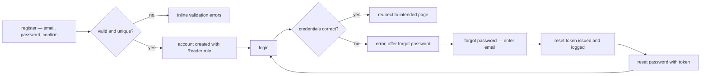
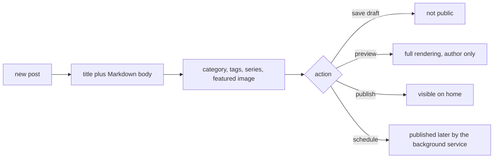

# TechieBlog — Usage Guide (Test Users · Test Plan · Setup)

> The single source for **how to test and run** this app. Every agent (flow-master self-smoke, the verifier) **and** the human UAT use the SAME test users and the SAME walkthrough listed here — no one invents throwaway accounts (enforced by `.tfcore/tasks/_smoke-test-policy.md`). Keep the Test-users table current: when an account is actually created, flip its `Created?` to ✅.

> ## ⚠ THE DATABASE — read this before running anything (corrected 2026-08-08)
>
> **The database is the `WinPostgre` Docker container, on host port `5550`.** It is a shared,
> multi-project PostgreSQL instance (`pgvector/pgvector:0.8.6-pg18-trixie`) that also hosts
> `AppMngrDb` and `TkStoriesDb` — so it is **not** disposable, and no agent may recreate, reset or
> `docker rm` it.
>
> ```bash
> docker start WinPostgre                                    # it is often stopped; just start it
> docker exec WinPostgre psql -U PgVectorAdmin -d TechieBlog  # psql lives INSIDE the container
> ```
>
> Connection string (now correct in `source/TechieBlog/appsettings.Development.json`):
> `Host=localhost;Port=5550;Database=TechieBlog;Username=PgVectorAdmin;Password=AdminPass@2025`
>
> **NEVER create a second PostgreSQL container.** The superseded day-1 note below said "TCP 5432 is
> unreachable from WSL" and recorded the port as 5432. Both were wrong: nothing listens on 5432
> because `WinPostgre` publishes `5550 -> 5432`. On 2026-08-08 that stale note cost a whole build
> phase's worth of database work — a build agent found 5432 dead, started an unrelated container,
> and every cluster then smoked against a throwaway database instead of this one. If the port
> appears dead, **start `WinPostgre`**; do not stand up your own.
>
> Schema and seed data are fully reproducible: boot the host and DbUp applies
> `source/BlogDb/PostgresScripts/001…022`, seeding 4 users, 10 posts, 7 comments and 5 categories.
>
> <details><summary>Superseded day-1 note (2026-08-02) — kept for traceability, do not follow</summary>
>
> > the database could not be inspected — TCP 5432 is unreachable from WSL, and the app's configured
> > connection string is `Host=localhost;Port=5432;Database=TechieBlog;Username=PgVectorAdmin`
> > (Windows-side). The table below therefore lists the **intended** account set, seeded or created on
> > first build after confirming with the owner. Also note the app currently **does not build**
> > (REQ-FN-043) — fix that before attempting any of the walkthroughs.
>
> </details>

## Test users (canonical — use THESE for all smoke / verify / UAT)

> **Reconciled against the live database 2026-08-14 (handoff).** All four accounts exist —
> `SELECT userid, username, emailid, userrole FROM bloguser` returns exactly ids 1-4 as listed
> (`ravi`/Admin, `maya`/Editor, `arun`/Author, `priya`/Contributor), all `isconfirmed = true`, with
> `issiteowner = true` on user 1 only. The `Created?` column below is therefore observed, not planned.

| # | Username / Email | Password | Role / Permission | Created? | Notes |
|---|------------------|----------|-------------------|----------|-------|
| 1 | `Ravi@techieblog.com` | `admin_password` | Admin | ✅ | **Seeded by `source/BlogDb/PostgresScripts/003-SeedData.sql`** — exists on any database where migrations have run. Stored as a PBKDF2-HMAC-SHA256 hash, not plaintext (REQ-NFR-023); the account is flagged `MustChangePassword`. Site owner (`IsSiteOwner = true`) — this is whose resume renders at `/resume`. |
| 2 | `editor@techieblog.test` | `Editor#Pass1` | Editor | ✅ | **Seeded by `source/BlogDb/PostgresScripts/019-SampleData.sql`** [REQ-FN-041] as *Maya Sharma* (`maya`). Exercises comment moderation and all-posts management; lands on `/admin` after sign-in. Hash: PBKDF2-HMAC-SHA256, 210 000 iterations, seed salt `TechieBlogEdt001`. Flagged `MustChangePassword`. |
| 3 | `author@techieblog.test` | `Author#Pass1` | Author | ✅ | **Seeded by `019-SampleData.sql`** [REQ-FN-041] as *Arun Nair* (`arun`). Owns the "PostgreSQL for .NET Developers" series and its two posts; lands on `/BlogsList`. Seed salt `TechieBlogAut001`. Flagged `MustChangePassword`. |
| 4 | `contributor@techieblog.test` | `Contrib#Pass1` | Contributor | ✅ | **Seeded by `019-SampleData.sql`** [REQ-FN-041] as *Priya Menon* (`priya`). Owns one unpublished draft; exercises the `ContributorOrAbove` policy and lands on `/` (no staff surface). Seed salt `TechieBlogCon001`. Flagged `MustChangePassword`. |
| 5 | ~~`reader@techieblog.test`~~ | — | ~~Reader~~ | **N/A** | **Retired 2026-08-06** — reader accounts and public registration were dropped (BRD-1/13/43/44). `019-SampleData.sql` deliberately seeds **no** Reader account: comments and ratings are now anonymous and email-keyed, so a Reader credential would open nothing. Use user 6 for engagement testing. |
| 6 | — (anonymous) | — | Guest | ✅ | No account — exercises every public page plus anonymous commenting and rating (name + email + double opt-in). |

> ⚠ **On a FRESH database, signing in with any of users 1–4 lands on `/change-password`, not on the role's usual landing route** — [REQ-NFR-023], implemented 2026-08-08. Every seeded account carries `MustChangePassword`, and that flag is **enforced**: the account is held on the change-password screen and cannot open any other page until the password is actually replaced (the new one must satisfy the same strength rules as `/reset-password`). This is the requirement, not a defect.
>
> **Verified at the source, 2026-08-14:** `019-SampleData.sql` inserts users 2-4 with
> `IsConfirmed, MustChangePassword` = `TRUE, TRUE`, and `017-SecurityAndTokenPersistence.sql` sets
> the flag on user 1. So a production deploy — always a fresh database — starts with **all four
> flagged**, and UAT should expect the change-password wall on first sign-in.
>
> ⚠ **A long-running DEV database may disagree, and that is drift rather than a doc error.** The
> development database on 2026-08-14 had `mustchangepassword = false` on users 2-4 and `true` only on
> user 1 — because the "before the run" statement below had been applied and the "after the run" one
> never was. **The re-arm is not optional bookkeeping; skipping it is what makes this table stop
> matching reality.** To restore the documented state on a drifted database:
>
> ```sql
> UPDATE BlogUser SET MustChangePassword = TRUE WHERE UserId IN (1, 2, 3, 4);
> ```
>
> **For a test that needs the account past the sign-in screen**, either complete the change (then use the new password for the rest of the run) or clear the flag first and re-arm it afterwards, so this table stays true for the next tester:
>
> ```sql
> -- before the run
> UPDATE BlogUser SET MustChangePassword = FALSE WHERE UserId IN (1, 2, 3, 4);
> -- after the run
> UPDATE BlogUser SET MustChangePassword = TRUE  WHERE UserId IN (1, 2, 3, 4);
> ```
>
> ⚠ **Corrected 2026-08-09.** These two statements previously read `WHERE UserId IN (1, 5, 6, 7)`,
> which does not match the four seeded accounts listed in the table above — ids **1, 2, 3, 4**.
> The old form silently cleared nothing for users 2–4 (no error, zero rows affected), so a scripted
> smoke that followed this guide was still held on `/change-password` with no indication why.
> Found by a build agent whose run was blocked by exactly that.
>
> The **passwords in this table are unchanged** — the forced change is a flag, not a rotation. If a test does complete a change, restore both the hash and the flag from `003-SeedData.sql` / `019-SampleData.sql` so the table remains the single source of truth.

- **Created?** — ✅ = the account exists in the database now (verified). ⬜ = planned; create it on first build, but **only after confirming with the owner** (see `_smoke-test-policy.md`). Never auto-create silently.
- **To add or confirm an account:** edit this table — it is the registry the whole pipeline reads from.
- **Seeding:** user 1 comes from `003-SeedData.sql`; users 2–4 come from `019-SampleData.sql` [REQ-FN-041]. DbUp applies both automatically at host startup, so the whole table is reproducible from a clean database — no manual `/AddUser` step. **No password is stored in plaintext anywhere in the migration scripts** (REQ-NFR-023): each script carries a PBKDF2-HMAC-SHA256 hash with a fixed per-account seed salt, and the plaintext lives only in this table.
- **Site owner:** exactly one user carries `IsSiteOwner = true` (enforced by a partial unique index) and is whose resume renders at `/resume`. It is user 1; `019-SampleData.sql` also seeds that user's skills, experience, awards and stats.
- **Sample content:** `019-SampleData.sql` seeds 10 posts (8 published, 1 scheduled series part, 1 contributor draft), 2 series with ordered parts, category/tag junction rows, 7 approved anonymous comments (one threaded reply) and 21 verified ratings — enough for every public listing to render non-empty on a clean database.

## How to test — screen by screen / menu by menu

Walk these in order; together they exercise every feature in `docs/TechieBlog-BRD.md` §9.

### Public — Home (`/`)
- **Log in as:** user 6 (anonymous)
- **Steps:** 1) open `/` → 2) confirm the featured post and the recent-posts grid render → 3) confirm the sidebar shows categories, tags and the subscribe form → 4) click a post card.
- **Expected:** real post data (not placeholders); the card click lands on `/post/{slug}`.
- **Covers:** BRD-30, BRD-33 · REQ-UI-005, REQ-UI-006, REQ-UI-045, REQ-FN-020

### Public — Post view (`/post/{slug}`)
- **Log in as:** nobody — anonymous throughout (user 6)
- **Steps:** 1) open a published post → 2) confirm Markdown renders as formatted HTML → 3) check author, date, category, tags, reading time → 4) scroll to related posts and series navigation → 5) leave a comment with name + email and confirm the double opt-in mail → 6) rate the post with the same email, then change the rating.
- **Expected:** engagement needs **no account** — comment and rating are keyed to the verified email. No sign-in prompt appears. Unapproved comments never render publicly, and no email address is ever displayed.
- **Covers:** BRD-31, BRD-32, BRD-36, BRD-40, BRD-43 · REQ-UI-007, REQ-UI-027, REQ-UI-028, REQ-UI-029

### Public — Category and tag archives (`/category/{slug}`, `/tag/{slug}`)
- **Log in as:** user 6
- **Steps:** 1) open a category archive from the sidebar → 2) open a tag archive → 3) compare the displayed post count with the number of posts actually listed.
- **Expected:** each archive lists only its own published posts; the tag count matches the listing (the Story 7.5 regression).
- **Covers:** BRD-25, BRD-26 · REQ-UI-008, REQ-UI-009, REQ-FN-017, REQ-FN-018

### Public — Series (`/series`, `/series/{slug}`)
- **Log in as:** user 6
- **Steps:** 1) open `/series` → 2) open one series → 3) open part 1 → 4) use next/previous navigation.
- **Expected:** parts are listed in reading order; navigation moves within the series only.
- **Covers:** BRD-27, BRD-28, BRD-29 · REQ-UI-010, REQ-UI-024, REQ-FN-019

### Public — Search (`/search`)
- **Log in as:** user 6
- **Steps:** 1) open `/search` → 2) search a word known to be in a post body → 3) apply a category filter → 4) page through results.
- **Expected:** results come from the database with the term highlighted; the category dropdown is populated from live categories, not hardcoded.
- **Covers:** BRD-34, BRD-35 · REQ-UI-011, REQ-FN-021

### Public — Authors and resume (`/authors`, `/author/{username}`, `/resume`)
- **Log in as:** user 6
- **Steps:** 1) open `/authors` → 2) confirm each author shows title and article count → 3) open one `/author/{username}` → 4) request a deliberately invalid username → 5) open `/resume` → 6) use the anchor navigation and click **Download CV**.
- **Expected:** invalid username returns 404; the resume shows the site owner's hero, experience, skills, awards, stats and contact; the CV downloads.
- **Covers:** BRD-49, BRD-50, BRD-51, BRD-52, BRD-53, BRD-54, BRD-55 · REQ-UI-036, REQ-UI-041, REQ-UI-042, REQ-FN-028, REQ-FN-029

### Public — RSS, sitemap, robots (`/rss`, `/sitemap.xml`, `/robots.txt`)
- **Log in as:** user 6
- **Steps:** 1) open each URL → 2) validate the sitemap XML parses → 3) confirm `robots.txt` points at the sitemap.
- **Expected:** the feed lists recent published posts; the sitemap includes posts, categories and tags.
- **Covers:** BRD-63, BRD-64 · REQ-UI-046, REQ-FN-037, REQ-FN-038

### Auth — Register, login, reset (`/register`, `/login`, `/forgot-password`, `/reset-password`)



- **Log in as:** user 4 (any seeded account works)
- **Steps:** 1) log in → 2) log out → 3) run forgot-password for that account's email → 4) retrieve the reset token **from the application log** (with no `EmailSettings:SmtpHost` configured, `ConsoleEmailService` logs it instead of sending — REQ-FN-033) → 5) reset and log in with the new password → 6) confirm the used token is rejected on a second attempt.
- **Expected:** each step behaves as above; an expired, invalid or already-used token shows a clear error.
- **Note:** **public registration was retired 2026-08-06** (~~BRD-1~~) — there is no `/register` flow to test and no self-service account creation. Accounts are seeded or created by an Admin.
- **Covers:** BRD-2, BRD-3, BRD-4, BRD-5, BRD-6 · REQ-UI-002, REQ-UI-003, REQ-FN-005…008

### Auth — Role gates (`/access-denied`)
- **Log in as:** anonymous first, then user 4 (Contributor), 3 (Author), 2 (Editor), 1 (Admin)
- **Steps:** for each, attempt `/admin`, `/users`, `/settings`, `/ManagePost`, `/admin/skills`.
- **Expected:** each user reaches exactly the pages their policy allows and lands on `/access-denied` otherwise; navigation items they cannot use are hidden.
- **Covers:** BRD-7, BRD-8, BRD-9 · REQ-UI-004, REQ-UI-047, REQ-FN-009

### Account — Profile and password (`/profile`)
- **Log in as:** user 3 (Author) — or any seeded account
- **Steps:** 1) open `/profile` → 2) edit display name and bio, save → 3) reload and confirm the values persisted → 4) change the password and re-login with the new one.
- **Expected:** changes persist across a reload; the current-password check rejects a wrong value.
- **⚠ Watch this one:** profile **save** has never been driven end to end by an automated pass, and REQ-FN-053 was a data-loss regression in this area. Verify step 3 carefully rather than assuming.
- **Covers:** BRD-11, BRD-12 · REQ-UI-013, REQ-FN-011
- **Retired 2026-08-06:** favourites and `/my-favorites` (~~BRD-43/44~~, F-FAV removed) and the
  My-Comments page (~~BRD-13~~, REQ-UI-015) — none of these exist; there is nothing to test.

### Authoring — Post editor and lifecycle (`/ManagePost`, `/BlogsList`, `/admin/preview/{id}`)



- **Log in as:** user 3 (Author)
- **Steps:** 1) create a post, type Markdown and watch the live preview → 2) confirm the slug auto-generates and is editable → 3) pick a category, add an existing tag and create a new tag inline, add it to a series → 4) insert an image from the media library → 5) save as draft and confirm it is absent from `/` → 6) preview it → 7) publish and confirm it appears on `/` → 8) create a second post scheduled two minutes out and confirm the background publisher promotes it → 9) edit and then delete a post.
- **Expected:** every metadata field persists; drafts never leak to the public site; the scheduled post publishes without user action.
- **Covers:** BRD-14…BRD-21, BRD-23, BRD-24 · REQ-UI-016, REQ-UI-017, REQ-UI-018, REQ-FN-012…016

### Authoring — Media library and image picker (`/admin/images`)
- **Log in as:** user 1 (Admin)
- **Steps:** 1) open `/admin/images` → 2) upload one image per category tab → 3) attempt an over-size file and a disallowed format → 4) copy an image URL and open it → 5) delete an image → 6) open `/admin/profile` and pick an avatar through the ImagePicker.
- **Expected:** per-category size/format limits are enforced server-side; uploaded files are reachable under `/uploads/{category}/…`; the picker binds the chosen path.
- **Covers:** BRD-45, BRD-46, BRD-47, BRD-48 · REQ-UI-034, REQ-UI-035, REQ-FN-025, REQ-FN-026

### Authoring — Resume data (`/admin/profile`, `/admin/experience`, `/admin/skills`, `/admin/awards`)
- **Log in as:** user 3 (Author), then user 1 (Admin)
- **Steps:** 1) as the author, set username, title, tagline, phone, location, upload a CV and enable the resume → 2) add two experience entries, one marked current, with logos and reordering → 3) add skills in two categories → 4) add an award with a badge → 5) view `/author/{username}` → 6) as Admin, confirm the user selector lets you edit another user's data.
- **Expected:** authors see only their own data; admins can switch user; the public author page reflects the edits.
- **Covers:** BRD-11, BRD-50, BRD-51, BRD-54 · REQ-UI-037…040, REQ-FN-027, REQ-FN-029

### Editorial — Comment moderation (`/CommentsList`)
- **Log in as:** user 2 (Editor)
- **Steps:** 1) **anonymously** post a comment (name + email, complete the double opt-in) → 2) as the editor, open the moderation queue → 3) approve it and confirm it appears on the post → 4) post another, reject it → 5) edit a comment → 6) bulk-select and process several.
- **Expected:** the queue reflects the moderation setting; approved comments appear publicly, rejected ones do not.
- **Covers:** BRD-36…BRD-39 · REQ-UI-021, REQ-UI-029, REQ-FN-022

### Admin — Dashboard, users, taxonomy, subscribers, settings
- **Log in as:** user 1 (Admin)
- **Steps:** 1) open `/admin` and confirm the count tiles show live numbers → 2) `/users` — search, change a role, disable an account → 3) `/CategoriesList` — add, rename, delete a category → 4) `/admin/tags` — same for tags → 5) subscribe from the public sidebar as an anonymous visitor, then `/admin/subscribers` — search, filter, export, remove → 6) `/settings` — change the site title, posts-per-page and the site theme, save, and confirm the public site reflects it.
- **Expected:** every management action persists and is reflected on the public site.
- **Covers:** BRD-10, BRD-22, BRD-24, BRD-56, BRD-57, BRD-58, BRD-62, BRD-68, BRD-69, BRD-70 · REQ-UI-019, REQ-UI-020, REQ-UI-022, REQ-UI-023, REQ-UI-025, REQ-UI-026, REQ-UI-030, REQ-FN-030, REQ-FN-031, REQ-FN-036, REQ-FN-040

### Theming — Light/dark and site themes
- **Log in as:** user 6, then user 1
- **Steps:** 1) toggle light/dark from the header on the home page, a post, an archive, search, about and an admin page → 2) reload and confirm the choice persisted → 3) as Admin, switch the site theme to Developer Dark, then Minimal Clean → 4) re-walk the public pages in each theme, in both modes.
- **Expected:** no unreadable text, invisible control or broken contrast in any of the six combinations (visual gate).
- **Covers:** BRD-65, BRD-66, BRD-67, BRD-68 · REQ-UI-031, REQ-UI-032, REQ-UI-033, REQ-FN-039

### Not testable here (needs infrastructure this machine does not have)
- **Real SMTP delivery (REQ-FN-033)** — `SmtpEmailService` ships and is selected whenever
  `EmailSettings:SmtpHost` is set; with no host configured, `ConsoleEmailService` runs and
  password-reset mail is written to the log instead. Exercise it against a real SMTP host during UAT.
- **The production deployment (REQ-NFR-038)** — needs the VPS; see `docs/Prod-Deploy-Checklist.md`.

*(Everything this section previously listed as "not built" — newsletter composition and sending,
the analytics dashboard, sample data, the health endpoint — is built and `Verified`. The
My-Comments page was removed from scope on 2026-08-06, not deferred.)*

## Prerequisites
- .NET 10 SDK
- PostgreSQL 15 or higher, reachable from the machine running the app
- A modern browser (Chrome, Firefox, Edge, Safari); headless Chromium for Playwright-driven verification
- **Windows-side `dotnet`** for anything that builds the whole solution — `source/BlogApp` targets
  `net10.0-windows10.0.19041.0`, which WSL `dotnet` cannot build. Use `cmd.exe /c "dotnet …"`.

## Setup / Deployment steps (runbook — one command per line, in order)

1. `git clone <repo> && cd TechieBlog`
2. **Start the existing database — do not create one:** `docker start WinPostgre` (publishes `5550 -> 5432`; the `TechieBlog` database already exists on it). Only on a machine that has never had it: `docker exec WinPostgre psql -U PgVectorAdmin -d postgres -c 'CREATE DATABASE "TechieBlog";'`
3. Connection string — `AppDbConString` in `source/TechieBlog/appsettings.Development.json` (or user secrets): `Host=localhost;Port=5550;Database=TechieBlog;Username=PgVectorAdmin;Password=<pass>`
4. **Set the two required secrets — the host refuses to start without them, by design (REQ-NFR-027):**
   `dotnet user-secrets set JwtSigningKey "$(openssl rand -base64 48)" --project source/TechieBlog` and
   `dotnet user-secrets set AppEncryptionKey "$(openssl rand -base64 32)" --project source/TechieBlog`
   (≥32 and ≥16 chars; the two previously committed literals are blocklisted by digest and cannot be reused).
5. `dotnet restore`
6. `cmd.exe /c "dotnet build TechieBlog.slnx"` *(green 2026-08-14 — 0 errors, 7/7 projects)*
7. `ASPNETCORE_ENVIRONMENT=Development dotnet run --project source/TechieBlog` — DbUp applies `source/BlogDb/PostgresScripts/001…022` automatically at startup. **The environment must be Development or user secrets are not loaded and startup fails on the missing secret.**
8. Open the URL printed by Kestrel (see `source/TechieBlog/Properties/launchSettings.json`) and log in as test user 1.
9. On a fresh database all four seeded accounts are flagged `MustChangePassword` and are redirected to `/change-password` before any authorised page. To bypass for a scripted smoke, clear the flag for **all four** and **re-arm afterwards** — skipping the re-arm is what makes the test-user table drift out of date:
   `UPDATE bloguser SET mustchangepassword=false WHERE userid IN (1,2,3,4);` … `UPDATE bloguser SET mustchangepassword=true WHERE userid IN (1,2,3,4);`

Optional — migrating an existing MySQL instance: `dotnet run --project source/BlogDb` (see `docs/database-migration-guide.md`).

## Test (automated)
```bash
cmd.exe /c "dotnet test tests\TechieBlog.Tests\TechieBlog.Tests.csproj"
```
*1 490 tests — 1 487 pass, 3 skipped, 0 fail (2026-08-14). Use rung #4 (`cmd.exe`): WSL `dotnet`
cannot build this solution because `source/BlogApp` targets `net10.0-windows`.*

## Smoke checklist (quick capability pass)
- [ ] Build is green (`cmd.exe /c "dotnet build TechieBlog.slnx"`)
- [ ] Home page loads and lists published posts (anonymous)
- [ ] Open a post; Markdown renders with author, date, category, tags, reading time (anonymous)
- [ ] Comment and rate a post anonymously (name + email + double opt-in) — no account needed
- [ ] Log in as Author; create, preview and publish a post with category and tags (user 3)
- [ ] Log in as Editor; approve a pending comment (user 2)
- [ ] Log in as Admin; open the dashboard and change the site theme in Settings (user 1)
- [ ] Upload an image in the media library and pick it through the ImagePicker (user 1)
- [ ] Open `/resume` and download the CV (anonymous)
- [ ] Toggle dark mode on public and admin pages; no unreadable text

## Known limitations
- **REQ-NFR-017 (`PARTIAL`) — CI cannot restore TrBlazeUI** until the `TrBlazeUiPackagesToken`
  repository secret exists. `docs/Prod-Deploy-Checklist.md` §5.
- **REQ-NFR-026 (`PARTIAL`) — stage 4 deferred** by owner decision.
- **REQ-NFR-025 (`In Progress`) — a revoked PAT remains in git history.** Dead (401); the open
  question is whether to rewrite history or accept it.
- **REQ-NFR-038 (`Implemented`, not agent-verifiable) — the deploy pipeline has never executed
  against the VPS.** Server *state* was verified 2026-08-14; pipeline *behaviour* was not.
- **REQ-FN-033 — real SMTP delivery is unexercised** (no SMTP host on this machine).
- **Never driven end to end:** profile save, newsletter Send, subscriber toggles. `newsletter` has
  0 rows, so REQ-UI-054 / REQ-FN-050 are unexercised.
- **BlogApp (MAUI): "build-verified only" is RETIRED (2026-08-22).** The real desktop head was driven
  over its own WebView2 CDP through the landing route, the connection-settings screen (probe, save,
  restart), an end-to-end image upload asserted at byte level, `/admin/skills`, `/admin/experience`,
  `/admin/images` and `/resume`. Owner UAT found three defects there, all fixed (REQ-UI-063,
  REQ-FN-062, REQ-UI-064). What is still undriven is the rest of the admin surface, not the head.
- **⚠ BlogApp: choose how images reach the server before uploading any.** Images are not stored in
  the database — the website serves them from a directory on the server's disk — so a desktop head
  that knows only where the *database* lives writes every upload to your own machine. In BlogApp go
  to **Change connection → Media storage** and pick one:
  - **Send to the server over SSH (SFTP)** — the right choice for this deployment. The site is a
    Linux VPS answering on 443 and 22 only, so its uploads directory cannot be mounted as a Windows
    path. Enter the SSH host, username, a password *or* a private-key file, and the server's own
    uploads directory: `/srv/data/techieblog/uploads`.
  - **Write to a mapped drive or network share** — only if the server's uploads directory really is
    reachable as a path. **A folder on this computer is refused**, however it is named: writing
    there cannot get an image onto the website, which is the whole point of the setting.
  - **Keep uploads on this machine** — the default, and legal. Nothing you upload will appear on the
    website. Right if you only edit text from the desktop.

  Press **Test** before saving. It writes a file to the destination, **reads it back** and deletes
  it, so a pass means the bytes genuinely made the journey — not merely that a folder was writable.
  The optional **Website address** (`https://techierathore.com`) is only used to *display* images
  inside BlogApp; stored paths are unchanged and the website does not need it.

  The SSH private key is chosen with a **Browse** button — you do not type the path.

  **⚠ Historical note, and a one-click recovery.** Before 2026-08-22 the screen offered only a folder
  box and its probe reported success for a folder on the local C: drive. Any image uploaded from
  BlogApp before that is still on this machine. **You do not need to re-upload them, and you do not
  need `scp`:** once the SSH transport is configured and tested, use **Send to server** on the same
  panel. Point it at a folder that plays the part of `uploads` and it pushes everything underneath,
  preserving the `logos/`, `awards/` … layout. Run it for
  `%LOCALAPPDATA%\TechieBlog\BlogApp\wwwroot\uploads` (the default) and for
  `C:\srv\data\techieblog\uploads`. The filenames already match what the database rows point at,
  so the existing images simply start working — nothing is written to the database.
- **Accessibility rests on a workaround** — axe reports 0/0 via an `App.razor` MutationObserver
  (TR-054/063/064); **no screen-reader pass has ever been run**.

*(Removed at handoff because each was verified false: the `NU1605` build failure — REQ-FN-043 is
`Verified` and the build is green 7/7; in-memory reset tokens — `017-SecurityAndTokenPersistence.sql`
persists them; "no automated tests and no CI" — 1 496 tests and two workflows exist; "the seeded
admin password is plaintext" — it is PBKDF2-HMAC-SHA256 at 210 000 iterations.)*
- No TrBlazeUI or TechieRag library dependency, so there are no `TR-` / `TR-RAG-` feedback items for this project.
