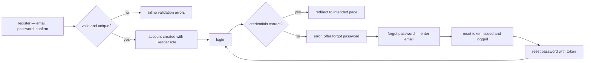
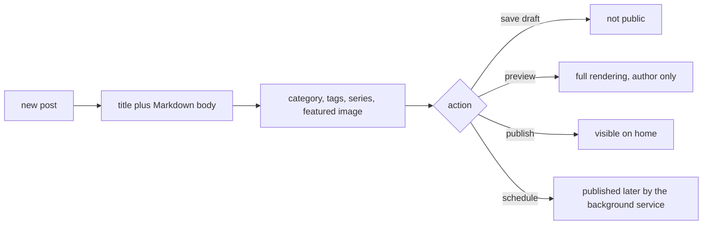

# TechieBlog — Usage Guide (Test Users · Test Plan · Setup)

> The single source for **how to test and run** this app. Every agent (flow-master self-smoke, the verifier) **and** the human UAT use the SAME test users and the SAME walkthrough listed here — no one invents throwaway accounts (enforced by `.tfcore/tasks/_smoke-test-policy.md`). Keep the Test-users table current: when an account is actually created, flip its `Created?` to ✅.

> **Day-1 note (2026-08-02):** the database could not be inspected — TCP 5432 is unreachable from WSL,
> and the app's configured connection string is `Host=localhost;Port=5432;Database=TechieBlog;Username=PgVectorAdmin`
> (Windows-side). The table below therefore lists the **intended** account set, seeded or created on
> first build after confirming with the owner. Also note the app currently **does not build**
> (REQ-FN-043) — fix that before attempting any of the walkthroughs.

## Test users (canonical — use THESE for all smoke / verify / UAT)

| # | Username / Email | Password | Role / Permission | Created? | Notes |
|---|------------------|----------|-------------------|----------|-------|
| 1 | `Ravi@techieblog.com` | `admin_password` | Admin | ⬜ | **Seeded by `source/BlogDb/PostgresScripts/003-SeedData.sql`** — exists on any database where migrations have run, but unverified at day-1. ⚠ stored as plaintext in the seed script (REQ-NFR-023); change it after first login. |
| 2 | `editor@techieblog.test` | `{ask owner}` | Editor | ⬜ | Needed to exercise comment moderation and all-posts management. Create via `/AddUser` as Admin. |
| 3 | `author@techieblog.test` | `{ask owner}` | Author | ⬜ | Needed for the post editor, series, media and own-profile/resume screens. |
| 4 | `contributor@techieblog.test` | `{ask owner}` | Contributor | ⬜ | Exercises the `ContributorOrAbove` policy (currently unused by any page — confirms the gate). |
| 5 | `reader@techieblog.test` | `{ask owner}` | Reader | ⬜ | Self-registered via `/register`; exercises comments, ratings, favourites. |
| 6 | — (anonymous) | — | Guest | ✅ | No account — exercises every public page and the "must sign in to engage" prompts. |

- **Created?** — ✅ = the account exists in the database now (verified). ⬜ = planned; create it on first build, but **only after confirming with the owner** (see `_smoke-test-policy.md`). Never auto-create silently.
- **To add or confirm an account:** edit this table — it is the registry the whole pipeline reads from.
- **Seeding:** user 1 comes from `003-SeedData.sql`, which DbUp applies automatically at host startup. Users 2–5 have no seed script yet; `REQ-FN-041` (sample data) should add one user per role so this table becomes reproducible from a clean database.
- **Site owner:** exactly one user carries `IsSiteOwner = true` (enforced by a partial unique index) and is whose resume renders at `/resume`. Set it on user 1 unless the owner says otherwise.

## How to test — screen by screen / menu by menu

Walk these in order; together they exercise every feature in `docs/TechieBlog-BRD.md` §9.

### Public — Home (`/`)
- **Log in as:** user 6 (anonymous)
- **Steps:** 1) open `/` → 2) confirm the featured post and the recent-posts grid render → 3) confirm the sidebar shows categories, tags and the subscribe form → 4) click a post card.
- **Expected:** real post data (not placeholders); the card click lands on `/post/{slug}`.
- **Covers:** BRD-30, BRD-33 · REQ-UI-005, REQ-UI-006, REQ-UI-045, REQ-FN-020

### Public — Post view (`/post/{slug}`)
- **Log in as:** user 6, then repeat as user 5
- **Steps:** 1) open a published post → 2) confirm Markdown renders as formatted HTML → 3) check author, date, category, tags, reading time → 4) scroll to related posts and series navigation → 5) as anonymous, try to comment/rate/favourite → 6) sign in as user 5 and retry.
- **Expected:** anonymous sees a sign-in prompt for engagement; signed-in can comment, rate and favourite.
- **Covers:** BRD-31, BRD-32, BRD-36, BRD-40, BRD-43 · REQ-UI-007, REQ-UI-027, REQ-UI-028, REQ-UI-029

### Public — Category and tag archives (`/category/{slug}`, `/tag/{slug}`)
- **Log in as:** user 6
- **Steps:** 1) open a category archive from the sidebar → 2) open a tag archive → 3) compare the displayed post count with the number of posts actually listed.
- **Expected:** each archive lists only its own published posts; the tag count matches the listing (the Story 7.5 regression).
- **Covers:** BRD-25, BRD-26 · REQ-UI-008, REQ-UI-009, REQ-FN-017, REQ-FN-018

### Public — Series (`/series`, `/series/{slug}`)
- **Log in as:** user 6
- **Steps:** 1) open `/series` → 2) open one series → 3) open part 1 → 4) use next/previous navigation.
- **Expected:** parts are listed in reading order; navigation moves within the series only.
- **Covers:** BRD-27, BRD-28, BRD-29 · REQ-UI-010, REQ-UI-024, REQ-FN-019

### Public — Search (`/search`)
- **Log in as:** user 6
- **Steps:** 1) open `/search` → 2) search a word known to be in a post body → 3) apply a category filter → 4) page through results.
- **Expected:** results come from the database with the term highlighted; the category dropdown is populated from live categories, not hardcoded.
- **Covers:** BRD-34, BRD-35 · REQ-UI-011, REQ-FN-021

### Public — Authors and resume (`/authors`, `/author/{username}`, `/resume`)
- **Log in as:** user 6
- **Steps:** 1) open `/authors` → 2) confirm each author shows title and article count → 3) open one `/author/{username}` → 4) request a deliberately invalid username → 5) open `/resume` → 6) use the anchor navigation and click **Download CV**.
- **Expected:** invalid username returns 404; the resume shows the site owner's hero, experience, skills, awards, stats and contact; the CV downloads.
- **Covers:** BRD-49, BRD-50, BRD-51, BRD-52, BRD-53, BRD-54, BRD-55 · REQ-UI-036, REQ-UI-041, REQ-UI-042, REQ-FN-028, REQ-FN-029

### Public — RSS, sitemap, robots (`/rss`, `/sitemap.xml`, `/robots.txt`)
- **Log in as:** user 6
- **Steps:** 1) open each URL → 2) validate the sitemap XML parses → 3) confirm `robots.txt` points at the sitemap.
- **Expected:** the feed lists recent published posts; the sitemap includes posts, categories and tags.
- **Covers:** BRD-63, BRD-64 · REQ-UI-046, REQ-FN-037, REQ-FN-038

### Auth — Register, login, reset (`/register`, `/login`, `/forgot-password`, `/reset-password`)



- **Log in as:** user 6 → becomes user 5
- **Steps:** 1) register a new reader → 2) confirm weak passwords and duplicate emails are rejected → 3) log in → 4) log out → 5) run forgot-password → 6) retrieve the reset token **from the application log** (email is not actually sent — `ConsoleEmailService`, REQ-FN-033) → 7) reset and log in with the new password.
- **Expected:** each step behaves as above; an expired or invalid token shows a clear error.
- **Covers:** BRD-1, BRD-2, BRD-3, BRD-4, BRD-5, BRD-6 · REQ-UI-001, REQ-UI-002, REQ-UI-003, REQ-FN-005…008

### Auth — Role gates (`/access-denied`)
- **Log in as:** user 5 (Reader), then user 4, 3, 2, 1
- **Steps:** for each user, attempt `/admin`, `/users`, `/settings`, `/ManagePost`, `/admin/skills`.
- **Expected:** each user reaches exactly the pages their policy allows and lands on `/access-denied` otherwise; navigation items they cannot use are hidden.
- **Covers:** BRD-7, BRD-8, BRD-9 · REQ-UI-004, REQ-UI-047, REQ-FN-009

### Reader account — Profile and favourites (`/profile`, `/my-favorites`)
- **Log in as:** user 5
- **Steps:** 1) open `/profile` → 2) edit display name and bio, save → 3) change the password and re-login → 4) favourite two posts → 5) open `/my-favorites` → 6) unfavourite one.
- **Expected:** changes persist; the favourites list reflects the toggles immediately.
- **Covers:** BRD-11, BRD-12, BRD-43, BRD-44 · REQ-UI-013, REQ-UI-014, REQ-FN-011, REQ-FN-024
- **Gap:** there is no My-Comments history page yet (REQ-UI-015, BRD-13) — nothing to test.

### Authoring — Post editor and lifecycle (`/ManagePost`, `/BlogsList`, `/admin/preview/{id}`)



- **Log in as:** user 3 (Author)
- **Steps:** 1) create a post, type Markdown and watch the live preview → 2) confirm the slug auto-generates and is editable → 3) pick a category, add an existing tag and create a new tag inline, add it to a series → 4) insert an image from the media library → 5) save as draft and confirm it is absent from `/` → 6) preview it → 7) publish and confirm it appears on `/` → 8) create a second post scheduled two minutes out and confirm the background publisher promotes it → 9) edit and then delete a post.
- **Expected:** every metadata field persists; drafts never leak to the public site; the scheduled post publishes without user action.
- **Covers:** BRD-14…BRD-21, BRD-23, BRD-24 · REQ-UI-016, REQ-UI-017, REQ-UI-018, REQ-FN-012…016

### Authoring — Media library and image picker (`/admin/images`)
- **Log in as:** user 1 (Admin)
- **Steps:** 1) open `/admin/images` → 2) upload one image per category tab → 3) attempt an over-size file and a disallowed format → 4) copy an image URL and open it → 5) delete an image → 6) open `/admin/profile` and pick an avatar through the ImagePicker.
- **Expected:** per-category size/format limits are enforced server-side; uploaded files are reachable under `/uploads/{category}/…`; the picker binds the chosen path.
- **Covers:** BRD-45, BRD-46, BRD-47, BRD-48 · REQ-UI-034, REQ-UI-035, REQ-FN-025, REQ-FN-026

### Authoring — Resume data (`/admin/profile`, `/admin/experience`, `/admin/skills`, `/admin/awards`)
- **Log in as:** user 3 (Author), then user 1 (Admin)
- **Steps:** 1) as the author, set username, title, tagline, phone, location, upload a CV and enable the resume → 2) add two experience entries, one marked current, with logos and reordering → 3) add skills in two categories → 4) add an award with a badge → 5) view `/author/{username}` → 6) as Admin, confirm the user selector lets you edit another user's data.
- **Expected:** authors see only their own data; admins can switch user; the public author page reflects the edits.
- **Covers:** BRD-11, BRD-50, BRD-51, BRD-54 · REQ-UI-037…040, REQ-FN-027, REQ-FN-029

### Editorial — Comment moderation (`/CommentsList`)
- **Log in as:** user 2 (Editor)
- **Steps:** 1) as user 5, post a comment → 2) as the editor, open the moderation queue → 3) approve it and confirm it appears on the post → 4) post another, reject it → 5) edit a comment → 6) bulk-select and process several.
- **Expected:** the queue reflects the moderation setting; approved comments appear publicly, rejected ones do not.
- **Covers:** BRD-36…BRD-39 · REQ-UI-021, REQ-UI-029, REQ-FN-022

### Admin — Dashboard, users, taxonomy, subscribers, settings
- **Log in as:** user 1 (Admin)
- **Steps:** 1) open `/admin` and confirm the count tiles show live numbers → 2) `/users` — search, change a role, disable an account → 3) `/CategoriesList` — add, rename, delete a category → 4) `/admin/tags` — same for tags → 5) subscribe from the public sidebar as an anonymous visitor, then `/admin/subscribers` — search, filter, export, remove → 6) `/settings` — change the site title, posts-per-page and the site theme, save, and confirm the public site reflects it.
- **Expected:** every management action persists and is reflected on the public site.
- **Covers:** BRD-10, BRD-22, BRD-24, BRD-56, BRD-57, BRD-58, BRD-62, BRD-68, BRD-69, BRD-70 · REQ-UI-019, REQ-UI-020, REQ-UI-022, REQ-UI-023, REQ-UI-025, REQ-UI-026, REQ-UI-030, REQ-FN-030, REQ-FN-031, REQ-FN-036, REQ-FN-040

### Theming — Light/dark and site themes
- **Log in as:** user 6, then user 1
- **Steps:** 1) toggle light/dark from the header on the home page, a post, an archive, search, about and an admin page → 2) reload and confirm the choice persisted → 3) as Admin, switch the site theme to Developer Dark, then Minimal Clean → 4) re-walk the public pages in each theme, in both modes.
- **Expected:** no unreadable text, invisible control or broken contrast in any of the six combinations (visual gate).
- **Covers:** BRD-65, BRD-66, BRD-67, BRD-68 · REQ-UI-031, REQ-UI-032, REQ-UI-033, REQ-FN-039

### Not testable yet (features not built)
Newsletter composition and sending (REQ-UI-043, REQ-FN-032), real SMTP delivery (REQ-FN-033), post-view
analytics and the analytics dashboard (REQ-UI-044, REQ-FN-034, REQ-FN-035), the My-Comments page
(REQ-UI-015), sample data (REQ-FN-041), health endpoint (REQ-NFR-014).

## Prerequisites
- .NET 10 SDK
- PostgreSQL 15 or higher, reachable from the machine running the app
- A modern browser (Chrome, Firefox, Edge, Safari); headless Chromium for Playwright-driven verification

## Setup / Deployment steps (runbook — one command per line, in order)

1. `git clone <repo> && cd TechieBlog`
2. `psql -U postgres -c "CREATE DATABASE \"TechieBlog\";"`
3. Set the connection string — add `AppDbConString` to `source/TechieBlog/appsettings.Development.json` (or user secrets): `Host=localhost;Port=5432;Database=TechieBlog;Username=<user>;Password=<pass>`
4. `dotnet restore`
5. `dotnet build TechieBlog.slnx` *(currently FAILS — see REQ-FN-043)*
6. `dotnet run --project source/TechieBlog` — DbUp applies `source/BlogDb/PostgresScripts/001…013` automatically at startup
7. Open the URL printed by Kestrel (see `source/TechieBlog/Properties/launchSettings.json`) and log in as test user 1.

Optional — migrating an existing MySQL instance: `dotnet run --project source/BlogDb` (see `docs/database-migration-guide.md`).

## Test (automated)
```bash
dotnet test
```
*No test project exists yet (REQ-NFR-016) — this command currently finds nothing to run.*

## Smoke checklist (quick capability pass)
- [ ] Build is green (`dotnet build TechieBlog.slnx`)
- [ ] Home page loads and lists published posts (user 6)
- [ ] Open a post; Markdown renders with author, date, category, tags, reading time (user 6)
- [ ] Register and log in as a reader; comment, rate and favourite a post (user 5)
- [ ] Log in as Author; create, preview and publish a post with category and tags (user 3)
- [ ] Log in as Editor; approve a pending comment (user 2)
- [ ] Log in as Admin; open the dashboard and change the site theme in Settings (user 1)
- [ ] Upload an image in the media library and pick it through the ImagePicker (user 1)
- [ ] Open `/resume` and download the CV (user 6)
- [ ] Toggle dark mode on public and admin pages; no unreadable text

## Known limitations
- **REQ-FN-043 — the solution does not build** (`NU1605`, FluentUI `4.*` vs pinned `Microsoft.AspNetCore.Components.Web 10.0.0`). Everything below is untestable until this is fixed.
- **REQ-FN-033 — no real email delivery.** Password-reset "emails" are written to the log by `ConsoleEmailService`; read the token from `logs/techieblog-*.log`.
- **REQ-NFR-019 — password-reset tokens live in memory** and are lost on restart.
- **REQ-NFR-016 / REQ-NFR-017 — no automated tests and no CI**, so this manual walkthrough is the only regression net.
- **REQ-NFR-023 / REQ-NFR-002 — ⚠ security:** the seeded admin password is plaintext in the seed script and password hashing is hand-rolled.
- No TrBlazeUI or TechieRag library dependency, so there are no `TR-` / `TR-RAG-` feedback items for this project.
