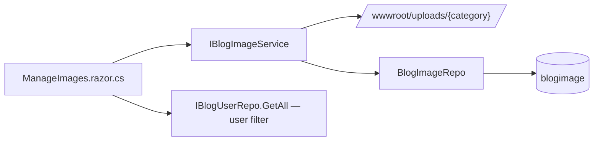
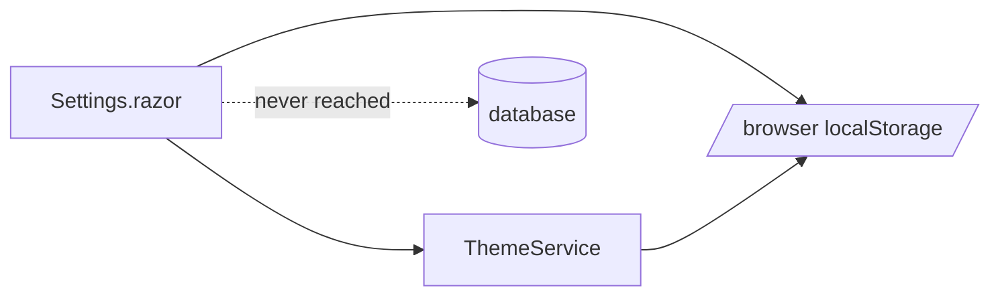

# TechieBlog — Developer Guide · Admin

> **Runtime-verified 2026-08-26 as Admin (web head, rung #4 :5473)** (verify-phase, scope REQ-UI-048 · REQ-FN-025 · REQ-UI-049 — TrBlazeUI 2.0.3). `/admin`, `/admin/images` (+ open upload dialog), `/users`, `/admin/skills`, `/admin/experience`, `/admin/analytics`, `/ManagePost` — **renders ✓ · looks-right ✓ (runtime-confirmed 2026-08-26)** at 1280 + 390; Select first-paint labels 13/13 across the admin surface. ⚠ New library finding **TR-075**: a styled `Select` inside a dialog drops focus to `<body>` after a pick (Escape needs a Tab first; mouse unaffected) — `/admin/images`, `/users`, `/admin/skills`. Desktop head not exercised this run.

> **Runtime-verified 2026-08-23 as Admin on BOTH heads** (verify-phase, scope REQ-UI-052 · REQ-FN-047 · REQ-FN-061 · REQ-NFR-018). Desktop head driven over the launched PID's WebView2 CDP; web head on rung #4 (0.0.0.0:5099).
> - **All 19 admin routes open ✓** — zero ErrorBoundary, zero access-denied, zero not-routed; sidebar renders 18 nav links; theme toggle flips the root `dark` class both ways. `pageOverflowX=false`, `zeroSize=[]` on every route → **looks-right ✓ (runtime-confirmed 2026-08-23)**.
> - ⚠ **Read the counts below with today's data in mind.** The development database now holds **0 posts / 0 series / 0 comments / 0 skills / 0 experience / 0 awards / 0 stats** (it held 10/2/7/18/3/3/4 on 2026-08-09). Those screens therefore render **correct EMPTY STATES**, not defects — `/admin/series` was opened and visually confirmed as a well-formed "No series yet" panel with its Add-New CTA. Any harness that asserts the 2026-08-09 counts will report false GAPs until it is re-seeded.
> - `/settings` — **renders ✓ · looks-right ✓** at 1280 + 390, but see the Known issue below: a Save that follows an abandoned unsaved edit takes **~45 s** to reach visitors instead of ~2 s (REQ-FN-061 / REQ-NFR-018).
> - ⚠ Desktop head only: the window lays out at **950×574 CSS px** (WinUI DPI-unaware, `devicePixelRatio` 1.5), so setup-screen controls read off-viewport and `/users` action controls read clippedX until the grid's own container is scrolled — both reachable by scrolling, both previously measured.
> - ⚠ **Cross-head staleness (new, 2026-08-23):** a post *deleted* in BlogApp stayed publicly reachable and listed on the web host for the **full 10-minute cache lifetime**. `MemoryCacheService` is per-process, so one head's write never evicts the other's cache. Publishing appears immediate only when the key happens to be a miss.

> **Runtime-verified 2026-08-22 as Admin** (verify-phase, scope REQ-UI-020 · REQ-FN-058). `/users` render + visual gates PASS at 1280 and 390; deep-linking into `/admin/speaking` and `/users` keeps the session. Screenshots: `tests/.artifacts/verify/users-{1280,390}.png`.

> ✅ **Runtime-verified 2026-08-09 as Admin and Editor** — supersedes the 2026-08-02 `STATIC-ONLY`
> banner, whose stated reason (solution does not compile, REQ-FN-043) is stale. Every screen below was
> exercised on **both heads**: the web host and the BlogApp desktop head.

Index: [TechieBlog-DevGuide.md](./TechieBlog-DevGuide.md)

## Runtime verification (2026-08-09)

Every count below was cross-checked against PostgreSQL **at the instant of measurement** (a start-of-run
snapshot proved unsafe — sibling agents moved the data mid-run).

| Screen | Observed | Detail |
|--------|----------|--------|
| `/admin` dashboard | **renders ✓ (runtime-confirmed)** | Posts 10, Users 4, Comments 16, Subscribers 7 — every tile an exact psql match. Needs-Attention 6/1/1 exact. Quick actions genuinely role-gated: an Editor is offered only the 2 non-`AdminOnly` destinations and both open without an access-denied bounce |
| `/admin` popular posts | **renders-empty (NO-DATA, downstream defect)** | shows an explicit empty state rather than a fabricated ranking — correct behaviour, but it can never populate because view tracking is dead code (`REQ-FN-034`) |
| `/users`, `/AddUser` | **renders ✓ · looks-right ✓ (runtime-verified 2026-08-22 as Admin)** | 4 rows with email + role badge, search narrows 4→1, all 7 create-form controls present. **Edit / activate / delete added and runtime-proven** (checklist `UAT-002`, `UAT-003`): the edit dialog prefills and its save survives a reload, deactivation now actually persists, delete removes the row (4→3), and the self / site-owner / last-admin guards render disabled with the reason in the tooltip. Screenshots `tests/.artifacts/harness/uat-users/` |
| `/CommentsList` | **renders ✓** | 16/16 rows all cells populated, tabs exact vs psql, 26 per-row controls + bulk actions; delete dialog opened and **cancelled** |
| `/admin/categories`, `/admin/tags` | **renders ✓** | 5 and 15 rows; per-row counts sum to the published-only totals exactly (8 and 27); editors load populated; delete dialogs opened and **cancelled** |
| `/admin/subscribers` | **renders ✓** | 7 rows = psql, summary "7 total (6 active)" exact, CSV export produced a real download. **Gap:** no delete/remove control exists — `Unsubscribe` is reachable only from the public token |
| `/settings` | **renders ✓** | all six tabs render and every value equals its `SiteSetting` row; 21 controls checked, 0 blank. The TR-032 `TabsTrigger` crash is **gone**. At 390 the tabs wrap to two rows and Storage is reachable |
| theme selector | **renders ✓** | preview does not persist and does not write LocalStorage; after Save a **fresh anonymous context** received the saved site theme. Restored afterwards |
| `/admin/analytics` | **renders-empty (NO-DATA, downstream defect)** | rating and comment tiles carry real numbers and the date range provably moves them; Views/Unique are 0 and the trend, popular and category panels show empty states — because `postviews` is never written (`REQ-FN-034`) |
| `AdminLayout` | **renders ✓** | 6 group headings, 17 entries for Admin vs 10 for Editor — refused groups are **hidden, not rendered empty**; exactly one active highlight; account menu names the identity |
| `/admin/images` | **render-error (DEFECT)** | gallery and per-category validation work end to end (upload → serve → delete), but the **user-filter Select displays the raw value `0`** instead of its "All Users" label. Reproduced on both heads |
| `/admin/skills` | **render-error (DEFECT)** | 13 skills in 5 categories = psql, but the **admin user selector shows the raw id `1`** instead of a user name — same defect class as above. **Updated 2026-08-22 (REQ-UI-064, owner UAT):** the screen now orders CATEGORIES by the lowest `DisplayOrder` they contain instead of alphabetically, carries category Move up / Move down controls, and shows a per-skill order badge — driven live in the BlogApp head, and the public `/resume` was confirmed to render the identical category sequence. The per-skill Move up / Move down chevrons were already present and working; what did not work was a swap between two skills sharing a `DisplayOrder`, which wrote two rows and moved nothing. Both moves now run through one renumbering pass |
| `/admin/experience`, `/admin/awards` | **render-error (DEFECT), one half CORRECTED** | lists, ordering, add/edit/delete and the user selector all render. **The "company-logo picker and badge-image picker do not exist" finding is STALE and is withdrawn (2026-08-22):** `/admin/experience` was driven live in the BlogApp head and its `experience-logo-picker` contains a real `ImagePicker` — the gallery and upload dialogs both open, and an upload through it was completed end to end and asserted at byte level. REQ-UI-037/039 built the pickers after this row was written; the plain path input beside the picker is a documented alternative, not its absence. The user-selector raw-value defect above is unaffected |
| `/admin/profile` | **visual-broken (DEFECT)** | all 10 fields match psql byte-for-byte and the **`REQ-FN-053` data-loss regression holds** (md5 over the nine at-risk columns identical across a no-edit save). At 390 `clear-image` **overlaps** `upload-new-image` and is invisible in the render |
| `/admin/newsletter` | **renders ✓ with a dead link (DEFECT)** | compose, preview, live audience estimate, send and per-recipient delivery log all work — but every message carries an unsubscribe link to `/unsubscribe/{token}`, which **404s with a zero-byte body**. No page is routed there |
| `/ManagePost` (see Author guide) | **render-error (DEFECT)** | the Markdown textarea **loses and reorders keystrokes**; saving with no category selected surfaces a **raw PostgreSQL FK violation** to the user |

**Dark mode:** measured, not eyeballed — contrast resolved through a 1-px canvas across 8 admin screens
(43–140 text nodes each): **0 nodes below WCAG AA**. **Icons:** 333 rendered `<svg>` nodes across 13
routes, **0 empty** — no Lucide alias-name misses remain.

An Admin sees every screen in the app. The eleven below are guarded by
`@attribute [Authorize(Policy = "AdminOnly")]` and use `AdminLayout`.

## Admin · Users (`/users`)

**File:** `source/BlogUI/Pages/AdminPages/UsersList.razor` + `.razor.cs` — **injects the repository
directly; there is no user service.**

| Control | What it does | Source call | Render status |
|---------|--------------|-------------|---------------|
| User table | Lists all **live** users (soft-deleted rows excluded) | `BlogUserRepo.GetAllAsync(...)` → `SELECT * FROM BlogUser WHERE IsDeleted = FALSE` | **renders ✓ (runtime-confirmed 2026-08-22)** — 4 rows |
| Edit user (`user-edit`) | Opens a dialog for first name, last name, email and role; validates blanks, malformed and duplicate email, and last-admin demotion | `BlogUserRepo.UpdateAsync(...)` → `UpdateBlogUser(...)` | **renders ✓ (runtime-confirmed)** — edit persisted across a reload |
| Activate / deactivate (`user-activate` / `user-deactivate`) | Writes `IsConfirmed` **only** | `BlogUserRepo.SetUserActiveAsync(...)` → `SetBlogUserActive(...)` | **renders ✓ (runtime-confirmed)** — deactivation persisted across a reload |
| Delete user (`user-delete`) | Confirmation dialog, then a **soft** delete | `BlogUserRepo.SoftDeleteUserAsync(...)` → `SoftDeleteBlogUser(...)` | **renders ✓ (runtime-confirmed)** — row removed from the list |

**Data lineage:** page → `IBlogUserRepo` → `BlogUserRepo.cs` → `SELECT * FROM BlogUser WHERE
IsDeleted = FALSE` (and the stored function `SelectBlogUserById` for single reads) /
`UpdateBlogUser` · `SetBlogUserActive` · `SoftDeleteBlogUser` (migration
`030-UserAdminEditDelete.sql`).

**Why activation has its own write path — do not "simplify" it back.** `UpdateBlogUser` has thirteen
parameters and `IsConfirmed` is not one of them. Until 2026-08-22 the toggle flipped the flag on the
in-memory model and called the general `Update`, so the write was silently discarded and the badge
reverted on the next load (UAT-003). `SetBlogUserActive` writes that one column and nothing else;
folding it back into `Update` would also mean any caller holding a projection without the column
could clobber a live account's activation during an unrelated profile save.

**Delete is a soft delete, and that is deliberate.** `BlogUser` is the target of **16** foreign keys
and only 4 declare `ON DELETE CASCADE`, so a hard `DELETE` would be refused outright for any account
that has written a post or left a comment — the exact account an administrator wants to remove —
while succeeding for a new one and taking its ratings and favourites with it. The row is flagged
instead: the account disappears from every list and every identity lookup (`GetUserByEmail`,
`GetLoginUser`, username and site-owner lookups all filter it), while its posts and comments stay
published and attributed. `SoftDeleteBlogUser` clears `IsConfirmed` in the same statement, so the
single confirmation check in `AuthSvc.AuthenticateAsync` refuses deleted and deactivated accounts
alike. **`GetSingle` / `GetAllById` are deliberately NOT filtered** — a caller holding a `UserId` is
resolving a specific row to render authorship, and hiding it there would blank the author name on
every post a departed writer left behind.

**Guards (code-behind, re-checked at click time — not merely rendered disabled):** you cannot delete
your own account, the site owner (also enforced in the database, because that row drives the public
home page and `/resume`), or the last active administrator; the same last-admin and self rules block
deactivation and last-admin demotion. Each refusal is surfaced in the button's `title`, because a
greyed control with no explanation is what made this screen read as having no delete at all.

**Known issues (static):** Story 2.6 also specifies **last-login display** and an **audit-log entry
per admin action**. Neither exists — no audit-log write for user administration was located anywhere
in the codebase. (Search/filter, delete-with-confirmation and edit were the other Story 2.6 gaps and
are now closed; see checklist `UAT-002` / `UAT-003`.)

## Admin · Add user (`/AddUser`)

**File:** `source/BlogUI/Pages/AdminPages/AddUser.razor` — `@inject BlogModels.IBlogUserRepo UserRepo`

| Control | Source call | Render status |
|---------|-------------|---------------|
| Create user form | `{unresolved — TODO: the insert call was not located in the page; BlogUserRepo exposes Insert / InsertToGetId and the stored function InsertBlogUser}` | unresolved |

**Known issue (static):** if this page writes a password, confirm it hashes through
`AppEncrypt.CreateHash` rather than storing plaintext — the seed script sets a plaintext password
(REQ-NFR-023, ⚠ SECURITY), so the pattern is already present in the repo.

## Admin · Categories (`/admin/categories`, `/CategoriesList`) and category editor (`/admin/category`, `/admin/category/{PageId:long}`)

**Files:** `Pages/AdminPages/CategoriesList.razor`, `Pages/AdminPages/ManageCategory.razor` + `.razor.cs`

| Screen | Control | Source call |
|--------|---------|-------------|
| CategoriesList | Table with post counts | `CategoryService.GetAllWithCounts()` |
| CategoriesList | Delete | `CategoryService.DeleteCategory(...)` |
| ManageCategory | Load | `CategoryService.GetCategory(PageId)` |
| ManageCategory | Save | `CategoryService.SaveCategory(...)` |

**Lineage:** page → `CategorySvc` → `CategoryRepo` → `INSERT INTO Category`, `UPDATE Category`,
`DELETE FROM Category`, `SELECT c.CategoryId …` joined for counts.

## Admin · Tags (`/admin/tags`, `/TagsList`) and tag editor (`/ManageTag`, `/ManageTag/{PageId:long}`)

**Files:** `Pages/AdminPages/TagsList.razor`, `Pages/AdminPages/ManageTag.razor`

| Screen | Control | Source call |
|--------|---------|-------------|
| TagsList | Table with post counts | `TagService.GetAllWithCounts()` |
| TagsList | Delete | `TagService.DeleteTag(...)` |
| ManageTag | Load | `TagService.GetSingleTag(PageId)` |
| ManageTag | Slug | `SlugGenerator.GenerateSlug(...)` (static helper, called in the page) |
| ManageTag | Save | `TagService.SaveTag(...)` |

**Lineage:** page → `TagSvc` → `BlogTagRepo` → `INSERT INTO Tag`, `DELETE FROM Tag`,
`INSERT INTO PostTag`, `DELETE FROM PostTag`, `SELECT t.TagId …` with the `COUNT` that Story 7.5 fixed.

**Known issue (static):** the tag-merge capability indicated in mockup `26-admin-tags.html` was not
found. `{unresolved — TODO: confirm whether merge exists.}`

## Admin · Subscribers (`/admin/subscribers`)

**File:** `source/BlogUI/Pages/AdminPages/SubscribersList.razor`

| Control | What it does | Source call | Render status |
|---------|--------------|-------------|---------------|
| Subscriber table | Lists subscribers | `SubscriberService.GetAllSubscribers()` | static-only |
| Status change | Activate / unsubscribe | `SubscriberService.UpdateSubscriberStatus(...)` | static-only |
| Export | CSV download via JS interop | `SubscriberService.GetSubscribersForExport()` + `IJSRuntime` | static-only |

**Lineage:** page → `SubscriberSvc` → `SubscriberRepo` → `INSERT INTO Subscriber`,
`UPDATE Subscriber`, `SELECT SubscriberId …`.

**Known issue (static):** no newsletter composer or send action exists on this page — the "Newsletter
management" claim in the migrated plan (Story 7.7) covers the subscriber list only. Newsletter
composition and SMTP delivery are REQ-UI-043 / REQ-FN-032 / REQ-FN-033, all Not Started.

## Admin · Media library (`/admin/images`)

**File:** `source/BlogUI/Pages/AdminPages/ManageImages.razor` + `.razor.cs`

| Control | What it does | Source call | Render status |
|---------|--------------|-------------|---------------|
| Category tabs (7) | Switches the listed category | page state | renders ✓ (runtime-confirmed 2026-08-26) |
| Gallery by category | Lists images | `ImageService.GetImagesByCategoryAsync(...)` | renders ✓ (runtime-confirmed 2026-08-26 — grid, or the documented `images-empty` state when the category has no rows) |
| Upload dialog — category picker (styled `Select` inside `DialogContent`) | Picks the category; caption, `accept` and dropzone ceiling follow it | `ImageCategoryRules` via `IBlogImageService.GetCategoryRule` | renders ✓ (runtime-confirmed 2026-08-26 — 7 options, mouse + keyboard; **TR-075**: focus drops to `<body>` after a pick, so Escape needs a Tab first) |
| Upload | Validates then stores | `ImageService.ValidateImageAsync(...)` → `UploadImageAsync(...)` | renders ✓ (dialog + dropzone confirmed 2026-08-26); server-side rejection last exercised 2026-08-11 |
| Delete | Removes row and file | `ImageService.DeleteImageAsync(...)` | per-card action present (2026-08-26); not driven — destructive |
| Copy URL | Public path for an image | `ImageService.GetImageUrl(...)` | per-card action present (2026-08-26) |
| User filter | Owner selection | `UserRepo.GetAll(...)` | renders ✓ (runtime-confirmed 2026-08-26 — first-paint label "All Users") |

**Render/visual status (observed 2026-08-26, host `:5473`, TrBlazeUI 2.0.3):** **looks-right ✓ (runtime-confirmed 2026-08-26)** at 1280 and 390 for the page and for the open upload dialog (dialog inside the viewport at both widths). Screenshots `tests/.artifacts/verify-203-gates/admin-images-{1280,390}.png`, `admin-images-upload-dialog-{1280,390}.png`.

**Lineage:** page → `IBlogImageService` (`BlogEngine/Services/BlogImageService.cs`) → disk write under
`source/BlogUI/wwwroot/uploads/{category}/` **and** `BlogImageRepo` → `INSERT INTO blogimage` /
`UPDATE blogimage` / `SELECT * FROM blogimage`.

**Business rules:** seven categories with per-category size and format limits (profiles 2 MB; logos,
awards 500 KB; icons 200 KB; blog, general 5 MB; cv 10 MB / PDF only). Filenames are
`{category}_{userId}_{timestamp}_{guid}.{ext}`.

**Known issues:**
0. **TR-075 (library, observed 2026-08-26):** after picking a category in the upload dialog's styled `Select`, focus is dropped to `<body>`; `Escape` does not close the dialog until the user Tabs back in (one Tab re-enters; mouse Cancel/X unaffected). Same on `/users` edit and `/admin/skills` add dialogs. `docs/TechieBlog-TrBlazeUI-Feedback.md` TR-075.
1. The screen is `AdminOnly` while `ImagePicker` (which uploads through the same service) is used on
   `AuthorOrAbove` pages — Authors can create uploads they can never browse or delete (REQ-UI-034).
2. Files live on local disk with no storage abstraction (REQ-FN-042) — a container redeploy without a
   mounted volume loses every upload.
3. Thumbnail generation (feature-ideation §2.3 item 4) was not found.
   `{unresolved — TODO: confirm whether thumbnails are generated.}`

## Admin · Site settings (`/settings`)

**File:** `source/BlogUI/Pages/AdminPages/Settings.razor`

| Control | What it claims to do | What it actually does | Render status |
|---------|----------------------|-----------------------|---------------|
| Theme selector | Set the **site** theme | `ThemeService` → the `SiteSetting` row; a visitor's own light/dark toggle still layers on top | renders |
| General settings (site title, tagline, admin email) | Persist | `SiteSettingsService.SaveSettingsAsync` → `SiteSetting` rows, cache dropped on save | renders |
| **Site logo** (added UAT-022, 2026-08-23) | Choose the brand mark | `ImagePicker Category="logos"` → `General.SiteLogo`; consumed by the public header, admin sidebar and sign-in shell, falling back to the built-in glyph when blank | **observed 2026-08-23** |
| Blog / SEO / Social / Email / Storage sections | Persist | Same service; `Smtp.Password` and `Storage.CloudAccessKey` are encrypted at rest under `AppEncryptionKey` | renders |
| **Clear cached content** (Maintenance, UAT-001) | Evict the public-page caches | `CacheService.EvictTag` for Content / Taxonomy / Settings | renders |
| Save button | Confirms success | Reports the actual outcome of the save | renders |

> ⚠ **This section was substantially WRONG until 2026-08-23 and is corrected here.** It described the
> pre-REQ-FN-061 state — "there is no `SiteSettings` table in any migration", every section
> "silently discarded", the Save button a "false success message". All of that has been untrue since
> REQ-FN-061 shipped: `016-SiteSettings.sql` creates the table, `SiteSettingsService` +
> `SiteSettingsMapper` persist and project it, and the values are cached and re-read on save. It was
> observed working directly on 2026-08-23 while fixing UAT-021/022. The stale text is called out
> rather than quietly deleted because a DevGuide that confidently describes a defect that no longer
> exists sends the next reader to rebuild something that is already there — the UAT-014/015 problem.

**What was actually wrong on this screen, and is now fixed (UAT-021 / UAT-022, 2026-08-23):**
the settings **saved** correctly but almost nothing **read** them. `SiteTitle` had exactly one
consumer (`RssFeedSvc.cs:162`) while the header, footer, admin sidebar, sign-in shell and ~35 page
titles had `"TechieBlog"` typed into the markup — so changing the title appeared to do nothing. Both
are now served by the narrow `SiteIdentity` projection (`SiteTitle` + `SiteLogoPath` only).

⚠ **Do not widen that projection.** `SiteSettings` carries two live credentials (`Smtp.Password`,
`Storage.CloudAccessKey`) plus the admin email, and public chrome renders anonymously; a unit test
pins the projection to exactly two members for that reason.

## Admin · Resume data screens

`/admin/profile`, `/admin/experience`, `/admin/skills`, `/admin/awards` are `AuthorOrAbove` and are
documented in the [Author guide](./TechieBlog-DevGuide-Author.md). For Admins these pages additionally
render a **user selector** fed by `UserRepo.GetAll(...)`, so an Admin can edit any user's resume data.

The missing `ManageStats` screen (for `UserStats`, whose repository *is* registered at
`BlogSvcInitializer.cs:69`) is also covered there.

## Admin · Everything else

Admins inherit the Editor screens (dashboard, comment moderation, all posts — see the
[Editor guide](./TechieBlog-DevGuide-Editor.md)), the Author screens, and every public screen.

## Admin · BlogApp desktop head (added 2026-08-22)

The desktop head hosts the SAME `BlogUI` pages as the website — one RCL, two heads — so everything
above applies there unchanged. Two things belong to the desktop head alone, and both were owner-UAT
defects fixed on 2026-08-22.

**Connection banner (UAT-020, 2026-08-23).** `Components/DesktopStatusBar.razor` renders the
"● Connected · *host*" chip and **Change connection**, once, from `ConnectionGuard.razor` above the
router — so no shared `BlogUI` page needs a desktop-specific edit. It is an **in-flow
`sticky top-0 w-full` top banner**: it occupies real layout space and the whole shell flows beneath
it. It was previously `fixed bottom-3 left-3`, which floated it directly over the expanded sidebar's
Settings entry. ⚠ **`<DesktopStatusBar />` must stay the FIRST child of `ConnectionGuard`** — a
`sticky` element only pins to the top of the window when it is first in the DOM. That ordering is
pinned by `tests/unit/DesktopApp/DesktopStatusBarPlacementTests.cs`, which also rejects any return to
`fixed`. Measured on the running head 2026-08-23: `top=0px`, `position: sticky`, 0 overlaps across
all 18 sidebar entries.

**Preview opens OUTSIDE this window (UAT-024, 2026-08-23).** Previewing a **published** post used to
navigate this very WebView to `/post/{slug}`, which renders `MainLayout` — no admin chrome, no route
back, and no browser chrome in a hybrid head, so the only escape was restarting the app. Both call
sites (`BlogsList.razor.cs` `NavigateToPreviewAsync`, `PreviewPost.razor` `ViewLivePostAsync`) now go
through `IExternalLinkOpener`: `window.open(url, "_blank")` on the website, `Launcher.OpenAsync` —
the OS default browser — in BlogApp. An **unpublished** post has no public URL and still opens
`/admin/preview/{id}` in the current window.

**Making a desktop edit visible on the website (UAT-023, 2026-08-23).** BlogApp writes straight to
the database and never enters the web host's process, so it cannot invalidate the website's
ten-minute content cache — an edit stays invisible on the public pages until the entry ages out.
`Services/RemoteSiteCacheNotifier.cs` now calls `POST /api/admin/cache/refresh` on the address stored
in `ConnectionSettings.SiteBaseUrl` after every publish-affecting save, authenticating with the
operator's own access token (the same `GetUserByAccessTokenAsync` lookup the website's cookie handler
uses — no new secret) and reporting the real outcome rather than assuming success. ⚠ That endpoint
needs **both** `DisableAntiforgery()` and `/api` in `NotFoundPage.InfrastructurePrefixes`; without the
first it answers 400 before reading the token, and without the second its own 401 is rewritten into a
400 HTML page. `tests/unit/Ops/CacheRefreshEndpointTests.cs` pins both.

**Where the app opens (REQ-UI-063).** `MainPage.xaml.cs` sets `blazorWebView.StartPath`. A
configured install now starts on `Components/Pages/DesktopStart.razor` (`/blogapp/start`), which
reads the authentication state on its first interactive render and forwards to
`RoleLandingRoutes.ResolveFor(role)` — `/admin` for Admin and Editor, `/BlogsList` for an Author —
or to `/login` when nobody is signed in. An unconfigured install still starts on
`ConnectionSetup.SetupRoute`.

*Why it is a BlogApp page and not a shared one:* the head used to start on `/login` directly, and
`LoginPage.OnInitializedAsync` sends an already-signed-in visitor to
`RoleLandingRoutes.PublicHome` when there is no `returnUrl`. That is right for the website, where
`/login` is a page a reader wandered onto, and wrong for an admin tool where it was the front door —
so every warm start opened the public blog. Fixing it inside `LoginPage` would have changed the
website; owning the entry point does not, and it also avoids a second navigation racing the first.

**Where uploaded images go (REQ-FN-062) — rebuilt 2026-08-22b after the first version failed UAT.**
The desktop head has no web root of its own worth writing to, so before this REQ every upload landed
under `%LOCALAPPDATA%` while the database row pointed at `/uploads/…` on the web server.

*The first fix was wrong, and the way it was wrong is the lesson.* It offered a folder box and
assumed the server's uploads directory could be mounted. This site is a Linux VPS answering on
**443 and 22 only** — no Windows path reaches `/srv/data/techieblog/uploads`. The operator typed the
server's path with a drive letter in front, Windows created it, the probe reported **"Media folder
OK"**, and five uploads went to the laptop. **Writability is not reachability**, and a probe that
cannot tell those apart is worse than none.

Media delivery is now an **explicit transport** (`Services/MediaTransports.cs`):

| Transport | What happens | Implementation |
|-----------|--------------|----------------|
| `None` (default) | Uploads stay on this machine. Legal, and the screen says so plainly. | engine `FileStorageFactory`, unchanged |
| `Sftp` | Written over SSH straight into the server's uploads directory. The deployment's route. | `Services/SftpFileStorage.cs` (SSH.NET) |
| `Folder` | Written to a path that genuinely reaches the server — a mapped drive or UNC share. | `NetworkFileStorage` rooted at the configured path |

`SftpFileStorage` reuses `FileSystemStorage.NormalizeRelativePath`, so the traversal contract is the
engine's rather than a second opinion — which matters more over SFTP than on local disk, because the
remote root is a live server. It reports `ProviderName = Network` and returns the same site-relative
`/uploads/{category}/{file}` URL the website writes, so a row created from the desktop is
indistinguishable from one created in a browser and the website knows nothing about SSH. Connections
are per-operation: a session held open behind a desktop app dies with the laptop's wifi and fails the
*next* upload with a confusing error.

`MediaLocationProbe` now proves a **round trip** — write, **read back**, compare, delete — against
the actual destination, names that destination in its success message, and **refuses a local fixed
drive before creating anything** (`ConnectionSettings.IsLocalFixedDrivePath`; a UNC path or mapped
network drive passes, a fixed/removable local one does not). Ordering matters: the old probe created
the directory first, so by the time it said "OK" the wrong folder existed.

`Components/UploadsUrlRewriter.razor` plus a MutationObserver in `wwwroot/index.html` resolve stored
`/uploads/…` paths against `SiteBaseUrl` **at display time**. That is what fixes "images do not show
in the Experience screen": the BlazorWebView serves only the app's packaged `wwwroot`, so a
site-relative uploads path resolves to nothing here whatever the transport. Stored data is untouched.

**Recovering images stranded by the old behaviour (`Services/MediaMigrator.cs`).** Every upload made
before the SFTP transport existed went to the operator's disk, but its `blogimage` row already records
`/uploads/{category}/{file}` on the server — so the ROWS are correct and only the FILES are misplaced.
The **Send to server** button walks a local folder that plays the part of `uploads` and pushes each
file over the configured SSH connection at the matching remote path. It writes nothing to the
database, and it overwrites by path, so re-running it is a no-op rather than a duplication.

*This replaced an `scp` instruction that failed on first use:* the advice carried a literal
`you@host` placeholder, was run verbatim, and produced a password prompt for an account that does not
exist. Worth keeping as a design note — the app already held credentials the operator had just proved
with **Test**, and already knew the server path, so sending them to a terminal to restate both was
work the product could do. Related: being connected to the site database on `localhost:5433` is a
forwarded port, not an SSH session `scp` can reuse.

**Paths are chosen, not typed (`Services/FilePickerService.cs`).** The SSH private key and the
migration folder both have **Browse** buttons. On Windows the folder picker is the WinUI one, bound
to the app window — MAUI Essentials 9 ships a file picker but no folder picker, and an
uninitialised WinUI picker throws rather than opening, which is the classic "the button does
nothing" symptom in an unpackaged desktop app. Elsewhere the operator picks a file inside the folder
and its directory is used. A hand-typed path is a path nobody checked, which is how this REQ's second
round began.

**Do not "fix" any of this by editing `Storage.LocalRootPath` in site settings.** Those rows are read
by the website out of the same database, so a Windows path there moves the SERVER's uploads to
somewhere that does not exist.

## Admin-relevant cross-cutting risks

| Risk | Where | REQ |
|------|-------|-----|
| Seeded admin password is plaintext | `source/BlogDb/PostgresScripts/003-SeedData.sql:59` | REQ-NFR-023 |
| Password hashing is hand-rolled | `source/BlogModel/Common/AppEncrypt.cs:93` | REQ-NFR-002 |
| No rate limiting on login | `source/TechieBlog/Program.cs` (no rate-limit middleware) | REQ-NFR-005 |
| No audit log for admin actions | nowhere | REQ-FN-010 |
| DbUp runs with DDL rights at every startup | `Program.cs:110-135` | operational note |

---
Generated 2026-08-02 · reflects code as built · ⚠ STATIC-ONLY except where a dated note says otherwise
(2026-08-22: the skills, experience and BlogApp desktop entries above were observed live on the running desktop head)
