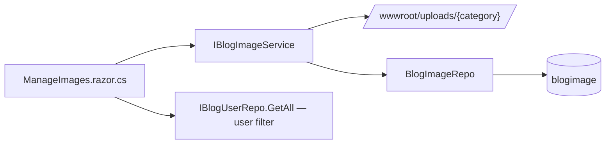
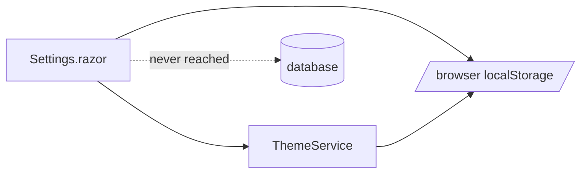

# TechieBlog — Developer Guide · Admin

> ⚠ **STATIC-ONLY (2026-08-02)** — built from code reading; NOT yet runtime-verified. Render-status is
> unconfirmed until `*verify` runs against the running app (the solution currently does not compile —
> REQ-FN-043).

Index: [TechieBlog-DevGuide.md](./TechieBlog-DevGuide.md)

An Admin sees every screen in the app. The eleven below are guarded by
`@attribute [Authorize(Policy = "AdminOnly")]` and use `AdminLayout`.

## Admin · Users (`/users`)

**File:** `source/BlogUI/Pages/AdminPages/UsersList.razor` + `.razor.cs` — **injects the repository
directly; there is no user service.**

| Control | What it does | Source call | Render status |
|---------|--------------|-------------|---------------|
| User table | Lists all users | `BlogUserRepo.GetAll(...)` | static-only (unconfirmed) |
| Role change / enable-disable | Persists the edited user | `BlogUserRepo.Update(...)` | static-only (unconfirmed) |

**Data lineage:** page → `IBlogUserRepo` → `BlogUserRepo.cs` → `SELECT * FROM BlogUser` (and the
stored function `SelectBlogUserById` for single reads) / inline `UPDATE BlogUser`.

**Known issues (static):** Story 2.6 specifies search/filter, last-login display, delete with
confirmation and an audit-log entry per admin action. Only list + update were found —
`{unresolved — TODO: confirm whether search/delete exist in the markup}`. No audit-log write was
located anywhere in the codebase.

## Admin · Add user (`/AddUser`)

**File:** `source/BlogUI/Pages/AdminPages/AddUser.razor` — `@inject BlogModels.IBlogUserRepo UserRepo`

| Control | Source call | Render status |
|---------|-------------|---------------|
| Create user form | `{unresolved — TODO: the insert call was not located in the page; BlogUserRepo exposes Insert / InsertToGetId and the stored function InsertBlogUser}` | unresolved |

**Known issue (static):** if this page writes a password, confirm it hashes through
`AppEncrypt.CreateHash` rather than storing plaintext — the seed script sets a plaintext password
(REQ-NFR-023, ⚠ SECURITY), so the pattern is already present in the repo.

## Admin · Categories (`/admin/categories`, `/CategoriesList`) and category editor (`/admin/category`, `/admin/category/{PageId:long}`)

**Files:** `Pages/AdminPages/CategoriesList.razor`, `Pages/AdminPages/ManageCategory.razor` + `.razor.cs`

| Screen | Control | Source call |
|--------|---------|-------------|
| CategoriesList | Table with post counts | `CategoryService.GetAllWithCounts()` |
| CategoriesList | Delete | `CategoryService.DeleteCategory(...)` |
| ManageCategory | Load | `CategoryService.GetCategory(PageId)` |
| ManageCategory | Save | `CategoryService.SaveCategory(...)` |

**Lineage:** page → `CategorySvc` → `CategoryRepo` → `INSERT INTO Category`, `UPDATE Category`,
`DELETE FROM Category`, `SELECT c.CategoryId …` joined for counts.

## Admin · Tags (`/admin/tags`, `/TagsList`) and tag editor (`/ManageTag`, `/ManageTag/{PageId:long}`)

**Files:** `Pages/AdminPages/TagsList.razor`, `Pages/AdminPages/ManageTag.razor`

| Screen | Control | Source call |
|--------|---------|-------------|
| TagsList | Table with post counts | `TagService.GetAllWithCounts()` |
| TagsList | Delete | `TagService.DeleteTag(...)` |
| ManageTag | Load | `TagService.GetSingleTag(PageId)` |
| ManageTag | Slug | `SlugGenerator.GenerateSlug(...)` (static helper, called in the page) |
| ManageTag | Save | `TagService.SaveTag(...)` |

**Lineage:** page → `TagSvc` → `BlogTagRepo` → `INSERT INTO Tag`, `DELETE FROM Tag`,
`INSERT INTO PostTag`, `DELETE FROM PostTag`, `SELECT t.TagId …` with the `COUNT` that Story 7.5 fixed.

**Known issue (static):** the tag-merge capability indicated in mockup `26-admin-tags.html` was not
found. `{unresolved — TODO: confirm whether merge exists.}`

## Admin · Subscribers (`/admin/subscribers`)

**File:** `source/BlogUI/Pages/AdminPages/SubscribersList.razor`

| Control | What it does | Source call | Render status |
|---------|--------------|-------------|---------------|
| Subscriber table | Lists subscribers | `SubscriberService.GetAllSubscribers()` | static-only |
| Status change | Activate / unsubscribe | `SubscriberService.UpdateSubscriberStatus(...)` | static-only |
| Export | CSV download via JS interop | `SubscriberService.GetSubscribersForExport()` + `IJSRuntime` | static-only |

**Lineage:** page → `SubscriberSvc` → `SubscriberRepo` → `INSERT INTO Subscriber`,
`UPDATE Subscriber`, `SELECT SubscriberId …`.

**Known issue (static):** no newsletter composer or send action exists on this page — the "Newsletter
management" claim in the migrated plan (Story 7.7) covers the subscriber list only. Newsletter
composition and SMTP delivery are REQ-UI-043 / REQ-FN-032 / REQ-FN-033, all Not Started.

## Admin · Media library (`/admin/images`)

**File:** `source/BlogUI/Pages/AdminPages/ManageImages.razor` + `.razor.cs`

| Control | What it does | Source call | Render status |
|---------|--------------|-------------|---------------|
| Gallery by category | Lists images | `ImageService.GetImagesByCategoryAsync(...)` | static-only |
| Upload | Validates then stores | `ImageService.ValidateImageAsync(...)` → `UploadImageAsync(...)` | static-only |
| Delete | Removes row and file | `ImageService.DeleteImageAsync(...)` | static-only |
| Copy URL | Public path for an image | `ImageService.GetImageUrl(...)` | static-only |
| User filter | Owner selection | `UserRepo.GetAll(...)` | static-only |

**Lineage:** page → `IBlogImageService` (`BlogEngine/Services/BlogImageService.cs`) → disk write under
`source/BlogUI/wwwroot/uploads/{category}/` **and** `BlogImageRepo` → `INSERT INTO blogimage` /
`UPDATE blogimage` / `SELECT * FROM blogimage`.

**Business rules:** seven categories with per-category size and format limits (profiles 2 MB; logos,
awards 500 KB; icons 200 KB; blog, general 5 MB; cv 10 MB / PDF only). Filenames are
`{category}_{userId}_{timestamp}_{guid}.{ext}`.

**Known issues (static):**
1. The screen is `AdminOnly` while `ImagePicker` (which uploads through the same service) is used on
   `AuthorOrAbove` pages — Authors can create uploads they can never browse or delete (REQ-UI-034).
2. Files live on local disk with no storage abstraction (REQ-FN-042) — a container redeploy without a
   mounted volume loses every upload.
3. Thumbnail generation (feature-ideation §2.3 item 4) was not found.
   `{unresolved — TODO: confirm whether thumbnails are generated.}`

## Admin · Site settings (`/settings`)

**File:** `source/BlogUI/Pages/AdminPages/Settings.razor`

| Control | What it claims to do | What it actually does | Render status |
|---------|----------------------|-----------------------|---------------|
| Theme selector | Set the **site** theme | `ThemeService.SetThemeAsync(...)` → writes `techieblog-theme` to **browser local storage** (`Common/ThemeService.cs:46`) | **DEFECT (static) — per-visitor, not site-wide** |
| Pagination word count | Persist a blog setting | `LocalStorage.SetItemAsync(PaginationWordCountKey, ...)` (`Settings.razor:335`) | static-only — browser-scoped |
| General settings (site title, tagline) | Persist | **nothing** — `// TODO: Implement actual save to database for other settings when settings service is created` (`Settings.razor:337`) | **DEFECT (static) — silently discarded** |
| Blog settings (posts per page, comment moderation) | Persist | **nothing** — same TODO | **DEFECT (static) — silently discarded** |
| SEO settings | Persist | **nothing** — same TODO | **DEFECT (static) — silently discarded** |
| Social media settings | Persist | **nothing** — same TODO | **DEFECT (static) — silently discarded** |
| Save button | Confirms success | Sets `StatusMessage = "Settings saved successfully."` regardless (`Settings.razor:338-339`) | **DEFECT (static) — false success message** |

**This is the second-highest-value finding.** The page presents five settings sections and reports
success, but only the pagination word count is written — to the current browser's local storage, not
the database. `LoadDefaultSettings()` even carries the comment
*"In a real implementation, other settings would be loaded from a database"* (`Settings.razor:325`).
There is no `SiteSettings` table in any migration and no settings repository or service in
`BlogEngine`. Logged to REQ-FN-040 (dropped from `In Progress 90%`) and REQ-UI-026.

**Knock-on effects:**
- BRD-68 ("admin selects the site theme") is not met — the selection is per-visitor.
- BRD-69 (site title, tagline, posts-per-page, SMTP, storage settings) is not met.
- The comment-moderation toggle has no persistent home, so whatever gates comment approval at runtime
  is `{unresolved — TODO}`.

**Fix sketch:** add a `SiteSettings` table + migration, a `SettingsRepo` and `SettingsSvc` (both are
named in the archived architecture doc §5.1/§7.2 but were never built), load through them at startup,
and cache per the caching design (REQ-NFR-018).

## Admin · Resume data screens

`/admin/profile`, `/admin/experience`, `/admin/skills`, `/admin/awards` are `AuthorOrAbove` and are
documented in the [Author guide](./TechieBlog-DevGuide-Author.md). For Admins these pages additionally
render a **user selector** fed by `UserRepo.GetAll(...)`, so an Admin can edit any user's resume data.

The missing `ManageStats` screen (for `UserStats`, whose repository *is* registered at
`BlogSvcInitializer.cs:69`) is also covered there.

## Admin · Everything else

Admins inherit the Editor screens (dashboard, comment moderation, all posts — see the
[Editor guide](./TechieBlog-DevGuide-Editor.md)), the Author screens, and every public screen.

## Admin-relevant cross-cutting risks

| Risk | Where | REQ |
|------|-------|-----|
| Seeded admin password is plaintext | `source/BlogDb/PostgresScripts/003-SeedData.sql:59` | REQ-NFR-023 |
| Password hashing is hand-rolled | `source/BlogModel/Common/AppEncrypt.cs:93` | REQ-NFR-002 |
| No rate limiting on login | `source/TechieBlog/Program.cs` (no rate-limit middleware) | REQ-NFR-005 |
| No audit log for admin actions | nowhere | REQ-FN-010 |
| DbUp runs with DDL rights at every startup | `Program.cs:110-135` | operational note |

---
Generated 2026-08-02 · reflects code as built · ⚠ STATIC-ONLY
