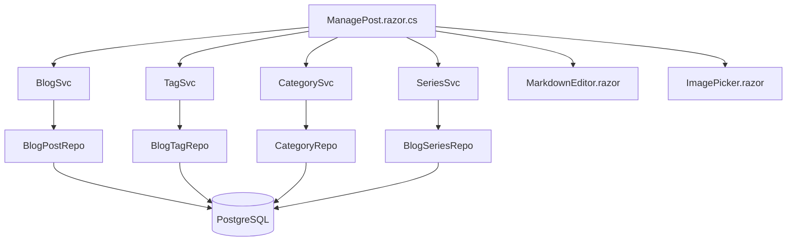

# TechieBlog — Developer Guide · Author

> ⚠ **STATIC-ONLY (2026-08-02)** — built from code reading; NOT yet runtime-verified. Render-status is
> unconfirmed until `*verify` runs against the running app (the solution currently does not compile —
> REQ-FN-043).

Index: [TechieBlog-DevGuide.md](./TechieBlog-DevGuide.md)

An Author sees every Reader screen plus the ten below, all guarded by
`@attribute [Authorize(Policy = "AuthorOrAbove")]` (Admin, Editor, Author) and rendered in `AdminLayout`.

## Author · Post editor (`/ManagePost`, `/ManagePost/{PageId:long}`)

**File:** `source/BlogUI/Pages/AdminPages/ManagePost.razor` + `.razor.cs` — the single richest screen in
the app, with six injected dependencies.

| Control | What it does | Source call | Render status |
|---------|--------------|-------------|---------------|
| Load existing post | Fetch for edit | `BlogService.GetSinglePost(PageId)` | static-only (unconfirmed) |
| Title + Markdown body | Editing surface with live preview | `Components/MarkdownEditor.razor` → `MarkdownRenderer` | static-only (unconfirmed) |
| Category dropdown | Choose one category | `CategoryService.GetAllCategories()` | static-only (unconfirmed) |
| Tag input | Autocomplete + inline create | `TagService.GetAllTags()`, `GetOrCreateTag(...)` | static-only (unconfirmed) |
| Tag persistence | Replace the post's tag set | `TagService.GetTagsForPost(...)`, `SetTagsForPost(...)` | static-only (unconfirmed) |
| Series selector | Attach to a series with a part number | `SeriesService.GetAllWithCounts()`, `GetNextPartNumber(...)` | static-only (unconfirmed) |
| Featured image | Pick or upload | `Components/ImagePicker.razor` → `IBlogImageService` | static-only (unconfirmed) |
| Save draft | Persist without publishing | `BlogService.SaveDraft(...)` | static-only (unconfirmed) |
| Save | Persist | `BlogService.SavePost(...)` | static-only (unconfirmed) |
| Publish | Set published state | `BlogService.PublishPost(...)` | static-only (unconfirmed) |
| Unpublish | Back to draft | `BlogService.UnpublishPost(...)` | static-only (unconfirmed) |
| Schedule | Set a future publish time | `BlogService.SchedulePost(...)` | static-only (unconfirmed) |
| Cancel schedule | Revert to draft | `BlogService.CancelSchedule(...)` | static-only (unconfirmed) |

**Data lineage**

| Step | Symbol | File |
|------|--------|------|
| Page | `ManagePost.razor.cs` `[Inject] BlogSvc BlogService`, `CategorySvc`, `TagSvc`, `SeriesSvc`, … | `Pages/AdminPages/ManagePost.razor.cs` |
| Services | `BlogSvc.SavePost/SaveDraft/PublishPost/UnpublishPost/SchedulePost/CancelSchedule` | `BlogEngine/Services/BlogSvc.cs` |
| | `TagSvc.GetOrCreateTag/GetTagsForPost/SetTagsForPost` | `BlogEngine/Services/TagSvc.cs` |
| Data access | `BlogPostRepo` → `INSERT INTO BlogPost` / `UPDATE BlogPost`; `BlogTagRepo` → `INSERT INTO Tag`, `INSERT INTO PostTag`, `DELETE FROM PostTag` | `BlogEngine/DbAccess/` |

**Business rules:** a post starts as Draft; publish sets the published flag and date; scheduling stores
`ScheduledFor` and leaves the post unpublished until `ScheduledPostPublisher` promotes it.

**Known issues (static):**
- Slug generation for **posts** was not located in this page — `ManageTag.razor` calls
  `SlugGenerator.GenerateSlug` explicitly, but `ManagePost.razor.cs` does not.
  `{unresolved — TODO: confirm whether BlogSvc.SavePost generates the slug server-side, and what happens on a slug collision (BRD-15 requires uniqueness).}`
- The editor's auto-save (PRD Story 3.2 AC7, "every 30 seconds") was not found in the page.
  `{unresolved — TODO: confirm whether auto-save exists.}`

## Author · Post list (`/BlogsList`)

**File:** `source/BlogUI/Pages/AdminPages/BlogsList.razor` + `.razor.cs` · **Guard:** `EditorOrAbove`
(note: *not* `AuthorOrAbove` — an Author cannot open their own post list; see Known issues)

| Control | Source call | Render status |
|---------|-------------|---------------|
| Post table | `BlogService.GetAllPosts(...)` | static-only |
| Publish action | `BlogService.QuickPublish(...)` | static-only |
| Unpublish action | `BlogService.UnpublishPost(...)` | static-only |
| Cancel schedule | `BlogService.CancelSchedule(...)` | static-only |
| Delete | `BlogService.DeletePost(...)` | static-only |

**Known issue (static):** `BlogsList.razor:11` declares `[Authorize(Policy = "EditorOrAbove")]`, so the
**Author role cannot reach the post list at all** even though `ManagePost` is `AuthorOrAbove`. Either the
list should be `AuthorOrAbove` with a per-author filter, or the "My Posts" screen from mockup
`18-my-posts.html` is genuinely missing. Logged to REQ-UI-017.

## Author · Draft preview (`/admin/preview/{PostId:long}`)

**File:** `source/BlogUI/Pages/AdminPages/PreviewPost.razor`

| Control | Source call | Render status |
|---------|-------------|---------------|
| Rendered post | `BlogService.GetSinglePost(PostId)` + `MarkdownRenderer.ToHtml(...)` | static-only |
| Reading time | `ReadingTimeCalculator.Calculate(...)` | static-only |
| Publish from preview | `BlogService.QuickPublish(...)` | static-only |

**Business rules:** shows unpublished content, so the `AuthorOrAbove` guard is the only thing keeping a
draft private — there is no per-author ownership check visible on this page
(`{unresolved — TODO: confirm whether GetSinglePost filters by author}`).

## Author · Series list (`/admin/series`, `/SeriesList`) and editor (`/admin/series/new`, `/admin/series/{PageId:long}`)

**Files:** `Pages/AdminPages/SeriesList.razor`, `Pages/AdminPages/ManageSeries.razor` + `.razor.cs`

| Screen | Control | Source call |
|--------|---------|-------------|
| SeriesList | Series table with counts | `SeriesService.GetAllWithCounts()` |
| SeriesList | Delete | `SeriesService.DeleteSeries(...)` |
| ManageSeries | Load series | `SeriesService.GetSeries(PageId)` |
| ManageSeries | Parts list | `SeriesService.GetPostsInSeries(...)` |
| ManageSeries | Save | `SeriesService.SaveSeries(...)` |

**Lineage:** page → `SeriesSvc` → `BlogSeriesRepo` → `INSERT/UPDATE/DELETE BlogSeries`,
`SELECT s.SeriesId …` joined to `BlogPost`.

## Author · Manage profile (`/admin/profile`)

**File:** `source/BlogUI/Pages/AdminPages/ManageProfile.razor` + `.razor.cs` — **injects `IBlogUserRepo`
directly; there is no user service.**

| Control | Source call | Render status |
|---------|-------------|---------------|
| Load profile | `UserRepo.GetSingle(userId)` | static-only |
| Username availability | `UserRepo.IsUsernameAvailable(...)` | static-only |
| Save username | `UserRepo.UpdateUsername(...)` | static-only |
| Save basic info + socials | `UserRepo.Update(...)` | static-only |
| Save resume fields (title, tagline, phone, location, CV, ResumeEnabled) | `UserRepo.UpdateResumeFields(...)` | static-only |
| Avatar / CV pickers | `Components/ImagePicker.razor` → `IBlogImageService` | static-only |

**Lineage:** page → `BlogUserRepo` (`BlogEngine/DbAccess/BlogUserRepo.cs`) → inline `UPDATE BlogUser`
against the columns added by migration `012-ResumeAndImageManagement.sql`.

**Note:** `ManageProfile.razor.cs` is one of the 17 files still carrying `_underscore`-prefixed fields
(REQ-NFR-021).

## Author · Manage experience (`/admin/experience`, `/admin/experience/{EventId:long}`)

**File:** `Pages/AdminPages/ManageExperience.razor` + `.razor.cs`

| Control | Source call | Render status |
|---------|-------------|---------------|
| Entry list | `EventRepo.GetByUserAndType(userId, "Experience")` | static-only |
| Load one | `EventRepo.GetSingle(eventId)` | static-only |
| Create | `EventRepo.InsertToGetId(...)` | static-only |
| Update | `EventRepo.Update(...)` | static-only |
| Delete | `EventRepo.Delete(...)` | static-only |
| User selector (Admin only) | `UserRepo.GetAll(...)` | static-only |
| Company logo | `ImagePicker` (category `logos`) | static-only |

**Lineage:** page → `IUserEventRepo` → `UserEventRepo.cs` → inline SQL on `userevents` (note the
lower-case table name in the SQL — PostgreSQL folds unquoted identifiers, so this matches `UserEvents`).

**Business rules:** experience rows are `UserEvents` discriminated by `Type = "Experience"`;
`IsCurrent` renders as "Present"; `DisplayOrder` drives manual ordering.

## Author · Manage skills (`/admin/skills`)

**File:** `Pages/AdminPages/ManageSkills.razor` + `.razor.cs`

| Control | Source call |
|---------|-------------|
| Skills grouped by category | `SkillsRepo.GetByUserId(userId)` |
| Load one | `SkillsRepo.GetById(...)` |
| Create / update / delete | `SkillsRepo.Create/Update/Delete(...)` |
| User selector (Admin) | `UserRepo.GetAll(...)` |

**Lineage:** page → `IUserSkillsRepo` → `UserSkillsRepo.cs` → `INSERT/UPDATE/DELETE userskills`,
`SELECT DISTINCT` for the category list.

## Author · Manage awards (`/admin/awards`)

**File:** `Pages/AdminPages/ManageAwards.razor` + `.razor.cs`

| Control | Source call |
|---------|-------------|
| Award list | `AwardsRepo.GetByUserId(userId)` |
| Load one | `AwardsRepo.GetById(...)` |
| Create / update / delete | `AwardsRepo.Create/Update/Delete(...)` |
| Badge image | `ImagePicker` (category `awards`) |
| User selector (Admin) | `UserRepo.GetAll(...)` |

**Lineage:** page → `IUserAwardsRepo` → `UserAwardsRepo.cs` → `INSERT/UPDATE/DELETE userawards`.

## Author · Manage stats — MISSING

`docs/OldDocs/feature-ideation-images-resume.md` §1.3 and the resume page both expect a **UserStats** editor
(`ManageStats.razor`), and `IUserStatsRepo` **is registered** in `BlogSvcInitializer.cs:69`. No admin
page exists to maintain those rows — the "About" and "Community" statistics on `/resume` can only be
populated by direct SQL. Logged to REQ-UI-037/REQ-FN-027 as a gap.

## Author · Media library (`/admin/images`)

Guarded `AdminOnly`, so an Author **cannot** open the library — but the `ImagePicker` component they use
inside the editor and profile pages talks to the same service. See the Admin guide for the screen.

`Components/ImagePicker.razor.cs` calls `ImageService.ValidateImageAsync`, `UploadImageAsync` and
`GetImagesByCategoryAsync` on `IBlogImageService` (`BlogEngine/Services/BlogImageService.cs`), which
writes to `wwwroot/uploads/{category}/` and records metadata through `BlogImageRepo` (`INSERT INTO blogimage`).

**Known issue (static):** an Author can upload through the picker but cannot browse or delete their
uploads, because the only gallery screen is `AdminOnly`. Logged to REQ-UI-034.

---
Generated 2026-08-02 · reflects code as built · ⚠ STATIC-ONLY
