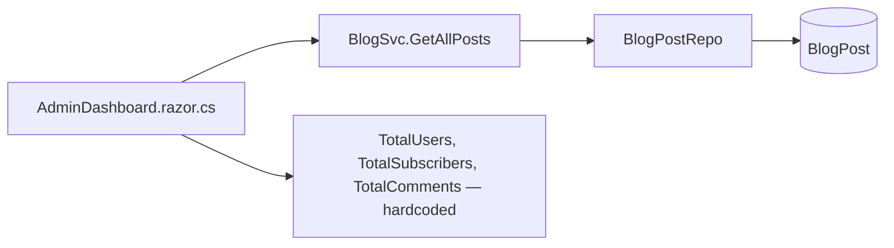
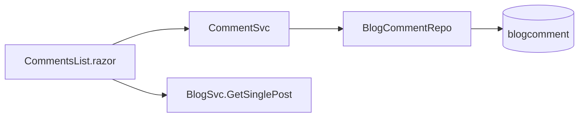

# TechieBlog — Developer Guide · Editor

> ⚠ **STATIC-ONLY (2026-08-02)** — built from code reading; NOT yet runtime-verified. Render-status is
> unconfirmed until `*verify` runs against the running app (the solution currently does not compile —
> REQ-FN-043).

Index: [TechieBlog-DevGuide.md](./TechieBlog-DevGuide.md)

An Editor sees every Author screen plus the three below. All are guarded by
`@attribute [Authorize(Policy = "EditorOrAbove")]` (Admin, Editor) and use `AdminLayout`.
Editors are also the lowest role that the post-login redirect (`/admin`) actually works for.

## Editor · Admin dashboard (`/admin`, `/AdminDashboard`)

**File:** `source/BlogUI/Pages/AdminPages/AdminDashboard.razor` + `.razor.cs`

| Control | What it shows | Source | Render status |
|---------|---------------|--------|---------------|
| Total posts tile | `posts.Count` | `BlogService.GetAllPosts(0, true)` — `AdminDashboard.razor.cs:46-47` | static-only (unconfirmed) |
| Posts this month | `posts.Count(p => p.CreatedOn >= startOfMonth)` | `:51-52` | static-only (unconfirmed) |
| Draft / scheduled counts | LINQ over the same list | `:48-49` | static-only (unconfirmed) |
| **Total users tile** | **`TotalUsers = 1` — hardcoded** | `:63` | **DEFECT (static) — stub data** |
| **Users this month** | **`UsersThisMonth = 0` — hardcoded** | `:64` | **DEFECT (static) — stub data** |
| **Subscribers tile** | **`TotalSubscribers = 1` — hardcoded** | `:65` | **DEFECT (static) — stub data** |
| **Subscribers this month** | **`SubscribersThisMonth = 0` — hardcoded** | `:66` | **DEFECT (static) — stub data** |
| **Comments tile** | **`TotalComments = 0` — hardcoded** | `:67` | **DEFECT (static) — stub data** |
| **Pending comments badge** | **`PendingComments = 0` — hardcoded**, so the badge always reads "All reviewed" | `:68`, markup `AdminDashboard.razor:33-40` | **DEFECT (static) — stub data** |
| **"Popular posts"** | Recent *published* posts with `Views = 0` | `:55-59` | **DEFECT (static) — mislabelled; no view data exists** |
| Recent activity feed | Derived from published posts | `BuildRecentActivity(...)` `:85-92` | static-only (unconfirmed) |

**This is the highest-value finding in the guide.** `CommentSvc.GetAdminCounts()` and the
`AdminCounts` model exist and would supply real comment counts, and `IBlogUserRepo` /
`ISubscriberRepo` could supply the rest — but the dashboard injects **only `BlogSvc`**
(`AdminDashboard.razor.cs:15-16`) and fills the other three tiles with constants. The screen renders
and looks correct; the numbers are fiction. Logged to REQ-UI-019 and REQ-FN-036 as
`Needs re-verify`.

**Data lineage**

| Step | Symbol | File |
|------|--------|------|
| Page | `AdminDashboard.razor.cs` `[Inject] BlogSvc BlogService` | `Pages/AdminPages/AdminDashboard.razor.cs:15` |
| Service | `BlogSvc.GetAllPosts(int, bool)` | `BlogEngine/Services/BlogSvc.cs` |
| Data access | `BlogPostRepo` | `BlogEngine/DbAccess/BlogPostRepo.cs` |
| SQL | inline `SELECT p.PostID …` on `BlogPost` | `BlogPostRepo.cs` |
| Users / comments / subscribers | **none — constants in the page** | `AdminDashboard.razor.cs:63-68` |

**Fix sketch:** inject `CommentSvc`, `IBlogUserRepo` and `SubscriberSvc`; replace lines 63–68 with
`CommentService.GetAdminCounts()`, `UserRepo.GetAll(...).Count()` and
`SubscriberService.GetAllSubscribers().Count()`; leave `PopularPosts` stubbed until REQ-FN-034
(view tracking) lands, but rename it so it does not claim to be popularity.

## Editor · Comment moderation (`/CommentsList`, `/comments`)

**File:** `source/BlogUI/Pages/AdminPages/CommentsList.razor`

| Control | What it does | Source call | Render status |
|---------|--------------|-------------|---------------|
| Comment table | All comments, paged | `CommentService.GetAllComments(...)` | static-only (unconfirmed) |
| Post title per row | Resolves the owning post | `BlogService.GetSinglePost(...)` | static-only (unconfirmed) — *per-row lookup; potential N+1* |
| Approve | Publishes a pending comment | `CommentService.ApproveComment(...)` | static-only (unconfirmed) |
| Delete | Removes a comment | `CommentService.DeleteComment(...)` | static-only (unconfirmed) |

**Data lineage:** page → `CommentSvc` (`BlogEngine/Services/CommentSvc.cs`, 313 lines, FIX-005) →
`BlogCommentRepo` → `SELECT * FROM blogcomment`, `UPDATE blogcomment`, `DELETE FROM blogcomment`,
`INSERT INTO blogcomment`.

**Business rules:** approval is required only when comment moderation is enabled — but that setting is
never persisted (see the Admin guide, Settings). `{unresolved — TODO: locate the runtime source of the moderation flag.}`

**Known issues (static):**
1. `GetSinglePost` is called per row to render the post title — an N+1 query pattern on a page that
   pages through all comments. Worth a join in `CommentSvc.GetAllComments`.
2. Story 4.2 specifies bulk approve/reject and a rejection reason; only single approve and delete were
   found. `{unresolved — TODO: confirm whether bulk actions exist in the markup.}`
3. `ManageComments.razor` exists with an 11-line code-behind containing only a `partial class`
   declaration — an empty scaffold. Confirm whether it is reachable or dead
   (`Pages/AdminPages/ManageComments.razor.cs:9`).

## Editor · All posts (`/BlogsList`)

Documented in the Author guide (the page is guarded `EditorOrAbove`, so in practice it is an Editor
screen — that mismatch is itself a logged finding).

---
Generated 2026-08-02 · reflects code as built · ⚠ STATIC-ONLY
