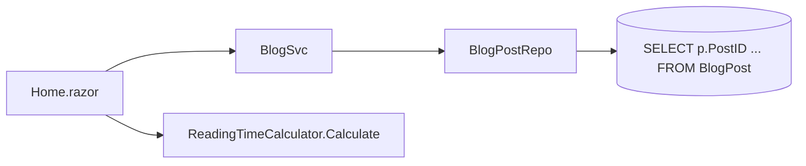
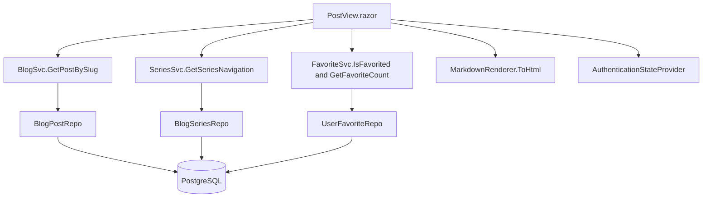
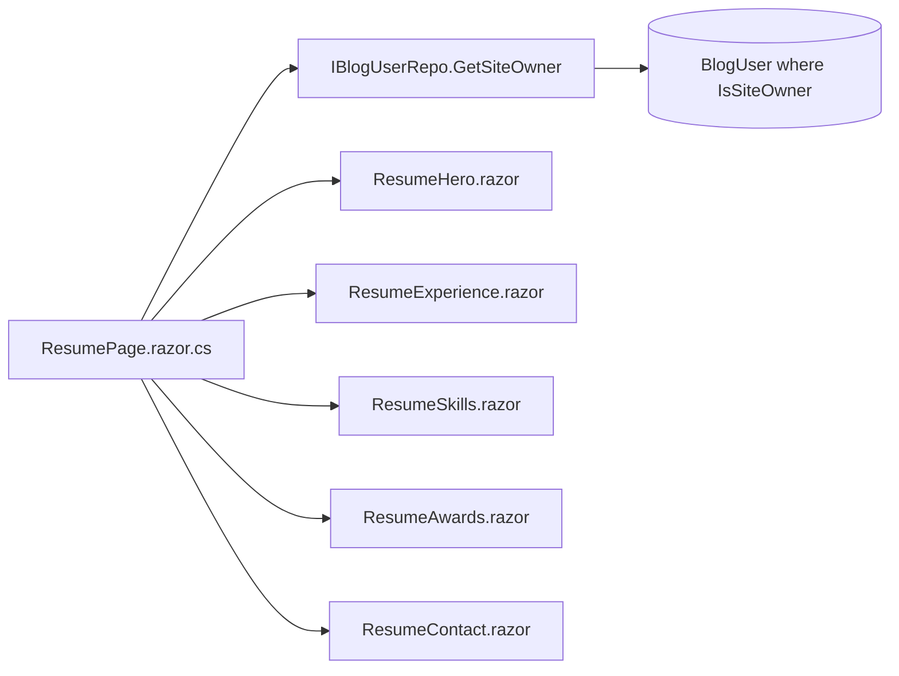

# TechieBlog — Developer Guide · Guest (anonymous)

> ✅ **Runtime-verified 2026-08-09 as Guest (anonymous)** — supersedes the 2026-08-02 `STATIC-ONLY`
> banner, whose stated reason (solution does not compile, REQ-FN-043) is stale. See
> **Runtime verification (2026-08-09)** below for what was actually observed.

Index: [TechieBlog-DevGuide.md](./TechieBlog-DevGuide.md) · Architecture: `docs/TechieBlog-Architecture.md`

Every screen below is reachable **without signing in**. Signed-in roles see the same pages plus their
own.

> ⚠ **This page's premise is out of date.** It says engagement controls "require authentication".
> They do not: reader accounts were retired (BRD-1/13/43/44) and commenting and rating are now
> **anonymous and email-keyed** with a captcha and double opt-in. Runtime check found no sign-in gate
> and zero `/login` links anywhere in the comment or rating components. The **Favourite toggle** noted
> per screen no longer exists at all (REQ-UI-028 removed).

## Runtime verification (2026-08-14) — REQ-NFR-001 scope only

Runtime-verified 2026-08-14 as **anonymous/guest**, against a genuine **Release + Production** host
(`--no-launch-profile`; see the REQ-NFR-001 checklist row for why a bare `dotnet run` silently boots
Development). This pass exercised only the four screens the performance budget is measured against —
**every other row in the 2026-08-09 table below is unchanged and NOT re-observed.**

| Screen | Observed 2026-08-14 | Detail |
|--------|---------------------|--------|
| `/` (portfolio home) | **renders ✓ (runtime-confirmed 2026-08-14)** · **looks-right ✓** | 4 stat tiles with values, featured post, 3 article cards each with image/category/title/excerpt/author/date/star-rating. 0 horizontal overflow at 1280×800 and 390×844; mobile stacks to hamburger + 2-col stat grid |
| `/post/{slug}` | **renders ✓ (runtime-confirmed 2026-08-14)** · **looks-right ✓ — the 2026-08-09 DEFECT IS FIXED** | title, hero, markdown body with fenced code, series nav ("Part 2 of 3", prev/next), tags, rating 4.5 from 2 ratings, view-count aggregate, comment form + captcha. **The 46px 390px table overflow is GONE:** probed across three posts — `the-markdown-kitchen-sink` (1 table) **0px**, `scaling-signalr-for-blazor-server` (1 table) **0px**, `blazor-circuits-and-state` (0 tables) 0px. The table-vs-no-table comparison that isolated the defect now shows no difference |
| `/category/{slug}` | **renders ✓ (runtime-confirmed 2026-08-14)** · **looks-right ✓** | header, post list and links render real data; 0 overflow at both widths. **NOTE: the 2026-08-09 `renders-empty` featured-image defect was NOT re-tested** — this pass asserted list/link/heading data only, not `<PostCard ImageUrl>`. Treat that defect as still open |
| `/newsletters` | **renders ✓ (runtime-confirmed 2026-08-14)** · **looks-right ✓** | content and navigable links render; 0 overflow at both widths |

Evidence: `tests/verify/req-nfr-001-render-visual.spec.ts` 12/12 passed; screenshots inspected in
`tests/.artifacts/req-nfr-001/`. Screens NOT runtime-verified this pass: `/tag/{slug}`, `/series/{slug}`,
`/search`, `/rss`, `/authors`, `/author/{username}`, `/resume`, `/about`, `/404`, the auth screens and
the sidebar subscribe surface — their 2026-08-09 verdicts stand.

## Runtime verification (2026-08-09)

Observed by `*verify all` against the running app. Screens not listed rendered their data and looked
right at 1280×900 and 390×844.

| Screen | Observed | Detail |
|--------|----------|--------|
| `/` (portfolio home) | **renders ✓** | hero, 4 stat tiles, about, 3 latest articles, contact — all from the site-owner row. Visual clean at both widths. `Download CV` correctly hidden (**NO-DATA**: `cvfilepath` empty) |
| `/post/{slug}` | **visual-broken (DEFECT)** | all 11 controls render real data, but at **390px the page scrolls horizontally 46px** — a Markdown-rendered `<table>` is 420px wide with `overflow-x:visible` and is not wrapped in a scroll container. Isolated by comparing a post with a table (46px) against one without (0px) |
| `/category/{slug}`, `/tag/{slug}` | **renders-empty (DEFECT)** | counts and cards match the DB exactly, but **featured images never render** — `CategoryArchive.razor:117` and `TagArchive.razor:107` pass no `ImageUrl` to `<PostCard>` although every published post has one |
| `/series/{slug}` | **renders-empty (DEFECT)** | **leaks unpublished parts to anonymous visitors** with title, abstract and a "Coming Soon" badge. `BlogPostRepo.cs:246-248` filters only on `IsDeleted`; `CountBySeriesSql:250-254` correctly filters `Published = TRUE`, so the list and the badge disagree |
| `/search` | **renders-empty (DEFECT)** | every result's category badge is the literal `"Blog"` — hardcoded at `SearchResults.razor:244`. Highlighting applies to excerpts only, so a title-only match shows no `<mark>` |
| `/rss` | **unreachable (DEFECT)** | the page advertises `/feed.xml`, which **404s**; there is no `<link rel="alternate">` in `<head>`. No feed is served anywhere |
| unmatched route | **render-error (DEFECT)** | returns HTTP 404 with a **zero-byte body** and a blank white page. `/404` renders correctly when requested directly, but nothing routes to it |
| public shell | **visual-broken (DEFECT)** | 5px horizontal overflow at **320px** from the header actions cluster; `mobile-nav-trigger` clipped past the right edge. Clean at 390 and 1280 |
| sidebar subscribe | **render-error (DEFECT)** | writes a subscriber with **no captcha and `isconfirmed=t`**, bypassing the double opt-in every other subscribe surface enforces |
| comments / rating | **renders ✓** | anonymous, email-keyed, captcha + double opt-in all proven end to end; unapproved comments never appear publicly; the public average counts verified ratings only |
| `/login`, `/forgot-password`, `/reset-password`, `/verify/{token}` | **renders ✓** | all controls render; anti-enumeration message confirmed; open-redirect guard rejects absolute and protocol-relative URLs |

**Cross-cutting artefact (not a screen defect):** the host prerenders and then re-renders interactively,
and for ~1.5s **both shells are in the DOM** — a visibly duplicated header over a still-loading page. It
self-resolves, but any measurement inside that window reads a doubled shell or phantom zero rows. This is
the root cause of the post page's blank flash and its `document-title` accessibility violation.

## Guest · Home (`/`)

**File:** `source/BlogUI/Pages/BlogPages/Home.razor` · **Layout:** `MainLayout`

| Control | What it shows | Source call | Render status |
|---------|---------------|-------------|---------------|
| Featured post | One highlighted post | `BlogService.GetFeaturedPost()` | static-only (unconfirmed) |
| Recent posts grid | Published posts, paged | `BlogService.GetPublishedPosts(...)` | static-only (unconfirmed) |
| Pagination | Page count | `BlogService.GetPublishedPostCount()` | static-only (unconfirmed) |
| Reading time per card | "N min read" | `ReadingTimeCalculator.Calculate(...)` (static helper, called in the page) | static-only (unconfirmed) |
| Sidebar | Categories, tags, subscribe form | `Components/Sidebar.razor` | static-only (unconfirmed) |

**Data lineage**

| Step | Symbol | File |
|------|--------|------|
| Page | `Home.razor` `@inject BlogEngine.Services.BlogSvc BlogService` | `Pages/BlogPages/Home.razor` |
| Service | `BlogSvc.GetPublishedPosts`, `GetFeaturedPost`, `GetPublishedPostCount` | `BlogEngine/Services/BlogSvc.cs` |
| Data access | `BlogPostRepo` (inherits `GenericRepository<BlogPost>`) | `BlogEngine/DbAccess/BlogPostRepo.cs` |
| SQL | inline parameterised `SELECT p.PostID …` / `SELECT COUNT …` against `BlogPost` | `BlogPostRepo.cs` |

**Business rules:** only `Published = true` posts appear; ordering is by publish date descending.

**Known issues:** none found statically.

## Guest · Post view (`/post/{Slug}`, `/post/{Slug}/{PageNumber}`)

**File:** `source/BlogUI/Pages/BlogPages/PostView.razor` · **Layout:** `FullWidthLayout`

This is the densest public screen — seven injected dependencies.

| Control | What it shows | Source call | Render status |
|---------|---------------|-------------|---------------|
| Article body | Markdown rendered to HTML | `MarkdownRenderer.ToHtml(post.PostContent)` | static-only (unconfirmed) |
| Title / author / date / category / tags | Post metadata | `BlogService.GetPostBySlug(Slug)` | static-only (unconfirmed) |
| Reading time | "N min read" | `ReadingTimeCalculator.Calculate(...)` | static-only (unconfirmed) |
| Series navigation | Previous / next part | `SeriesService.GetSeriesNavigation(...)` | static-only (unconfirmed) |
| Related posts | Other published posts | `BlogService.GetPublishedPosts(...)` | static-only (unconfirmed) — *note: this is a generic published-post query, not a category/tag-similarity match; "related" is loosely implemented* |
| Star rating | Average + user's rating | `Components/StarRating.razor` → `RatingSvc` | static-only (unconfirmed) |
| Favourite toggle | Favourited state + count | `FavoriteService.IsFavorited`, `GetFavoriteCount` | static-only (unconfirmed) |
| Comments | List + form (sign-in required) | `Components/…` → `CommentSvc` | static-only (unconfirmed) |

**Data lineage**

| Step | Symbol | File |
|------|--------|------|
| Page | `PostView.razor` | `Pages/BlogPages/PostView.razor` |
| Services | `BlogSvc`, `SeriesSvc`, `FavoriteSvc`, `MarkdownRenderer` | `BlogEngine/Services/`, `BlogEngine/Common/` |
| Data access | `BlogPostRepo`, `BlogSeriesRepo`, `UserFavoriteRepo` | `BlogEngine/DbAccess/` |
| SQL | inline parameterised SQL on `BlogPost`, `BlogSeries`, `UserFavorite` | as above |

**Business rules:** anonymous visitors can read but not engage — the page injects
`AuthenticationStateProvider` and gates the engagement controls on the resulting principal.

**Known issues:** "Related posts" reuses `GetPublishedPosts` rather than a similarity query
(BRD-32 expects category/tag-based relatedness) — `{unresolved — TODO: confirm whether a filter is applied inside the page's related-post block}`.

## Guest · Category archive (`/category/{Slug}`, `/categories`, `/categories/{Slug}`)

**File:** `source/BlogUI/Pages/BlogPages/CategoryArchive.razor`

| Control | Source call | Render status |
|---------|-------------|---------------|
| Category header | `CategoryService.GetCategoryBySlug(Slug)` | static-only |
| Post list | `BlogService.GetPostsByCategory(...)` | static-only |
| Post count / paging | `BlogService.GetPostCountByCategory(...)` | static-only |
| Category list (index mode) | `CategoryService.GetAllWithCounts()` | static-only |
| Reading time | `ReadingTimeCalculator.Calculate(...)` | static-only |

**Lineage:** page → `CategorySvc` / `BlogSvc` → `CategoryRepo` / `BlogPostRepo` → inline SQL on
`Category`, `PostCategory`, `BlogPost`.

## Guest · Tag archive (`/tag/{Slug}`, `/tags`, `/tags/{Slug}`)

**File:** `source/BlogUI/Pages/BlogPages/TagArchive.razor`

| Control | Source call | Render status |
|---------|-------------|---------------|
| Tag header | `TagService.GetTagBySlug(Slug)` | static-only |
| Post list | `TagService.GetPostsByTag(...)` | static-only |
| Post count | `TagService.GetPostCountByTag(...)` | static-only |
| Tag list / cloud | `TagService.GetAllWithCounts()` | static-only |
| Category name per card | `CategorySvc.GetAllCategories()` cached in a page dictionary | static-only |

**Lineage:** page → `TagSvc` (+ `CategorySvc`) → `BlogTagRepo` → inline SQL joining `Tag`, `PostTag`,
`BlogPost`. The per-tag `COUNT` was the Story 7.5 bug (fixed in `BlogTagRepo.cs`); the category-name
lookup was FIX-009.

## Guest · Series (`/series`, `/series/{Slug}`)

**File:** `source/BlogUI/Pages/BlogPages/SeriesView.razor` · **Layout:** `FullWidthLayout`

| Control | Source call | Render status |
|---------|-------------|---------------|
| Series list (no slug) | `SeriesService.GetAllWithCounts()` | static-only |
| Series header + parts | `SeriesService.GetSeriesBySlug(Slug)` | static-only |
| Reading time per part | `ReadingTimeCalculator.Calculate(...)` | static-only |

**Lineage:** page → `SeriesSvc` → `BlogSeriesRepo` → inline SQL on `BlogSeries` + `BlogPost`.

## Guest · Search (`/search`)

**File:** `source/BlogUI/Pages/BlogPages/SearchResults.razor`

| Control | Source call | Render status |
|---------|-------------|---------------|
| Result list | `BlogSvc.SearchPosts(...)` | static-only |
| Result count / paging | `BlogSvc.GetSearchResultCount(...)` | static-only |
| Category filter dropdown | `CategorySvc.GetAllCategories()` | static-only |

**Lineage:** page → `BlogSvc.SearchPosts` (`BlogSvc.cs:555-580`) → `BlogPostRepo.SearchPosts`
(`BlogPostRepo.cs:424-465`) → PostgreSQL `ILIKE` across `Title`, `Abstract`, `PostContent`, `Tags`.

**Business rules:** search covers published posts only; terms are highlighted in the rendered results.

## Guest · Authors (`/authors`)

**File:** `source/BlogUI/Pages/BlogPages/AuthorsPage.razor` (+ `.razor.cs`)

| Control | Source call | Render status |
|---------|-------------|---------------|
| Author list | `UserRepo.GetAllAuthors()` (**repository injected directly — no service layer**) | static-only |
| Article count per author | part of `GetAllAuthors()`'s projection | static-only |

**Lineage:** page → `IBlogUserRepo.GetAllAuthors` → `BlogUserRepo.cs` inline `SELECT DISTINCT …` over
`BlogUser` joined to `BlogPost`.

## Guest · Author profile (`/author/{Username}`)

**File:** `source/BlogUI/Pages/BlogPages/AuthorProfilePage.razor` (+ `.razor.cs`)

| Control | Source call | Render status |
|---------|-------------|---------------|
| Author header | `UserRepo.GetByUsername(Username)` | static-only |
| Article list | `{unresolved — TODO: the posts-by-author call was not located in AuthorProfilePage.razor.cs}` | unresolved |
| Resume sections (when `ResumeEnabled`) | `Components/Resume/*` fed by the skills/awards/events repositories | static-only |

**Business rules:** an unknown username must 404 (BRD-55); `ResumeEnabled` gates the resume sections.

## Guest · Resume (`/resume`)

**File:** `source/BlogUI/Pages/ResumePage.razor` (+ `.razor.cs`) · **Layout:** `FullWidthLayout`

| Control | Source call | Render status |
|---------|-------------|---------------|
| Hero (photo, name, title, tagline, CTAs, socials) | `UserRepo.GetSiteOwner()` → `ResumeHero.razor` | static-only |
| Experience timeline | `ResumeExperience.razor` → `IUserEventRepo.GetByUserAndType(userId, "Experience")` | static-only |
| Skills grid | `ResumeSkills.razor` → `IUserSkillsRepo.GetByUserId` | static-only |
| Awards | `ResumeAwards.razor` → `IUserAwardsRepo.GetByUserId` | static-only |
| Contact | `ResumeContact.razor` — fields off `AppUser` | static-only |
| Download CV | `AppUser.CVFilePath` → static file under `wwwroot/uploads/cv/` | static-only |

**Lineage:** `ResumePage.razor.cs:47` `siteOwner = UserRepo.GetSiteOwner();` → `BlogUserRepo` inline SQL
on `BlogUser` filtered by `IsSiteOwner` (uniqueness enforced by the partial index in migration `012`).

**Business rules:** if no user has `IsSiteOwner = true`, the whole page has nothing to render.
**Known issue (static):** no fallback/empty state was located for that case —
`{unresolved — TODO: confirm ResumePage behaviour when GetSiteOwner() returns null}`.

## Guest · About (`/about`) and 404 (`/404`)

**Files:** `Pages/BlogPages/About.razor`, `Pages/AdminPages/404Page.razor` (uses `AuthLayout`).
Static content; no service calls. Dark-mode styling for About was fixed in Story 7.3.

## Guest · RSS (`/rss`), sitemap (`/sitemap.xml`), robots (`/robots.txt`)

| Endpoint | Implementation | Lineage |
|----------|----------------|---------|
| `/rss` | `Pages/BlogPages/RssFeed.razor` | page → `BlogSvc.GetPublishedPosts` → `BlogPostRepo` |
| `/sitemap.xml` | minimal endpoint, `source/TechieBlog/Program.cs:169` | → `SitemapSvc.GenerateSitemap()` → `BlogSvc` / repositories |
| `/robots.txt` | minimal endpoint, `Program.cs:176` | reads `SiteSettings:BaseUrl` from configuration |

## Guest · Login / Register / Forgot / Reset

Documented once here because anonymous visitors reach them; see the index §3 **LANDING-TRUTH** section
for the post-login redirect defect.

| Screen | File | Key call |
|--------|------|----------|
| `/login` | `Pages/AdminPages/LoginPage.razor` + `.razor.cs` | `AuthSvc.LoginAsync(SvcData)` → `CustomAuthStateProvider.MarkUserAsAuthenticated` → `NavigateTo("/admin")` (`:106`) |
| `/register` | `Pages/AdminPages/RegisterPage.razor` | `AuthService.RegisterUser(...)` → on success `NavigateTo("/login")` (`:160`) |
| `/forgot-password` | `Pages/AdminPages/ForgotPasswordPage.razor` | `await AuthService.RequestPasswordReset(...)` |
| `/reset-password/{Token}` | `Pages/AdminPages/ResetPasswordPage.razor` | `AuthService.ValidateResetToken(...)`, `AuthService.ResetPassword(...)` |
| `/access-denied` | `Pages/AccessDenied.razor` | static |

**Lineage:** page → `AuthSvc` (`BlogEngine/Services/AuthSvc.cs`) → `BlogUserRepo` → PostgreSQL stored
functions `GetLoginUser`, `GetUserByEmail`, `InsertBlogUser`, `SelectBlogUserById`. Reset tokens go to
`PasswordResetTokenRepo`, an **in-memory singleton** (`BlogSvcInitializer.cs:19`) — they do not survive
a restart. The reset "email" is written to the log by `ConsoleEmailService`, not sent.

**Known issues (static):**
1. **Role-blind redirect** — see index §3 and finding #1.
2. Reset tokens are lost on restart (REQ-NFR-019, by design per FIX-PLAN but a real operational trap).
3. No rate limiting on the login endpoint (REQ-NFR-005).

---
Generated 2026-08-02 · reflects code as built · ⚠ STATIC-ONLY
