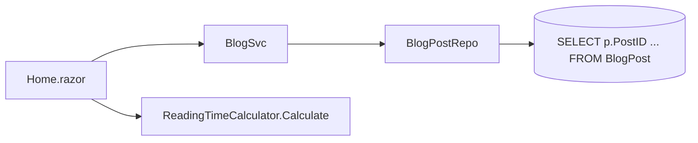
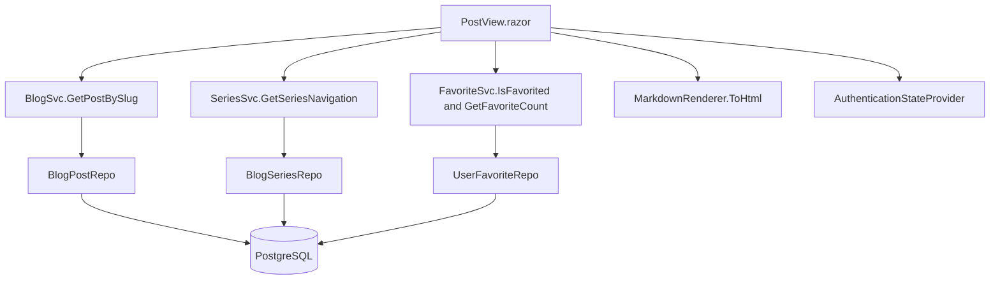
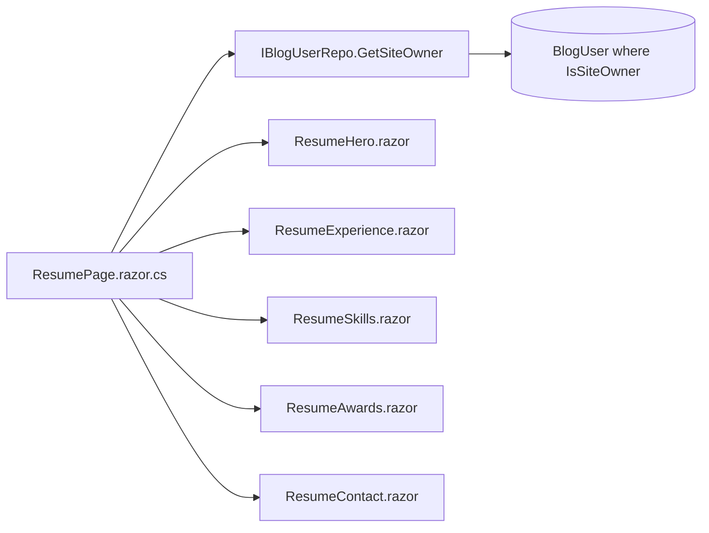

# TechieBlog — Developer Guide · Guest (anonymous)

> **Runtime-verified 2026-08-26 as Guest (anonymous)** (verify-phase, scope REQ-UI-048 · REQ-FN-025 · REQ-UI-049 — TrBlazeUI 2.0.3). `/`, `/categories`, `/tags`, `/series`, `/search`, `/newsletters`, `/speaker-profile`, `/post/{slug}` — **renders ✓ · looks-right ✓ (runtime-confirmed 2026-08-26)** at 1280 + 390: 0 error boundaries, 0 empty icons, 0 zero-sized / overlapping / off-viewport controls, 0 horizontal scroll, 0 console errors. The home **stats band rendered for the first time** (4 tiles, against rows seeded for the run). Screenshots `tests/.artifacts/verify-203-gates/`.

> **Runtime-verified 2026-08-23 as Guest (anonymous)** (verify-phase, scope REQ-UI-053 · REQ-NFR-018).
> - `/newsletters` and `/newsletter/{slug}` — **renders ✓ · looks-right ✓ (runtime-confirmed 2026-08-23)**. Every listed control reported RENDERS with non-empty data (issue position "Issue 1 of 2", all-issues link, compact subscribe CTA + heading); §4b clean at **1280 and 390** — `overlaps=[] zeroSize=[] offViewport=[] hScroll=0 consoleErrors=[]`. Only-sent-issues, pending-subscriber-until-confirmed and the TbEmpty no-data state all hold.
> - `/sitemap.xml`, `/feed.xml` and `/rss.xml` — **output cache confirmed live** (runtime-confirmed 2026-08-23): rising `Age` on repeat requests, feeds served as `application/rss+xml`.
> - **Correction (2026-08-23):** an earlier note here said "`/rss` returns `no-cache, no-store`, so the RSS half is not implemented". That was a testing error on my part — **`/rss` is not a feed route**, it is an ordinary Blazor HTML page and is correctly uncached. The feed is `RssFeedSvc.FeedPath` = **`/feed.xml`**, aliased as **`/rss.xml`**, and both are output-cached under the `Feed` policy tagged `CacheTags.Content`.
> - ⚠ **Public content can be stale after a write from the BlogApp desktop head** — `MemoryCacheService` is per-process, so one head's write cannot evict the other's cache (the SQL itself filters `IsDeleted` correctly). BlogApp calls `POST /api/admin/cache/refresh` automatically to close this, **provided its Website address is configured**; without it the wait is the 10-minute lifetime. Tracked on REQ-NFR-018 / UAT-023.

> ✅ **Runtime-verified 2026-08-09 as Guest (anonymous)** — supersedes the 2026-08-02 `STATIC-ONLY`
> banner, whose stated reason (solution does not compile, REQ-FN-043) is stale. See
> **Runtime verification (2026-08-09)** below for what was actually observed.

Index: [TechieBlog-DevGuide.md](./TechieBlog-DevGuide.md) · Architecture: `docs/TechieBlog-Architecture.md`

Every screen below is reachable **without signing in**. Signed-in roles see the same pages plus their
own.

> ⚠ **This page's premise is out of date.** It says engagement controls "require authentication".
> They do not: reader accounts were retired (BRD-1/13/43/44) and commenting and rating are now
> **anonymous and email-keyed** with a captcha and double opt-in. Runtime check found no sign-in gate
> and zero `/login` links anywhere in the comment or rating components. The **Favourite toggle** noted
> per screen no longer exists at all (REQ-UI-028 removed).

## Runtime verification (2026-08-14) — REQ-NFR-001 scope only

Runtime-verified 2026-08-14 as **anonymous/guest**, against a genuine **Release + Production** host
(`--no-launch-profile`; see the REQ-NFR-001 checklist row for why a bare `dotnet run` silently boots
Development). This pass exercised only the four screens the performance budget is measured against —
**every other row in the 2026-08-09 table below is unchanged and NOT re-observed.**

| Screen | Observed 2026-08-14 | Detail |
|--------|---------------------|--------|
| `/` (portfolio home) | **renders ✓ (runtime-confirmed 2026-08-14)** · **looks-right ✓** | 4 stat tiles with values, featured post, 3 article cards each with image/category/title/excerpt/author/date/star-rating. 0 horizontal overflow at 1280×800 and 390×844; mobile stacks to hamburger + 2-col stat grid |
| `/post/{slug}` | **renders ✓ (runtime-confirmed 2026-08-14)** · **looks-right ✓ — the 2026-08-09 DEFECT IS FIXED** | title, hero, markdown body with fenced code, series nav ("Part 2 of 3", prev/next), tags, rating 4.5 from 2 ratings, view-count aggregate, comment form + captcha. **The 46px 390px table overflow is GONE:** probed across three posts — `the-markdown-kitchen-sink` (1 table) **0px**, `scaling-signalr-for-blazor-server` (1 table) **0px**, `blazor-circuits-and-state` (0 tables) 0px. The table-vs-no-table comparison that isolated the defect now shows no difference |
| `/category/{slug}` | **renders ✓ (runtime-confirmed 2026-08-14)** · **looks-right ✓** | header, post list and links render real data; 0 overflow at both widths. **NOTE: the 2026-08-09 `renders-empty` featured-image defect was NOT re-tested** — this pass asserted list/link/heading data only, not `<PostCard ImageUrl>`. Treat that defect as still open |
| `/newsletters` | **renders ✓ (runtime-confirmed 2026-08-14)** · **looks-right ✓** | content and navigable links render; 0 overflow at both widths |

Evidence: `tests/verify/req-nfr-001-render-visual.spec.ts` 12/12 passed; screenshots inspected in
`tests/.artifacts/req-nfr-001/`. Screens NOT runtime-verified this pass: `/tag/{slug}`, `/series/{slug}`,
`/search`, `/rss`, `/authors`, `/author/{username}`, `/resume`, `/about`, `/404`, the auth screens and
the sidebar subscribe surface — their 2026-08-09 verdicts stand.

## Runtime verification (2026-08-09)

Observed by `*verify all` against the running app. Screens not listed rendered their data and looked
right at 1280×900 and 390×844.

| Screen | Observed | Detail |
|--------|----------|--------|
| `/` (portfolio home) | **renders ✓** | hero, 4 stat tiles, about, 3 latest articles, contact — all from the site-owner row. Visual clean at both widths. `Download CV` correctly hidden (**NO-DATA**: `cvfilepath` empty) |
| `/post/{slug}` | **visual-broken (DEFECT)** | all 11 controls render real data, but at **390px the page scrolls horizontally 46px** — a Markdown-rendered `<table>` is 420px wide with `overflow-x:visible` and is not wrapped in a scroll container. Isolated by comparing a post with a table (46px) against one without (0px) |
| `/category/{slug}`, `/tag/{slug}` | **renders-empty (DEFECT)** | counts and cards match the DB exactly, but **featured images never render** — `CategoryArchive.razor:117` and `TagArchive.razor:107` pass no `ImageUrl` to `<PostCard>` although every published post has one |
| `/series/{slug}` | **renders-empty (DEFECT)** | **leaks unpublished parts to anonymous visitors** with title, abstract and a "Coming Soon" badge. `BlogPostRepo.cs:246-248` filters only on `IsDeleted`; `CountBySeriesSql:250-254` correctly filters `Published = TRUE`, so the list and the badge disagree |
| `/search` | **renders-empty (DEFECT)** | every result's category badge is the literal `"Blog"` — hardcoded at `SearchResults.razor:244`. Highlighting applies to excerpts only, so a title-only match shows no `<mark>` |
| `/rss` | **unreachable (DEFECT)** | the page advertises `/feed.xml`, which **404s**; there is no `<link rel="alternate">` in `<head>`. No feed is served anywhere |
| unmatched route | **render-error (DEFECT)** | returns HTTP 404 with a **zero-byte body** and a blank white page. `/404` renders correctly when requested directly, but nothing routes to it |
| public shell | **visual-broken (DEFECT)** | 5px horizontal overflow at **320px** from the header actions cluster; `mobile-nav-trigger` clipped past the right edge. Clean at 390 and 1280 |
| sidebar subscribe | **render-error (DEFECT)** | writes a subscriber with **no captcha and `isconfirmed=t`**, bypassing the double opt-in every other subscribe surface enforces |
| comments / rating | **renders ✓** | anonymous, email-keyed, captcha + double opt-in all proven end to end; unapproved comments never appear publicly; the public average counts verified ratings only |
| `/login`, `/forgot-password`, `/reset-password`, `/verify/{token}` | **renders ✓** | all controls render; anti-enumeration message confirmed; open-redirect guard rejects absolute and protocol-relative URLs |

**Cross-cutting artefact (not a screen defect):** the host prerenders and then re-renders interactively,
and for ~1.5s **both shells are in the DOM** — a visibly duplicated header over a still-loading page. It
self-resolves, but any measurement inside that window reads a doubled shell or phantom zero rows. This is
the root cause of the post page's blank flash and its `document-title` accessibility violation.

**Cross-cutting layout contract (UAT-027 / UAT-028, 2026-08-24) — read this before touching any public
screen's width.** Every public surface now shares ONE two-tier width system, defined as real CSS rules in
`source/BlogUI/wwwroot/css/layout.css`:

| Class | Rule | Use for |
|---|---|---|
| `.site-container` | `width: min(100% - 3rem, 1600px)` (`- 2rem` below 640px), `margin-inline: auto` | **Layout tier** — header, footer, page shells, card grids, hero and stat bands. Fluid: grows with the viewport, stops at 1600. |
| `.prose-container` | `max-width: 52rem` | **Reading tier** — article body only. Capped *deliberately*: line length drives reading accuracy, and uncapped prose on a 4K panel runs ~250 characters per line. |

It replaced six disagreeing fixed caps (header/footer 1280, home/resume **1024**, search 880, post text 820,
`--max-content-width` 1200, mockups 1120), which made the header bar render visibly wider than the content
beneath it on every page, and made the site fill 45.6% of a 2246px macOS viewport but 54.3% of a 1798px
Windows/RDP one — the owner's "looks different on Mac and Windows" report. Now **header width == body
container width to the pixel** (verified across 24 page × width × theme combinations) and the page fills
**71.2% @2246 / 89.0% @1798 / 96.3% @1280**.

Applied at `Header.razor:40`, `Footer.razor:21`, `FullWidthLayout.razor:16`, `MainLayout.razor:20`. The dead
`--max-content-width`, `--article-max-width`, `.page-container` and `.main-content--full` are **deleted** —
do not reintroduce a page-level width number. ⚠ Two traps: (1) **never nest `.site-container` inside another
`.site-container`** — the rule computes against its immediate parent, so nesting subtracts the gutter twice
(caught on `SpeakerProfile.razor`, which measured 1552px instead of 1600px); (2) this build ships TrBlazeUI's
**prebuilt** CSS with no Tailwind JIT, so `max-w-[1600px]` and friends are never generated and silently do
nothing — six such inert values were found and removed during this work.

**Type scales with the viewport too (UAT-030, 2026-08-24).** The ROOT font size is now fluid —
`html { font-size: clamp(16px, 0.89vw, 20px) }` in `source/BlogUI/wwwroot/css/base.css` — so it resolves to
16px at the 1798px Windows/RDP viewport and 20px at the 2246px macOS one. That is why `.prose-container` is
expressed as **`52rem`, not `820px`**: a fixed px cap would hold ~90 characters at 16px but only ~72 at 20px,
so the reading measure would shrink as the type grew. In `rem` it tracks the root and the measure stays
~90 characters at every viewport (832px @1798, 1040px @2246). For the same reason the four remaining
**px-based font clamps were converted to `rem`** — `h1.page-title`, `.speaker-banner__title`,
`.speaker-banner__sub` and the resume hero in `resume.css`: pinned at their px ceilings they stayed 46px/32px
at *every* viewport, so once the root scaled they would have shrunk relative to their own body copy.

## Guest · Home (`/`)

**File:** `source/BlogUI/Pages/BlogPages/Home.razor` · **Layout:** `MainLayout`

| Control | What it shows | Source call | Render status |
|---------|---------------|-------------|---------------|
| Hero (name, title, tagline, photo, Get-In-Touch, social row) | The `IsSiteOwner` user's resume header | `IBlogUserRepo.GetSiteOwnerAsync()` via `ResumeHero` | renders ✓ (runtime-confirmed 2026-08-26) |
| Headline stats band (`home-stats`, 4 × `StatTile`) | Owner's `UserStats` rows, value + label slots | `IUserStatsRepo.GetByUserId()` via `HomeStats` | renders ✓ (runtime-confirmed 2026-08-26 — observed for the first time locally, against 4 rows seeded for the run; collapses by design when the table is empty) |
| About summary | Owner bio | `HomeAbout` | renders ✓ (runtime-confirmed 2026-08-26) |
| Latest articles grid (`home-latest-articles`, `PostCard` ×N) | Recent published posts, each linking to `/post/{slug}` | `BlogSvc.GetPublishedPostsAsync(3, 0)` (content-cached) | renders ✓ (runtime-confirmed 2026-08-26 — card link → HTTP 200) |
| No-banner card fallback | `bg-gradient-to-br from-muted to-card` + `image-off` glyph | `PostCard.razor` (TrBlazeUI 2.0.3 gradient-stop utilities) | renders ✓ (runtime-confirmed 2026-08-26 — computed two-stop oklch gradient) |
| Contact block | Owner contact details | `ResumeContact` | renders ✓ (runtime-confirmed 2026-08-26) |
| Download-CV CTA | Link to `CVFilePath` | `ResumeHero` | conditional — NOT observable (no `CVFilePath` in this DB), collapses by design |

**Data lineage**

| Step | Symbol | File |
|------|--------|------|
| Page | `Home.razor` `@inject BlogEngine.Services.BlogSvc BlogService` | `Pages/BlogPages/Home.razor` |
| Service | `BlogSvc.GetPublishedPosts`, `GetFeaturedPost`, `GetPublishedPostCount` | `BlogEngine/Services/BlogSvc.cs` |
| Data access | `BlogPostRepo` (inherits `GenericRepository<BlogPost>`) | `BlogEngine/DbAccess/BlogPostRepo.cs` |
| SQL | inline parameterised `SELECT p.PostID …` / `SELECT COUNT …` against `BlogPost` | `BlogPostRepo.cs` |

**Business rules:** only `Published = true` posts appear; ordering is by publish date descending.

**Known issues:** none. **✅ UAT-025 and UAT-026 are both FIXED and verified 2026-08-24** (`*fix-issues`; observed on the running host, not inferred):

- **(1) banner-less post card — FIXED.** `ImagePlaceholder` is **retired entirely** from `PostCard.razor` and all of its call sites, so no caller can feed the title into the image box again. The no-image state is now a designed fallback — a theme-token gradient (`.post-card-fallback`, `wwwroot/css/utilities.css:228`) behind a centred low-opacity Lucide `image-off` glyph — and the same fallback also catches a `FeaturedImage` URL that 404s, via an idempotent inline `onerror` on the `` (`PostCard.razor:36`). **Observed:** placeholder text is now the empty string (it was byte-identical to the card title before), glyph 40×40, gradient computes to real `oklch` stops in both light and dark. `SearchResults.razor`, which renders its own thumbnail rather than a `<PostCard>`, was brought to the same behaviour so all three listing surfaces agree.
- **(2) cross-platform typography — FIXED.** The site now self-hosts **Inter** as a variable woff2 from its own origin (`_content/BlogUI/fonts/inter-latin-var.woff2`, 48 KB latin + an 85 KB latin-ext subset that an English page never requests), declared with `@font-face` + `font-display: swap` and `unicode-range` subsetting at `css/theme.css:66-82`; `--tb-font-ui`/`--tb-font-heading` lead with `"Inter"` and the unshipped `Poppins` entries are gone from `blogui.css:15` / `adminui.css:15`. **Observed:** `document.fonts.size` 0 → 2, `fonts.check('16px Inter')` true, and blocking the woff2 shifts a real `h1` by 79.5px — so the glyphs genuinely changed. macOS and Windows now render the same face. The `developer` (mono) and `minimal` (serif) site themes were deliberately left on their own faces and confirmed free of Inter leak.

**Render/visual status (observed 2026-08-26, host `:5473`, TrBlazeUI 2.0.3):** RENDERS + **looks-right ✓ (runtime-confirmed 2026-08-26)** at 1280 and 390 — 0 zero-sized, 0 overlaps, 0 off-viewport, 0 horizontal scroll, 0 console errors. Screenshots `tests/.artifacts/verify-203-gates/home-{1280,390}{,-full}.png`. The **stats band was observed rendering** (4 tiles, value + label slots) against `UserStats` rows seeded for the run and reverted afterwards; the **Download-CV CTA** remains NOT observable (no `CVFilePath`) and collapses by design. Note for the next verifier: the `.post-card-fallback` rule named above is gone since the 2.0.3 upgrade — the fallback is now `bg-gradient-to-br from-muted to-card` on the element itself — and published listings are **content-cached**, so seed the database *before* booting the host or the home page keeps showing the empty list.

## Guest · Post view (`/post/{Slug}`, `/post/{Slug}/{PageNumber}`)

**File:** `source/BlogUI/Pages/BlogPages/PostView.razor` · **Layout:** `FullWidthLayout`

This is the densest public screen — seven injected dependencies.

**Rebuilt 2026-08-24 (UAT-027).** The owner reported "a lot of gap on both sides, be it Windows or Mac": on a
2246px viewport the page was header 1280 / `main` 1024 / article text 820, leaving ~1220px of empty gutter
with nothing using it. The **article measure was NOT the bug and was not widened** — 820px is already ~90
characters per line, and stretching it would make posts harder to read. What changed is the structure around
the text:

- **Full-bleed title band** (`.post-title-band`, `post.css`) — badge, title, author, date, reading time and
  view count, spanning the whole `.site-container` width. Two variants: a theme-token gradient when the post
  has no `FeaturedImage`, or the image as a backdrop with a scrim when it does (same reasoning as
  `.speaker-banner` — the overlaid title is `#fff` in both light and dark because it sits on a photograph the
  theme cannot control). Height is content-driven with a `min-height` for CLS, deliberately *not*
  `aspect-ratio`-locked, because the wrapping meta row would clip at narrow widths.
- **Sticky TOC rail — REMOVED (UAT-029, 2026-08-24).** It briefly existed as `PostTocRail.razor` +
  `PostTocHeading.cs`, built from the rendered markdown's `<h2>`/`<h3>` headings. It was **deleted** at the
  owner's request, along with its JS workaround and its tests — not hidden behind a breakpoint. Do not
  reintroduce it; it was the third of the post page's three disagreeing left edges.
- Body stays in `.prose-container`; comments, ratings and related posts use the fluid width.

⚠ **`post-toc-rail.js` was deleted with the rail (UAT-029).** It had existed solely to work around a TrBlazeUI
defect: **TR-074** — `AnchorNav` emits bare `href="#id"` links, which resolve against this app's
`<base href="/">` and so navigate the whole app *away* from the article instead of scrolling. **TR-074 is a
genuine upstream library defect and is still open**, but with the rail gone it no longer affects this page,
and there is no workaround file left to remove once the library is fixed.

**One column, one pair of edges (UAT-029).** The earlier 1600-vs-1108 title-band/article offset is **gone**.
Every block on a post page — title band, article, pagination, rating panel, author card, comments and related
posts — now sits in a single `.post-column` (`width: min(100%, 52rem)`, `layout.css`), so they share ONE left
edge and ONE right edge at every viewport. Verified: 832px wide at a 1798px viewport and 1039px at a 2246px
viewport — **46.3% of the screen on both**.

| Control | What it shows | Source call | Render status |
|---------|---------------|-------------|---------------|
| Article body | Markdown rendered to HTML | `MarkdownRenderer.ToHtml(post.PostContent)` | static-only (unconfirmed) |
| Title / author / date / category / tags | Post metadata | `BlogService.GetPostBySlug(Slug)` | static-only (unconfirmed) |
| Reading time | "N min read" | `ReadingTimeCalculator.Calculate(...)` | static-only (unconfirmed) |
| Series navigation | Previous / next part | `SeriesService.GetSeriesNavigation(...)` | static-only (unconfirmed) |
| Related posts | Other published posts | `BlogService.GetPublishedPosts(...)` | static-only (unconfirmed) — *note: this is a generic published-post query, not a category/tag-similarity match; "related" is loosely implemented* |
| Star rating | Average + user's rating | `Components/StarRating.razor` → `RatingSvc` | static-only (unconfirmed) |
| Favourite toggle | Favourited state + count | `FavoriteService.IsFavorited`, `GetFavoriteCount` | static-only (unconfirmed) |
| Comments | List + form (sign-in required) | `Components/…` → `CommentSvc` | static-only (unconfirmed) |

**Data lineage**

| Step | Symbol | File |
|------|--------|------|
| Page | `PostView.razor` | `Pages/BlogPages/PostView.razor` |
| Services | `BlogSvc`, `SeriesSvc`, `FavoriteSvc`, `MarkdownRenderer` | `BlogEngine/Services/`, `BlogEngine/Common/` |
| Data access | `BlogPostRepo`, `BlogSeriesRepo`, `UserFavoriteRepo` | `BlogEngine/DbAccess/` |
| SQL | inline parameterised SQL on `BlogPost`, `BlogSeries`, `UserFavorite` | as above |

**Business rules:** anonymous visitors can read but not engage — the page injects
`AuthenticationStateProvider` and gates the engagement controls on the resulting principal.

**Known issues:** "Related posts" reuses `GetPublishedPosts` rather than a similarity query
(BRD-32 expects category/tag-based relatedness) — `{unresolved — TODO: confirm whether a filter is applied inside the page's related-post block}`.

## Guest · Category archive (`/category/{Slug}`, `/categories`, `/categories/{Slug}`)

**File:** `source/BlogUI/Pages/BlogPages/CategoryArchive.razor`

| Control | Source call | Render status |
|---------|-------------|---------------|
| Category header | `CategoryService.GetCategoryBySlug(Slug)` | static-only |
| Post list | `BlogService.GetPostsByCategory(...)` | static-only |
| Post count / paging | `BlogService.GetPostCountByCategory(...)` | static-only |
| Category list (index mode) | `CategoryService.GetAllWithCounts()` | static-only |
| Reading time | `ReadingTimeCalculator.Calculate(...)` | static-only |

**Lineage:** page → `CategorySvc` / `BlogSvc` → `CategoryRepo` / `BlogPostRepo` → inline SQL on
`Category`, `PostCategory`, `BlogPost`.

## Guest · Tag archive (`/tag/{Slug}`, `/tags`, `/tags/{Slug}`)

**File:** `source/BlogUI/Pages/BlogPages/TagArchive.razor`

| Control | Source call | Render status |
|---------|-------------|---------------|
| Tag header | `TagService.GetTagBySlug(Slug)` | static-only |
| Post list | `TagService.GetPostsByTag(...)` | static-only |
| Post count | `TagService.GetPostCountByTag(...)` | static-only |
| Tag list / cloud | `TagService.GetAllWithCounts()` | static-only |
| Category name per card | `CategorySvc.GetAllCategories()` cached in a page dictionary | static-only |

**Lineage:** page → `TagSvc` (+ `CategorySvc`) → `BlogTagRepo` → inline SQL joining `Tag`, `PostTag`,
`BlogPost`. The per-tag `COUNT` was the Story 7.5 bug (fixed in `BlogTagRepo.cs`); the category-name
lookup was FIX-009.

## Guest · Series (`/series`, `/series/{Slug}`)

**File:** `source/BlogUI/Pages/BlogPages/SeriesView.razor` · **Layout:** `FullWidthLayout`

| Control | Source call | Render status |
|---------|-------------|---------------|
| Series list (no slug) | `SeriesService.GetAllWithCounts()` | static-only |
| Series header + parts | `SeriesService.GetSeriesBySlug(Slug)` | static-only |
| Reading time per part | `ReadingTimeCalculator.Calculate(...)` | static-only |

**Lineage:** page → `SeriesSvc` → `BlogSeriesRepo` → inline SQL on `BlogSeries` + `BlogPost`.

## Guest · Search (`/search`)

**File:** `source/BlogUI/Pages/BlogPages/SearchResults.razor`

| Control | Source call | Render status |
|---------|-------------|---------------|
| Result list | `BlogSvc.SearchPosts(...)` | static-only |
| Result count / paging | `BlogSvc.GetSearchResultCount(...)` | static-only |
| Category filter dropdown | `CategorySvc.GetAllCategories()` | static-only |

**Lineage:** page → `BlogSvc.SearchPosts` (`BlogSvc.cs:555-580`) → `BlogPostRepo.SearchPosts`
(`BlogPostRepo.cs:424-465`) → PostgreSQL `ILIKE` across `Title`, `Abstract`, `PostContent`, `Tags`.

**Business rules:** search covers published posts only; terms are highlighted in the rendered results.

## Guest · Authors (`/authors`)

**File:** `source/BlogUI/Pages/BlogPages/AuthorsPage.razor` (+ `.razor.cs`)

| Control | Source call | Render status |
|---------|-------------|---------------|
| Author list | `UserRepo.GetAllAuthors()` (**repository injected directly — no service layer**) | static-only |
| Article count per author | part of `GetAllAuthors()`'s projection | static-only |

**Lineage:** page → `IBlogUserRepo.GetAllAuthors` → `BlogUserRepo.cs` inline `SELECT DISTINCT …` over
`BlogUser` joined to `BlogPost`.

## Guest · Author profile (`/author/{Username}`)

**File:** `source/BlogUI/Pages/BlogPages/AuthorProfilePage.razor` (+ `.razor.cs`)

| Control | Source call | Render status |
|---------|-------------|---------------|
| Author header | `UserRepo.GetByUsername(Username)` | static-only |
| Article list | `{unresolved — TODO: the posts-by-author call was not located in AuthorProfilePage.razor.cs}` | unresolved |
| Resume sections (when `ResumeEnabled`) | `Components/Resume/*` fed by the skills/awards/events repositories | static-only |

**Business rules:** an unknown username must 404 (BRD-55); `ResumeEnabled` gates the resume sections.

## Guest · Resume (`/resume`)

**File:** `source/BlogUI/Pages/ResumePage.razor` (+ `.razor.cs`) · **Layout:** `FullWidthLayout`

| Control | Source call | Render status |
|---------|-------------|---------------|
| Hero (photo, name, title, tagline, CTAs, socials) | `UserRepo.GetSiteOwner()` → `ResumeHero.razor` | static-only |
| Experience timeline | `ResumeExperience.razor` → `IUserEventRepo.GetByUserAndType(userId, "Experience")` | static-only |
| Skills grid | `ResumeSkills.razor` → `IUserSkillsRepo.GetByUserId` | static-only |
| Awards | `ResumeAwards.razor` → `IUserAwardsRepo.GetByUserId` | static-only |
| Contact | `ResumeContact.razor` — fields off `AppUser` | static-only |
| Download CV | `AppUser.CVFilePath` → static file under `wwwroot/uploads/cv/` | static-only |

**Lineage:** `ResumePage.razor.cs:47` `siteOwner = UserRepo.GetSiteOwner();` → `BlogUserRepo` inline SQL
on `BlogUser` filtered by `IsSiteOwner` (uniqueness enforced by the partial index in migration `012`).

**Business rules:** if no user has `IsSiteOwner = true`, the whole page has nothing to render.
**Known issue (static):** no fallback/empty state was located for that case —
`{unresolved — TODO: confirm ResumePage behaviour when GetSiteOwner() returns null}`.

## Guest · About (`/about`) and 404 (`/404`)

**Files:** `Pages/BlogPages/About.razor`, `Pages/AdminPages/404Page.razor` (uses `AuthLayout`).
Static content; no service calls. Dark-mode styling for About was fixed in Story 7.3.

## Guest · RSS (`/rss`), sitemap (`/sitemap.xml`), robots (`/robots.txt`)

| Endpoint | Implementation | Lineage |
|----------|----------------|---------|
| `/rss` | `Pages/BlogPages/RssFeed.razor` | page → `BlogSvc.GetPublishedPosts` → `BlogPostRepo` |
| `/sitemap.xml` | minimal endpoint, `source/TechieBlog/Program.cs:169` | → `SitemapSvc.GenerateSitemap()` → `BlogSvc` / repositories |
| `/robots.txt` | minimal endpoint, `Program.cs:176` | reads `SiteSettings:BaseUrl` from configuration |

## Guest · Login / Register / Forgot / Reset

Documented once here because anonymous visitors reach them; see the index §3 **LANDING-TRUTH** section
for the post-login redirect defect.

| Screen | File | Key call |
|--------|------|----------|
| `/login` | `Pages/AdminPages/LoginPage.razor` + `.razor.cs` | `AuthSvc.LoginAsync(SvcData)` → `CustomAuthStateProvider.MarkUserAsAuthenticated` → `NavigateTo("/admin")` (`:106`) |
| `/register` | `Pages/AdminPages/RegisterPage.razor` | `AuthService.RegisterUser(...)` → on success `NavigateTo("/login")` (`:160`) |
| `/forgot-password` | `Pages/AdminPages/ForgotPasswordPage.razor` | `await AuthService.RequestPasswordReset(...)` |
| `/reset-password/{Token}` | `Pages/AdminPages/ResetPasswordPage.razor` | `AuthService.ValidateResetToken(...)`, `AuthService.ResetPassword(...)` |
| `/access-denied` | `Pages/AccessDenied.razor` | static |

**Lineage:** page → `AuthSvc` (`BlogEngine/Services/AuthSvc.cs`) → `BlogUserRepo` → PostgreSQL stored
functions `GetLoginUser`, `GetUserByEmail`, `InsertBlogUser`, `SelectBlogUserById`. Reset tokens go to
`PasswordResetTokenRepo`, an **in-memory singleton** (`BlogSvcInitializer.cs:19`) — they do not survive
a restart. The reset "email" is written to the log by `ConsoleEmailService`, not sent.

**Known issues (static):**
1. **Role-blind redirect** — see index §3 and finding #1.
2. Reset tokens are lost on restart (REQ-NFR-019, by design per FIX-PLAN but a real operational trap).
3. No rate limiting on the login endpoint (REQ-NFR-005).

---
Generated 2026-08-02 · reflects code as built · ⚠ STATIC-ONLY
