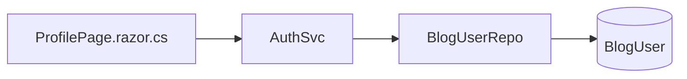

# TechieBlog — Developer Guide · Reader (and Contributor)

> ⚠ **STATIC-ONLY (2026-08-02)** — built from code reading; NOT yet runtime-verified. Render-status is
> unconfirmed until `*verify` runs against the running app (the solution currently does not compile —
> REQ-FN-043).

Index: [TechieBlog-DevGuide.md](./TechieBlog-DevGuide.md)

A Reader sees every Guest screen plus the four below. **Contributor is functionally identical to
Reader** — the `ContributorOrAbove` policy exists (`Program.cs:96`) but no page requires it, so the
role grants nothing extra (index finding #5).

> **Login trap:** after a successful login `LoginPage.razor.cs:106` sends *every* role to `/admin`,
> which requires `EditorOrAbove`. A Reader therefore lands on `/access-denied` rather than the site.
> See index §3.

## Reader · Profile (`/profile`)

**File:** `source/BlogUI/Pages/AdminPages/ProfilePage.razor` (+ `.razor.cs`) · **Guard:** `[Authorize]` ·
**Layout:** `AdminLayout`

| Control | What it does | Source call | Render status |
|---------|--------------|-------------|---------------|
| Profile details | Loads the signed-in user | `AuthService.GetUserProfile(...)` | static-only (unconfirmed) |
| Save profile | Persists display name, bio, avatar, socials | `AuthService.UpdateProfile(...)` | static-only (unconfirmed) |
| Change password | Verifies current, sets new | `AuthService.ChangePassword(...)` | static-only (unconfirmed) |

**Data lineage**

| Step | Symbol | File |
|------|--------|------|
| Page | `ProfilePage.razor` `@inject BlogEngine.Services.AuthSvc AuthService`, `AuthenticationStateProvider` | `Pages/AdminPages/ProfilePage.razor` |
| Service | `AuthSvc.GetUserProfile`, `UpdateProfile`, `ChangePassword` | `BlogEngine/Services/AuthSvc.cs` |
| Data access | `BlogUserRepo.GetSingle`, `Update` | `BlogEngine/DbAccess/BlogUserRepo.cs` |
| SQL | stored function `SelectBlogUserById` for reads; inline `UPDATE BlogUser` for writes | `BlogUserRepo.cs` |

**Business rules:** the user id comes from the `ClaimsPrincipal` (`PrimarySid` claim issued by
`AuthSvc`), not from a route parameter — a user cannot open someone else's profile here.

**Known issues:** password change ultimately calls `AppEncrypt.CreateHash`, a hand-rolled hash rather
than a standard salted KDF (REQ-NFR-002, ⚠ SECURITY).

## Reader · My Favourites (`/my-favorites`)

**File:** `source/BlogUI/Pages/UserPages/MyFavorites.razor` · **Guard:** `[Authorize]` ·
**Layout:** `MainLayout`

| Control | Source call | Render status |
|---------|-------------|---------------|
| Favourites list | `FavoriteService.GetUserFavorites(userId)` | static-only (unconfirmed) |
| Count | `FavoriteService.GetUserFavoriteCount(userId)` | static-only (unconfirmed) |

**Data lineage:** page → `FavoriteSvc` (`BlogEngine/Services/FavoriteSvc.cs`) → `UserFavoriteRepo`
(`BlogEngine/DbAccess/UserFavoriteRepo.cs`) → inline SQL `SELECT FavoriteId …` / `INSERT INTO UserFavorite`
/ `DELETE FROM UserFavorite` against the table created by migration `009-CreateUserFavorite.sql`.

**Business rules:** the current user id is resolved from `AuthenticationStateProvider`; the page
redirects unauthenticated users via `NavigationManager`.

**Known issues:** the favourites list returns `UserFavorite` rows — confirm the post title/slug shown on
each card is joined in the repository rather than fetched per row
(`{unresolved — TODO: check whether GetUserFavorites projects post fields or the page issues N+1 lookups}`).

## Reader · Engagement on a post (`/post/{Slug}`)

The post page itself is documented under Guest. These controls become active only when signed in:

| Control | Component | Service | Data access |
|---------|-----------|---------|-------------|
| Comment form | `Components/…` on `PostView.razor` | `CommentSvc.AddComment` | `BlogCommentRepo` → `INSERT INTO blogcomment` |
| Star rating | `Components/StarRating.razor` | `RatingSvc.RatePost`, `GetUserRating`, `GetPostRatingStats` | `PostRatingRepo` → `INSERT/UPDATE/DELETE PostRating` |
| Favourite toggle | `Components/FavoriteToggle.razor` | `FavoriteSvc.ToggleFavorite`, `IsFavorited` | `UserFavoriteRepo` |

**Business rules:** one rating per user per post (enforced by a unique index from migration `010`);
comments may require approval before display, controlled by the moderation setting — but see the
Admin guide: that setting is **not persisted**, so its runtime source is
`{unresolved — TODO: locate where the comment-moderation flag is read at runtime}`.

## Reader · Subscribe (component, public pages)

**Component:** `source/BlogUI/Components/Sidebar.razor` (subscribe block) → `SubscriberSvc.Subscribe`
→ `SubscriberRepo` → `INSERT INTO Subscriber` / duplicate check via `SELECT SubscriberId …`.

Available to anonymous visitors too; listed here because it is part of the reader journey.

## Missing screen — My Comments

`docs/TechieBlog-BRD.md` BRD-13 and mockup `mockups/14-my-comments.html` specify a comment-history page
for readers. **No such page exists** in `source/BlogUI/Pages/` — tracked as REQ-UI-015 (Not Started).
Nothing to map.

---
Generated 2026-08-02 · reflects code as built · ⚠ STATIC-ONLY
