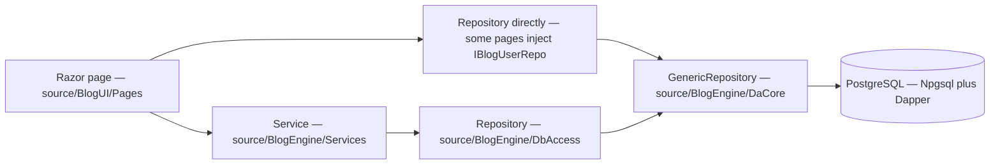

# TechieBlog — Developer Guide (index)

> ✅ **Runtime-verified 2026-08-09** as Guest, Contributor, Author, Editor and Admin — superseding the
> 2026-08-02 `STATIC-ONLY` banner. That banner's stated reason (the solution does not compile, `NU1605`)
> is **stale**: the solution builds `0 Error(s)` across 7/7 projects and both heads run. `*verify all`
> exercised 131 REQs against the running app on `http://localhost:5399` plus the BlogApp desktop head
> over WebView2 CDP, capturing 183 screenshots.
>
> Render-status cells below that still read `static-only (unconfirmed)` were **not** individually
> re-stamped; the authoritative per-screen runtime observations are in each role guide's
> **"Runtime verification (2026-08-09)"** section, and the authoritative per-REQ verdicts are in
> `docs/TechieBlog-Checklist.md` → Requirements Status.

**Generated 2026-08-02 · reflects code as built.**

## 1. How to use this guide

This is the developer's map from **screen → control → service method → data-access method → SQL /
stored function**. Use it to chase a bug without reverse-engineering the repository, and to check
whether AI-generated code actually wired what it claims.

- Every path below was **read** in the working tree and is cited as `file:line` where the claim is
  non-obvious. Anything that could not be confirmed is marked `{unresolved — TODO}` rather than guessed.
- Control render-status is `static-only (unconfirmed)` throughout — the OBSERVE pass could not run.
  Where static reading shows a control **cannot** show real data, it is marked **DEFECT (static)** and
  logged to `docs/TechieBlog-Checklist.md`.
- Guides are split by role. Screens reachable by several roles are documented once, in the lowest role
  that can reach them, and cross-referenced from the others.

| Role | File | Screens |
|------|------|---------|
| Guest (anonymous) | [./TechieBlog-DevGuide-Guest.md](./TechieBlog-DevGuide-Guest.md) | 12 |
| Reader | [./TechieBlog-DevGuide-Reader.md](./TechieBlog-DevGuide-Reader.md) | 4 |
| Author | [./TechieBlog-DevGuide-Author.md](./TechieBlog-DevGuide-Author.md) | 10 |
| Editor | [./TechieBlog-DevGuide-Editor.md](./TechieBlog-DevGuide-Editor.md) | 3 |
| Admin | [./TechieBlog-DevGuide-Admin.md](./TechieBlog-DevGuide-Admin.md) | 11 |

**Contributor** has no screens of its own. The `ContributorOrAbove` policy is registered in
`source/TechieBlog/Program.cs:96` but **no page references it** — a Contributor can reach only what a
Reader can. Logged as a finding (§6).

**Structure decision:** split per role — 6 roles (≥ 3) and 40 routable screens (> 12), so the auto-rule
in `devguide.md §3` selects the split layout under `docs/devguides/`.

## 2. Architecture cheat-sheet

Full detail: `docs/TechieBlog-Architecture.md`.



| Layer | Path | Notes |
|-------|------|-------|
| Host | `source/TechieBlog/` | `Program.cs` — DI, Serilog, cookie auth + 5 policies, DbUp at startup, `/sitemap.xml`, `/robots.txt` |
| UI (RCL) | `source/BlogUI/` | `Pages/`, `Components/`, `Layouts/`, `Common/`, `wwwroot/Themes/` |
| Services | `source/BlogEngine/Services/` | 14 services, registered in `BlogSvcInitializer.cs` |
| Data access | `source/BlogEngine/DbAccess/` | 18 Dapper repositories over `DaCore/GenericRepository.cs` |
| Contracts | `source/BlogModel/` | Entities, interfaces, `AppRoles`/`AppPolicies`, `Result<T>`, `AppEncrypt` |
| Migrations | `source/BlogDb/PostgresScripts/` | `001`…`013` (011 unused), applied by DbUp on every boot |

**Data-access reality check.** The archived architecture doc says stored functions are preferred. In
practice only `BlogUserRepo` calls PostgreSQL functions (`GetLoginUser`, `GetUserByEmail`,
`SelectBlogUserById`, `InsertBlogUser`); every other repository issues **inline parameterised SQL**
against the tables. Both forms are safe (Dapper `DynamicParameters` everywhere), but expect table SQL,
not procs, when you go looking.

**Two access patterns coexist.** Most pages inject a `*Svc` from `BlogEngine.Services`. Several pages
inject a **repository directly** — `AddUser`, `UsersList`, `ManageProfile`, `ManageImages`,
`ManageSkills`, `ManageAwards`, `ManageExperience`, `AuthorsPage`, `AuthorProfilePage` and
`ResumePage` all take `IBlogUserRepo` / `IUserSkillsRepo` / `IUserAwardsRepo` / `IUserEventRepo`
straight into the page. There is no user *service*; that layer simply does not exist. Keep this in
mind before "following the service" for a user-related bug — there isn't one.

## 3. Roles and menu map

Roles come from `source/BlogModel/Common/AppRoles.cs` and the policies in `source/TechieBlog/Program.cs:81-102`,
reconciled against the test-user table in `docs/TechieBlog-UsageGuide.md`.

| Policy | Roles | Registered at |
|--------|-------|---------------|
| `AdminOnly` | Admin | `Program.cs:84` |
| `EditorOrAbove` | Admin, Editor | `Program.cs:88` |
| `AuthorOrAbove` | Admin, Editor, Author | `Program.cs:92` |
| `ContributorOrAbove` | Admin, Editor, Author, Contributor | `Program.cs:96` — **unused by any page** |
| `Authenticated` | any signed-in user | `Program.cs:100` |

**Public header menu** (`source/BlogUI/Components/Header.razor:25-36`): Home `/`, Categories
`/categories`, Series `/series`, Search `/search`, plus a search box, the theme toggle and the user menu.

**Admin sidebar menu** (`source/BlogUI/Layouts/AdminLayout.razor:19-141`): Dashboard `/admin`, Posts
`/BlogsList`, Users `/users`, Comments `/CommentsList`, Categories `/CategoriesList`, Tags
`/admin/tags`, Series `/SeriesList`, Profile `/admin/profile`, Experience `/admin/experience`, Skills
`/admin/skills`, Awards `/admin/awards`, Images `/admin/images`, Subscribers `/admin/subscribers`,
Settings `/settings`, and a "View Site" link back to `/`.

### LANDING-TRUTH — where a user actually lands after login

Read from `source/BlogUI/Pages/AdminPages/LoginPage.razor.cs`:

- **Successful login → `NavigationManager.NavigateTo("/admin")` at line 106 — for EVERY role**, with no
  role check anywhere in `ValidateUser()`.
- An **already-authenticated** user who opens `/login` is sent to `/` (`line 74`, in `OnInitializedAsync`).
- Registration success → `/login` (`RegisterPage.razor:160`).

> **DEFECT (static) — role-blind post-login redirect.** `/admin` is guarded by `EditorOrAbove`
> (`AdminDashboard.razor:12`). A **Reader** or **Contributor** who logs in is therefore redirected
> straight to a page their policy rejects, landing on `/access-denied`. The fix is a role-aware
> redirect (Reader → `/`, Editor/Admin → `/admin`). Logged to REQ-UI-001 / REQ-FN-009.

## 4. Screens

See the per-role files linked in §1.

## 5. Cross-cutting notes for bug-chasing

- **No user service layer** — user reads/writes go page → `IBlogUserRepo` (see §2).
- **`Result<T>`** (`source/BlogModel/Common/Result.cs`) is the service return convention; a page that
  ignores `Result.IsSuccess` will silently swallow a failure. Check this first when "save did nothing".
- **Markdown** is rendered by `MarkdownRenderer.ToHtml` (`source/BlogEngine/Common/MarkdownRenderer.cs`,
  singleton) — injected directly into `PostView.razor` and `PreviewPost.razor`.
- **Reading time** comes from the static `ReadingTimeCalculator.Calculate` — called from the *pages*
  (Home, PostView, CategoryArchive, TagArchive, SeriesView, PreviewPost), not from a service.
- **Slugs** come from the static `SlugGenerator.GenerateSlug`, called from `ManageTag.razor` and
  `{unresolved — TODO: confirm where post slugs are generated; ManagePost.razor.cs calls BlogService.SavePost, and slug assignment was not located}`.
- **Logging**: everything flows through Serilog to `logs/techieblog-*.log` (daily rolling, 7 retained).
  For a runtime bug, that file is the first place to look — including password-reset "emails", which
  `ConsoleEmailService` writes to the log instead of sending.

## 6. Findings logged to the checklist

All of these were confirmed by reading the code and are recorded in
`docs/TechieBlog-Checklist.md` Remarks:

| # | Finding | File:line | Owning REQ |
|---|---------|-----------|------------|
| 1 | Post-login redirect is role-blind — every role is sent to `/admin`, which Readers/Contributors cannot enter | `LoginPage.razor.cs:106` | REQ-UI-001, REQ-FN-009 |
| 2 | Admin dashboard stat tiles are **stub data** — `TotalUsers = 1`, `TotalSubscribers = 1`, `TotalComments = 0`, `PendingComments = 0` are hardcoded, and "Popular posts" is really *recent* posts with `Views = 0` | `AdminDashboard.razor.cs:59-68` | REQ-UI-019, REQ-FN-036 |
| 3 | Site Settings does **not persist** — only the pagination word count is written (to browser local storage); everything else reports "Settings saved successfully" while a `TODO` admits no database save exists | `Settings.razor:327-350` | REQ-FN-040, REQ-UI-026 |
| 4 | The site theme is stored **per browser** in local storage, so the "admin-selectable *site* theme" is actually a per-visitor preference | `Common/ThemeService.cs:46-50`, `Settings.razor:14` | REQ-UI-032, REQ-FN-039 |
| 5 | `ContributorOrAbove` policy is registered but no page uses it — the Contributor role grants nothing beyond Reader | `Program.cs:96` | REQ-FN-009 |
| 6 | Orphan code-behinds `BlogHome.razor.cs` and `BlogPage.razor.cs` have no matching `.razor` — dead legacy files | `source/BlogUI/Pages/BlogPages/` | REQ-NFR-020 |
| 7 | Duplicate `AccessDenied` exists as both a page and a component | `Pages/AccessDenied.razor`, `Components/AccessDenied.razor` | REQ-NFR-020 |
| 8 | Solution does not build (`NU1605`) — blocks every runtime verification | `source/BlogUI/BlogUI.csproj` | REQ-FN-043 |

## 7. CI and package-feed authentication

**If a build fails with `NU1301` / `403 Forbidden` on restore, this section is the whole answer.**

The solution depends on `TrBlazeUI.Components` and `TrBlazeUI.Icons.Lucide`, published to a **private,
user-scoped GitHub Packages feed** (`https://nuget.pkg.github.com/techierathore/index.json`). Restore
cannot reach it anonymously — locally, in CI, or inside the deploy image build.

`NuGet.Config` at the repository root deliberately carries **no credentials** (REQ-NFR-025): a PAT was
committed there until 2026-08-09, was invalidated by GitHub secret scanning, and **cannot be reused**.
Never put a token back into that file — it is published to every clone and fork.

**Local machine.** Store your own token in your *user-level* NuGet config, which lives outside the
repository and merges with the committed one:

```bash
dotnet nuget add source https://nuget.pkg.github.com/techierathore/index.json \
  --name TrBlazeUI \
  --username techierathore \
  --password <your PAT with read:packages> \
  --store-password-in-clear-text
```

That writes to `~/.nuget/NuGet/NuGet.Config` (Linux/macOS) or `%APPDATA%\NuGet\NuGet.Config` (Windows).

**GitHub Actions.** Do **one** of:

1. Create a **classic** PAT (fine-grained tokens do not work with GitHub Packages for NuGet) with the
   **`read:packages`** scope only, then add it under *Settings → Secrets and variables → Actions → New
   repository secret* named exactly **`TrBlazeUiPackagesToken`** (case-sensitive).
2. Or, on each TrBlazeUI package page under `github.com/users/techierathore/packages`, open
   *Package settings → Manage Actions access* and grant this repository **Read** access. The built-in
   `GITHUB_TOKEN` then suffices and no secret is needed.

`.github/workflows/ci.yml` writes a throwaway `nuget.ci.config` at run time from that secret (falling
back to `GITHUB_TOKEN` with a warning) and runs a **preflight probe** before restore, so a credential
problem fails in one actionable line instead of ~60 lines of NuGet retry noise. The deploy workflow
passes the same token to `docker build` as a **BuildKit secret** with id `nuget_pat` — never as a
build `ARG`, because `docker history` would expose it. That id must match the `Dockerfile`'s
`RUN --mount=type=secret,id=nuget_pat` **exactly**: BuildKit does not error on a mismatch, it just
mounts an empty file, and the build then dies with an `NU1301` that never mentions a secret.

> **Fuller reference:** [`docs/Prod-Deploy-Checklist.md`](../Prod-Deploy-Checklist.md) §"NuGet /
> TrBlazeUI package feed authentication" carries the click-by-click steps, plus every other GitHub
> secret the production pipeline needs and what breaks without each one.

---
Generated 2026-08-02 · reflects code as built · ⚠ STATIC-ONLY
